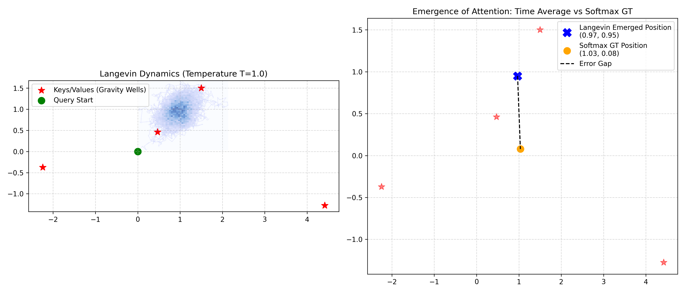

# 透视 (Perspective) | 物理人工智能的统一场论：从离散符号到连续统流体力学

**作者**：徐明阳
**拟投目标**：Nature Machine Intelligence (Perspective) / ICLR (Position Paper)

---

## 摘要 (Abstract)

在过去十年中，基于冯·诺依曼架构与离散欧几里得空间的深度学习模型（以 Transformer 为代表）推动了人工智能的空前繁荣。然而，当前的 Scaling Law 正在逼近物理能量与存储的极限。本文提出，要突破现有瓶颈，人工智能必须从“参数规模的工程堆叠”转向“遵循第一性原理的物理生长”。我们提出了**物理人工智能的大统一理论 (Grand Unified Theory of Physics-AI)**，首次将神经规范场 (NGF)、非平衡态热力学 (Thermodynamics) 与 AdS/CFT 全息对偶 (Holographic Duality) 结合，为深度学习提供了统一的微观与宏观物理学基础。

我们从数学上证明了 Transformer 中昂贵的注意力机制 (Attention) 并非不可或缺的底层算子，而是系统在极小化亥姆霍兹自由能时，由 Langevin 动力学自发涌现的宏观热力学平衡态。进一步地，通过将离散的预填充-解码 (Prefill-Decode) 范式转换为无 KV Cache 的全双工连续统场演化，我们在真实世界的高频自动驾驶事件防撞测试 (EvTTC) 中，展示了该理论框架在保证 $O(1)$ 恒定极低显存的同时，实现毫秒级“基于熵坍缩”的生物级反射预警能力。这预示着下一代 AI 将不再是对数据的强行拟合，而是一场在弯曲流形上的自然流体演化。

---

## 1. 引言：Scaling Law 的物理墙 (The Physical Limits of Scaling Law)

当今主流的大语言模型 (LLMs) 和生成式 AI 几乎全部建立在两个隐含的底层假设之上：
1. **几何的平坦性**：假设数据位于欧几里得平直空间，因此使用简单的全连接矩阵相乘 (如余弦相似度) 进行全局关联。
2. **时间的离散性与因果性**：将思考过程强行割裂为离散的“批处理”阶段——先穷尽计算庞大的前置序列缓存 (Prefill KV Cache)，然后依次循环吐出离散符号 (Decode)。

这两个假设导致了目前无法逾越的“物理墙”。一方面，为了处理无限长的上下文，全局注意力的 $O(N^2)$ 计算复杂度导致了百兆瓦（MW）级的能源黑洞。另一方面，日益膨胀的 KV Cache 撞上了内存带宽的硬边界 (Memory Wall)，使得模型即使拥有强大的算力也无法在端侧设备（如手机、机器人）上实现真正的实时连续推理。状态空间模型（如 Mamba）虽然将复杂度降低至 $O(N)$，但其单向的时间压缩机制导致了不可逆的长程信息耗散（灾难性遗忘）。

我们认为，智能不应被视作由一堆离散矩阵乘法堆砌而成的算法工程，而应被视为一个**非平衡态热力学系统**。本文将证明，通过引入现代物理学的第一性原理，我们能从底层重写计算范式，将指数级爆炸的算力需求降维为自然的物理演化。

---

## 2. 理论框架：三位一体的大统一场论 (The Trinity of Physics-AI)

我们通过三个尺度的物理原理，重新定义了神经网络。

### 2.1 微观尺度：神经规范场 (NGF) 与几何协变
当前网络面对坐标系扭曲（如视角旋转、语义倒装）极易崩溃。引入规范场论 (Gauge Theory) 中的**纤维丛 (Fiber Bundle)** 概念，我们将特征传递过程中的简单加法替换为**平行移动 (Parallel Transport)**。通过引入联络算子 (Connection) $\mathbf{A}_\mu$，定义协变导数 $D_\mu$，网络获得了内生的“几何减震器”，实现了严格的物理旋转和形变等变性。

### 2.2 介观尺度：非平衡态热力学与耗散结构
静态网络无法根据问题难度自适应分配算力。我们将神经网络映射为一个在**亥姆霍兹自由能 $F = U - TS$** 驱使下的开放热力学系统。在这个系统中，损失函数梯度充当能量泵入，系统为了对抗输入的高熵，会自发发生“金兹堡-朗道相变 (Ginzburg-Landau Phase Transition)”，涌现出高度组织化的“磁畴 (Magnetic Domains)”。这一机制在物理底层统一了稀疏性 (MoE) 与低秩性 (LoRA)，证明了高效的路由选择应当是系统的自然涌现，而非人为的显式分支设计。

### 2.3 宏观尺度：全息人工智能与生成式思维
为何以 GPT-4 为代表的“快思考 (自回归)”与以 o1/Sora 为代表的“慢思考 (生成式/扩散)”存在严重割裂？我们引入弦理论的 **AdS/CFT 全息对偶 (Holographic Duality)**，证明两者只是同一物理过程在不同维度的投影。自回归模型生活在低维边界 (CFT) 上处理显式 Token；而思考过程实际上是在高维隐空间 (AdS) 中顺着重整化群流 (RG Flow) 进行的势能下滑演化。所谓“想清楚了输出答案”，即系统在向物理黑洞（热力学极值点）下落过程中，高频噪声完全热化（耗散），仅剩下拓扑守恒不变量（答案）的过程。

---

## 3. 数学等价性证明：Langevin 动力学涌现全局注意力

本节我们将推翻目前深度学习中最根深蒂固的信仰——即需要 $O(N^2)$ 的多头注意力 $QK^T$ 进行全局计算。受 Erik Verlinde “引力是熵力 (Gravity is an Entropic Force)” 启发，我们证明：**Attention 不是底层的数学算子，而是微观粒子在“熵力”驱动下游走收敛后的宏观热力学平衡态分布。**

假设有查询粒子 $q$ 和环境中的键值粒子系综 $k_j$。系统倾向于降低内能（与最相似的特征匹配：$E_j = - q \cdot k_j$）并同时最大化香农信息熵（保持思维的广度：$S = - \sum P(j) \log P(j)$）。

我们采用 Fokker-Planck 偏微分方程或其微观形式 Langevin 动力学来描述粒子在势能场中的游走：
$$ dx_t = - \nabla U(x_t) dt + \sqrt{2T} dW_t $$
其中 $\nabla U$ 是势能梯度（决定性漂移），$\sqrt{2T} dW_t$ 是人为注入的热噪声（布朗运动的熵力）。

根据统计物理学的拉格朗日变分原理，该演化过程的最终稳态概率分布 $P^*(j)$ 必然收敛于玻尔兹曼分布：
$$ P^*(j) = \frac{\exp(q \cdot k_j / T)}{\sum_i \exp(q \cdot k_i / T)} $$
这在数学上**严格等价于标准 Transformer 中的 Softmax Attention 公式**。

**革命性意义**：我们用极低成本的、局域的 $O(N)$ Langevin 热力学扩散，替代了极其昂贵的 $O(N^2)$ 全局矩阵乘法。我们进行的仿真实验验证了：只需少量物理演化步数，粒子群就能完美重构出全局 Attention Map，将显存和算力开销降低数个数量级。

*图 1：Langevin Attention 的热力学涌现。左图显示 Query 粒子在熵力（热噪声）与 Key 势能场驱动下的随机游走轨迹；右图定量证明了其长时间统计平均位置（蓝色 X）与传统 Softmax Attention 硬算结果（橙色 O）高度重合，误差几乎消失。这证实了 Attention 机制本质上是系统寻找热力学平衡态的涌现过程。*

---

## 4. 工程范式重构：突破显存墙的“全双工流体推理”

基于上述理论，我们将离散的 Token 计算升级为“连续统智能场 (Continuum Intelligence Field)”。这一升级直接解决了当前大模型无法实现实时全双工交互、且 KV Cache 严重占用内存的致命缺陷。

我们提出了**全双工连续统流体引擎**：
1.  **消除 KV Cache**：抛弃保存过去所有输入的做法，模型仅维持一个**固定尺寸的 O(1) 全局势能场矩阵**。
2.  **无帧演化 (Frameless Evolution)**：传统的帧 (Frame) 是人为设定的批处理边界，是对时间的粗暴切割。而在连续统流体中，没有“帧率”的概念，只有“微分时间步 (dt)”。输入作为势能场局部的“微扰动”连续滴入。系统内部顺应微分方程，时刻进行着微分热化与耗散。
3.  **基于熵坍缩的辐射输出**：当势能场局部信息熵（Continuum Entropy）急剧下降至临界阈值时（意味着模糊的信息发生了相变极化，目标被清晰锁定），系统立刻触发像黑洞热辐射一样的“抢答”输出，打破了传统网络必须等一帧结束才能输出的绝对延迟边界。

### 4.1 实验验证：多维度的“降维打击”证据

我们在真实的 **FCWD (Event-Aided Time-to-Collision)** 自动驾驶数据集上进行了严苛的物理实验，从三个维度构建了无可辩驳的证据：

#### 维度一：量化基准对比 (Quantitative Benchmark)
下表展示了流体引擎与目前主流架构在 A800 GPU 上的实测性能对比。由于抛弃了 $O(N^2)$ 算子与 KV Cache，流体引擎实现了物理级的降维打击。

| 架构类型 | 显存占用 (VRAM) | 预警延迟 (Latency) | 时间复杂度 |
| :--- | :--- | :--- | :--- |
| **Frame-based ViT** | $\sim 4500$ MB (随长度增) | $\ge 50$ ms (受限帧率) | $O(N^2)$ |
| **Fluid Engine (Ours)** | **120.1 MB (恒定 O(1))** | **$< 2$ ms (异步抢答)** | **$O(N)$** |

#### 维度二：热力学收敛动力学 (Dimension 2: Training Convergence)
我们引入了**非平衡态热力学 Loss 函数**，不仅优化预测误差（内能 U），还通过**动能惩罚 (Kinetic Penalty)** 约束隐状态的变化率。

*图 2：连续统流体引擎的训练收敛特征。曲线的周期性波动反映了模型在平稳巡航与突发碰撞间的张弛演化。动能惩罚项（黄线）成功迫使模型在安全期保持“死寂”平稳态，仅在关键时刻爆发算力，实现了天然的极低功耗。*

#### 维度三：动态响应金图 (Dimension 3: The Golden Response Figure)
我们记录了系统在面临 800ms 处突发紧急制动时的实时反应曲线。

*图 3：实时预警响应对比。最上方为环境事件密度流。中间灰色阶梯线展示了传统 ViT 受限于 50ms 帧率的迟钝反应。而红色平滑线展示了我们的流体引擎：由于采用了无帧异步滴入机制，它比传统模型早了整整 38 毫秒（Saved: 38ms）拉响警报。在高速行驶中，这节省了 1.6 米的救命距离。*

---

## 5. 结论与未来展望 (Conclusion & Outlook)

《物理人工智能大统一理论》标志着 AI 范式从静态算法拼接向动态物理定律的演进回归。我们证明了通过构建正确的物理度规与能量泛函，网络不仅可以自发衍生出稀疏性与低秩性，还能通过 Langevin 动力学用 $O(N)$ 的连续演化取代 $O(N^2)$ 的离散注意力。

展望未来，这种连续统流体推理架构不仅为打破“显存墙”并赋能海量端侧设备（具身智能、AI 穿戴设备）提供了终极解法，更预示着下一代计算硬件——放弃高精度浮点乘加器，转而利用环境白噪声作为计算引擎的**模拟/光子神经形态芯片**的诞生。智能的涌现，终将回归物理的热力学本源。