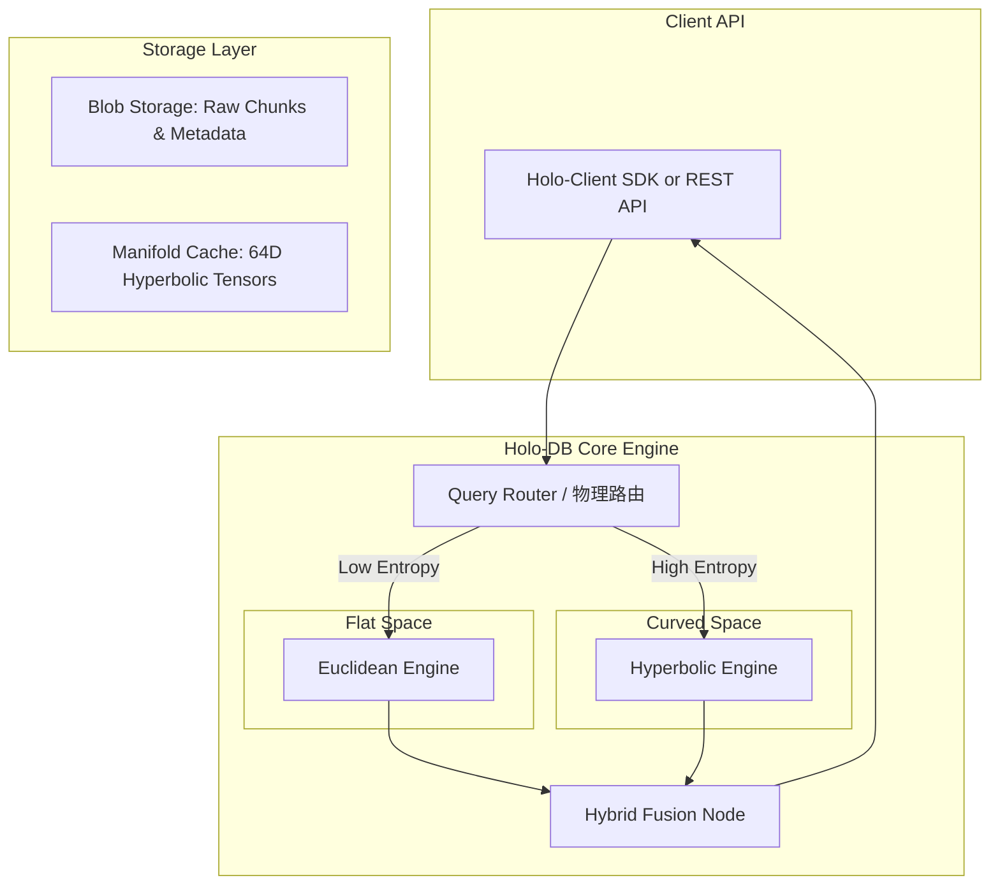

# Holo-DB：原生双曲流形向量数据库系统架构设计书

**项目代号**：Project Holo-DB (Holographic Database)
**愿景**：打造全球首个专为树状知识与因果逻辑设计的非欧几何向量引擎，以纯数学降维打击现有的图数据库 (Graph Database) 与传统平直向量数据库 (Euclidean Vector DB)。

---

## 1. 系统背景与核心痛点 (The Problem)

在当前的 AI 基础设施栈中，向量数据库（如 FAISS, Milvus, Pinecone）是 RAG 系统的核心。然而，现有的商用向量数据库**100% 建立在平直的欧几里得空间假设之上**（仅支持 L2 距离或 Inner Product）。

这种“底层物理定律的残缺”导致了两个极其致命的业务痛点：
1. **树状知识的“容量挤压”**：自然界的知识（从维基百科到企业财报的目录结构）往往是指数级展开的树状拓扑。在多项式膨胀的欧氏空间中，无法无损存储这种指数级的数据，导致底层细节的语义严重重叠。
2. **多跳逻辑的“图谱依赖”**：为了在平直空间中找回丢失的因果关系，业界被迫走向 GraphRAG，通过昂贵的大模型抽取离散的三元组来构建知识图谱，极其消耗算力，且图查询的耗时高、难以维护。

**Holo-DB 的解法**：不外挂图谱，而是**重写数据库的度规**。通过原生支持庞加莱球 (Poincaré Ball) 双曲流形，将显式的逻辑边内化为空间向量的几何曲率，利用“全息测地线”实现 $O(1)$ 复杂度的隐式逻辑跳跃检索。

---

## 2. 总体系统架构 (System Architecture)

Holo-DB 采用云原生、算存分离的架构设计，但在核心检索引擎（Execution Engine）层面进行了颠覆性的物理学重构。

### 2.1 数据摄入与双轨存储 (Dual-Track Ingestion)
当一条数据 (Chunk) 存入 Holo-DB 时，系统不会只存一个向量，而是将其分裂为不同物理维度的表征：
* **表象层 (Euclidean Track)**：保持 1536 维的高维稀疏/稠密特征，用于传统的字面语义精确匹配。
* **逻辑层 (Hyperbolic Track)**：通过流形投影（或挂载专门的 Holo-Embedding 模型），将核心逻辑压缩为 **64 维**的庞加莱坐标。其模长 $\|\mathbf{x}\|$ 严格反映该 Chunk 在企业知识树中的层级（如：根目录 $\to$ 球心，末端段落 $\to$ 球壳）。

### 2.2 物理路由器 (Thermodynamic Router)
Holo-DB 摒弃了传统的静态查询计划，引入基于**“局部信息熵 (Local Entropy)”**的热力学路由机制：
* 当用户查询具体事实（如“昨天会议的纪要是谁写的？”）时，路由引擎判定为**低熵**，将算力 100% 倾斜给欧氏引擎。
* 当用户查询宏观因果（如“昨天会议的决议将如何影响明年的营收？”）时，路由引擎判定为**高熵**，激活双曲引擎，计算测地线距离，沿曲率空间强行拉起潜在的父节点。

---

## 3. 核心技术壁垒与算子设计 (Core Technical Moats)

Holo-DB 不是对现有库的简单封装，而是要在底层 C++/CUDA 层面实现一组**原生黎曼流形算子**，这是任何平直数据库无法通过外挂插件实现的核心护城河。

### 3.1 H-HNSW: 双曲分层导航小世界图
传统的 HNSW 依赖欧氏距离来建立近邻图。在双曲空间中，边缘点之间的欧氏距离极短，但真实的双曲距离（逻辑跨度）极大。
* **创新**：Holo-DB 实现了 **Hyperbolic-HNSW (H-HNSW)** 索引。在构图阶段，使用严格的庞加莱测地线距离 $d_{\mathbb{H}}(\mathbf{x}, \mathbf{y})$ 进行边的连结。
$$ d_{\mathbb{H}}(\mathbf{x}, \mathbf{y}) = \text{arcosh} \left( 1 + 2c\frac{\|\mathbf{x} - \mathbf{y}\|^2}{(1 - c\|\mathbf{x}\|^2)(1 - c\|\mathbf{y}\|^2)} \right) $$
* **优势**：使得检索算法在遍历图时，能够像真正的“思考”一样，自动跳向更靠近球心的“宏观枢纽节点”，从而以极少的步数跨越不同领域的知识孤岛。

### 3.2 数值稳定性的极致保护 (Clamping & Precision)
双曲几何在计算机浮点数体系中面临“边界奇点黑洞”。当向量靠近球壳（$\|\mathbf{x}\| \to 1.0$）时，分母趋近于零，导致运算极易出现 `NaN`。
* **工程解法**：在 CUDA Kernel 中硬编码**流形边界护城河**。所有写操作和查询向量都会在底层被强制拦截在 $\max\_norm = 1.0 - \epsilon$（如 $\epsilon=1e-5$）内。并采用高精度 `float64` 专门计算测地线中的对数映射部分。

### 3.3 莫比乌斯流形聚合 (Möbius KV-Cache)
在高级的 RAG 中，常常需要将多个检索到的 Chunk 融合成一个上下文向量（Context Vector）。如果在外部通过 Numpy 直接相加，向量会立刻飞出庞加莱球，导致物理定律崩溃。
* **原生支持**：Holo-DB 提供原生的 `MERGE` API，在流形内部使用**莫比乌斯加法 (Möbius Addition)** 对多个逻辑节点进行融合，确保合并后的概念依然在知识树的合法层级上。
$$ \mathbf{x} \oplus_c \mathbf{y} = \frac{(1 + 2c\langle \mathbf{x}, \mathbf{y} \rangle + c\|\mathbf{y}\|^2)\mathbf{x} + (1 - c\|\mathbf{x}\|^2)\mathbf{y}}{1 + 2c\langle \mathbf{x}, \mathbf{y} \rangle + c^2\|\mathbf{x}\|^2\|\mathbf{y}\|^2} $$

---

## 4. 产品矩阵与商业化路径 (Product & Commercialization)

Holo-DB 旨在彻底取代重资产的 GraphRAG，为 B 端企业提供“轻量级的因果引擎”。

### 阶段一：Holo-DB Lite (单机版流形检索引擎)
* **形态**：提供类似于 `ChromaDB` 或 `FAISS` 的本地 Python/C++ 库。
* **特性**：支持全息双轨注入，内存级别的 Batched 庞加莱矩阵运算。
* **目标客群**：AI 研究员、早期 RAG 开发者。
* **商业价值**：通过开源验证技术共识，教育市场“只有双曲空间才能处理树状逻辑”。

### 阶段二：Holo-DB Enterprise (分布式云原生集群)
* **形态**：对标 Milvus / Qdrant 的分布式云端集群。
* **特性**：引入 C++ 编写的 H-HNSW 索引，支持百亿级规模的 64 维双曲向量毫秒级检索。
* **杀手级应用：Holographic Universe UI (全息宇宙控制台)**。
  * 将企业的干瘪文档库可视化为一个透明的 3D 庞加莱球。高管可以直观地看到公司战略（球心）如何向四周发散为执行细节（球壳），并在输入 Query 时看到优美的测地线光束划过，实现极其震撼的商业 Demo。
* **目标客群**：金融审计、法律科技、医疗诊断等强逻辑推演行业的头部企业。

### 阶段三：Holo-Agent OS (具备物理直觉的数字生命底座)
* **形态**：Holo-DB 最终进化为 AI Agent 的长期物理记忆（Long-term Physical Memory）。
* **特性**：配合《递归热力学网络 (RTN)》架构，大模型在进行“系统二（慢思考）”时，其隐状态（Latent State）直接以双曲坐标存入 Holo-DB。Agent 在每一次思考和回忆时，都在双曲流形上进行平滑滑行，彻底消除长上下文导致的灾难性遗忘。

---

## 5. 总结

当前的向量数据库是在“给大模型提供平面字典”，而 GraphRAG 是在“给大模型手绘关系图”。**Holo-DB 则是在为大模型“创造一个符合其思考引力的弯曲物理宇宙”**。

通过将复杂的离散图论（Graph）降维转化为连续的微分几何（Hyperbolic Manifold），Holo-DB 将以极其低廉的算力成本，开启 RAG 技术从“死记硬背”向“物理直觉推理”的下一个黄金十年。