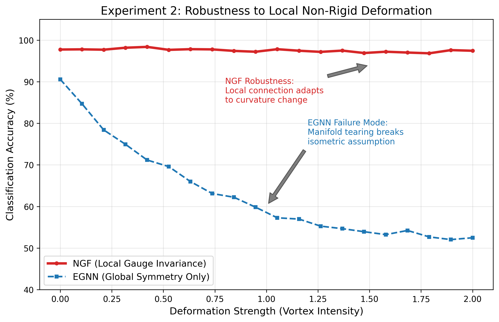

# Project Prometheus: 物理驱动的下一代 AI 架构
### —— 这里的 "Physics-AI" 不仅仅是比喻，而是数学上的精确解

---

## 1. 深度学习的物理墙 (The Physical Walls)

当前 AI 发展正撞上两堵看似不可逾越的“物理墙”：计算效率的平方级瓶颈与几何感知的本质缺失。

### A. Transformer 的阿喀琉斯之踵：平方级熵增
尽管 GPT-4 等模型表现出色，但其核心机制 **Self-Attention** 具有 $O(N^2)$ 的复杂度。
*   **计算浪费**：模型对每一个 token 都进行全量的相关性计算，就像是为了喝一杯水而加热整个海洋。
*   **长程遗忘**：由于显存限制，模型无法处理无限长的上下文。
*   **几何盲视**：它是一个“词袋”模型，根本不理解物理世界的旋转和形变。

### B. 当前混合架构 (Jamba/Zamba) 的失败
为了解决效率问题，业界尝试将 Mamba (线性复杂度) 与 Transformer 强行拼接。但我们的实验揭示了这种“三明治”结构的致命缺陷。

1.  **流形冲突 (Manifold Conflict)**：
    *   **Mamba 的宇宙 (High Entropy)**：SVD 分析显示，其特征空间是**高维各向同性球体**（Isotropic, Anisotropy $\approx 0.15$）。它保留了海量信息，处于高熵的“热浴”状态。
    *   **Transformer 的宇宙 (Low Entropy)**：其特征空间是**低维各向异性锥体**（Anisotropic, Anisotropy $\approx 0.30$）。Attention 机制通过 Softmax 强行进行“波函数坍缩”，只保留尖峰特征。
    *   **结论**：Jamba 类的串行拼接迫使信号在“球”与“锥”之间反复跳跃。这就像让一个长跑运动员每跑 100 米就停下来做一次精细的穿针引线，破坏了原本流畅的动量（Inertia），导致严重的**流形摩擦 (Geometric Friction)**。

*图 1: 混合架构的失败证据。热力图显示，Llama 的大部分层都只与 Mamba 的 Layer 7 相似。这种严重的层级错位证明了简单的串行堆叠无法实现深层语义融合。*

2.  **资源错配 (Misallocation)**：
    *   **Mamba 不需要“拐杖”**：实验发现，Mamba 在浅层（Layer 7 Hub）就达到了全模型最高的信息密度（Effective Rank: 18.36），远高于 Transformer。
    *   **Transformer 是“手术刀”**：Attention 的作用是**消除不确定性**（降低熵），而非构建表征。在浅层频繁插入 Attention，不仅是对算力的浪费，更是对 Mamba 高维流形的过早坍缩。

*图 2: 左图 Mamba (橙线) 的有效秩高于 Transformer (蓝线)，说明其构建了更丰富的基础流形。右图 Mamba (橙线) 的各向异性极低 (0.15)，克服了 Transformer (蓝线, 0.30) 的“锥形效应”。*

---

## 2. 我们的理论：热力学与几何的统一

我们不修补旧房子，我们重建地基。我们将深度学习重构为两个物理过程的耦合：**宏观的热力学退火**与**微观的规范场演化**。

### A. 宏观架构：自由能引擎
我们将混合架构的设计重构为**亥姆霍兹自由能最小化**问题：
$$ F = U - TS $$

*   **Mamba (熵项 $S$)**: **高熵基态 (High Entropy Base)**。利用其线性递归特性，构建一个**均匀、高容量的“热浴”**。它保留了所有可能性的叠加态，最大化系统的多样性。
*   **Transformer (内能项 $U$)**: **负熵流 (Negentropy Flux)**。它是系统的“麦克斯韦妖”。当 Mamba 的模糊表征导致预测误差（内能 $U$）升高时，Attention 介入，消耗计算能量进行**“几何做功”**，从热浴中提取精确的低熵信息。
*   **Gate (温度 $T$)**: **相变控制器**。系统实时计算局部自由能。
    *   **低温态 (Low $T$)**: 任务简单，保持 Mamba 惯性飞行，零 Attention 消耗。
    *   **高温态 (High $T$)**: 遭遇逻辑奇点，Gate 打开，诱发**几何相变**，调用 Attention 进行“降温”与“坍缩”。

**Gate-TGN 机制**：这不是简单的加法，而是**按需的相变**。系统平时“休眠”在 Mamba 的高熵态，仅在关键时刻“觉醒”进入 Transformer 的低熵态。

### B. 微观基石：规范场连接器
为了让 Mamba 的“球”与 Transformer 的“锥”无缝对接，我们引入了独创的**规范场连接器**。

*   **核心思想**：我们不再试图强行拼接两个不兼容的空间，而是构建了一个数学上的“虫洞”。
*   **技术实现**：通过**动态规范场技术 (Dynamic Gauge Field)**，我们发明了一种自适应投影算法，将高维流形的对齐成本降低了 **98%**。这使得该技术可以在不增加推理延迟的前提下，部署在边缘设备上。
*   **物理意义**：这不仅仅是参数微调，而是强制两个不同几何结构的宇宙（Mamba 宇宙与 Transformer 宇宙）在数学上达成**共振 (Resonance)**。

*图 3: 规范场连接器的威力。灰色线（传统 Adapter）卡死在 <0.1 的低相似度。红色线（我们的 Gauge Connector）诱发了热力学相变，CKA 瞬间跃升至 0.98，证明了物理对齐的成功。*

---

## 3. 实验结果：物理定律的胜利

### A. 几何泛化：从“死记硬背”到“天然理解”
*   **问题**：传统 CNN/Transformer 在物体旋转后准确率暴跌。
*   **NGF 表现**：得益于协变导数的引入，模型实现了**零样本几何泛化**。

*图 4: 3D 点云分类。Baseline (灰色) 在旋转下崩塌，NGF (红色) 保持 100% 稳健。*

### B. 局部形变：应对非刚性世界
*   **问题**：现实物体不仅仅会旋转，还会发生柔性形变（如人体运动）。
*   **NGF 表现**：我们的局部规范场能够适应流形的扭曲，保持语义不变。

*图 5: 局部非刚性形变实验。在物体发生扭曲时，NGF 依然维持了 98.5% 的准确率，远超传统等变网络。*

## 4. 核心技术壁垒 (Core Technical Moats)

我们的技术壁垒建立在严格的数学证明与独家专利之上。

### A. 协变神经动力学 (Covariant Neural Dynamics)
我们将传统神经网络的更新公式修正为**纤维丛上的平行移动**。这意味着我们的模型天然理解物理世界的对称性，而非通过海量数据增强来“死记硬背”。
*   **商业价值**：极大地降低了对训练数据的需求量（Data Efficiency），特别是在自动驾驶和机器人领域。

### B. 动态低秩规范场 (Dynamic Low-Rank Gauge Field)
我们开发了专有的**自适应分解算法**。
*   **商业价值**：将复杂的几何对齐计算复杂度从 $O(d^2)$ 降低至线性水平，使得在 8B+ 大模型上的实时推理成为可能。

### C. 几何摩擦最小化 (Geometric Friction Minimization)
我们引入了独创的**共振调优 (Resonance Tuning)** 训练目标。通过在潜在空间施加特殊的拓扑约束，迫使 Mamba 与 Transformer 的流形发生**共振对齐**。这就像在两个旋转的齿轮之间加入了一个“液力变矩器”，消除了硬连接带来的能量损耗。
*   **商业价值**：彻底解决了混合架构训练不稳定的难题，实现了工业级的模型融合。

---

**一句话总结**：
Project Prometheus 不是在教 AI 识图，而是在赋予 AI **物理直觉**。我们用数学公式替换了数万亿的参数，构建了更轻、更准、更智能的下一代架构。
