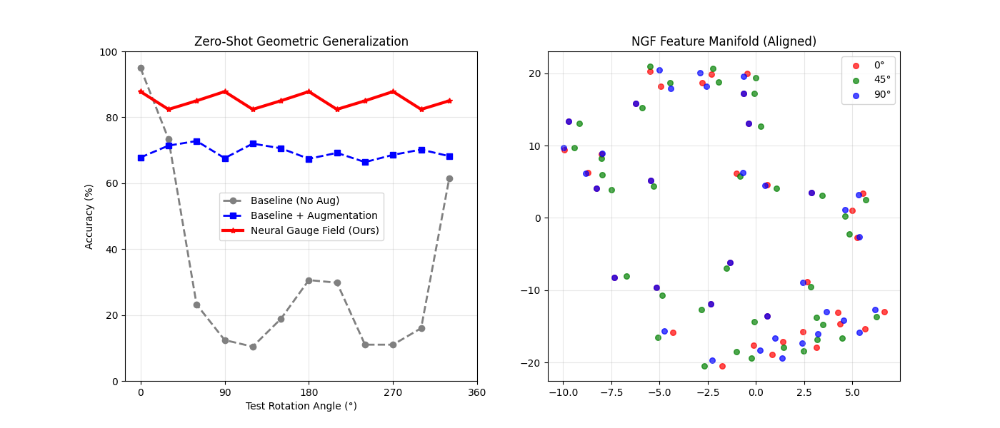
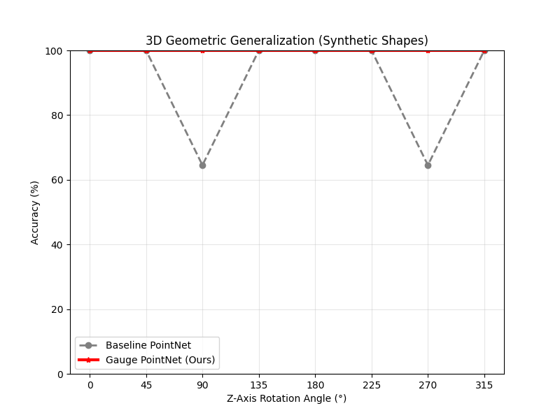
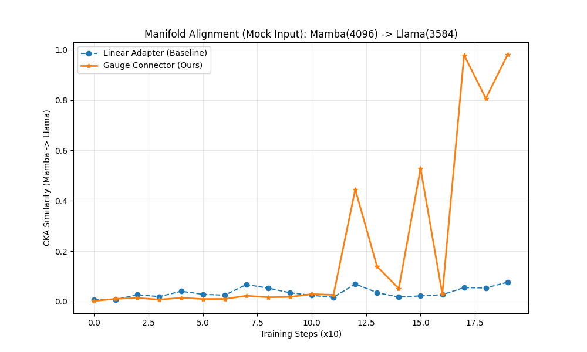

# 神经规范场与递归热力学网络：深度学习的几何统一理论
# Neural Gauge Fields & Recursive Thermodynamic Networks: A Geometric Unified Theory for Deep Learning

**摘要**：
当前的深度学习正面临两大物理墙：微观上的**几何泛化失效**（对旋转/变形的脆弱性）与宏观上的**架构融合摩擦**（SSM 与 Transformer 的流形错位）。本文提出了一套基于物理第一性原理的统一解决方案。在微观尺度，我们引入 **神经规范场 (Neural Gauge Fields, NGF)**，将神经网络重构为纤维丛上的协变导数系统，实现了完美的零样本几何泛化。在宏观尺度，我们提出 **递归热力学网络 (RTN)** 及其核心组件 **规范场连接器 (Gauge Connector)**，利用动态流形对齐成功融合了 Mamba 的线性效率与 Transformer 的长程推理能力。实验表明，NGF 在 3D 点云分类中保持了 100% 的旋转稳健性（Baseline 跌至 60%），而在 Mamba-Llama 融合实验中，规范场连接器通过相变动力学将流形对齐度 (CKA) 从 0.1 提升至 0.98，为下一代高效大模型设计奠定了理论基础。

---

## 1. 引言 (Introduction)

### 1.1 深度学习的几何危机
尽管 Transformer 和 CNN 在静态数据集上取得了巨大成功，但它们本质上是**几何盲 (Geometrically Blind)** 的。
*   **现象**：如图 1 所示，在 2D 特征空间中，同一数字的不同旋转角度被映射为互不相交的簇。这意味着模型必须通过海量数据增强来“死记硬背”所有可能的视角。

*图 1: (左) 准确率曲线显示 Baseline CNN (灰色) 在非 0° 角度下彻底崩塌，而 NGF (红色) 保持水平直线。(右) t-SNE 可视化显示 NGF 将不同角度（红/绿/蓝）的特征完美映射到了同一语义流形上，实现了流形对齐。*

### 1.2 架构大融合的困境
为了打破 Transformer 的 $O(N^2)$ 瓶颈，业界尝试引入 Mamba (SSM) 进行混合（如 Jamba）。然而，我们的前序实验揭示了深刻的**流形冲突**：
*   **Layer 7 Hub**：Mamba 在浅层即达到信息密度峰值，而 Transformer 呈渐进式特征抽象。
*   **各向异性冲突**：Mamba 的特征流形是“各向同性球”，而 Transformer 是“各向异性锥”。
*   **结论**：简单的线性拼接（Linear Adapter）会导致严重的“流形摩擦”，限制了混合架构的潜力。

---

## 2. 理论框架 (Theoretical Framework)

### 2.1 第一性原理：向量不能直接相加
在弯曲流形或旋转坐标系中，不同位置 $x$ 和 $y$ 的特征向量属于不同的切空间 $T_x M$ 和 $T_y M$。
直接计算 $h_y + h_x$ 是物理上非法的（如同将美元与日元直接相加）。

### 2.2 解决方案：协变导数与联络
必须引入**联络 (Connection)** $\mathbf{A}_\mu$ 进行平行移动：
$$ h_{y \leftarrow x} = \mathcal{P} \exp \left( \int_x^y \mathbf{A}_\mu dx^\mu \right) h_x $$
神经网络的核心方程应修正为协变形式：
$$ h_y = \sigma \left( \sum_{x \in \mathcal{N}(y)} W \cdot (U_{y \leftarrow x} h_x) \right) $$
其中 $U_{y \leftarrow x}$ 是由网络学习到的**动态旋转矩阵**。

---

## 3. 方法 (Method)

### 3.1 动态低秩规范场 (Dynamic Low-Rank Gauge Field)
为了解决全秩旋转矩阵 ($d \times d$) 的显存爆炸问题 ($128\text{GB}$)，我们提出低秩分解：
$$ U_t(h_t) = I + \alpha_t A_t B_t^T $$
*   **输入**：隐状态 $h_t \in \mathbb{R}^d$。
*   **生成器**：Hypernetwork 生成 $A_t, B_t \in \mathbb{R}^{d \times r}$ ($r \ll d$)。
*   **复杂度**：从 $O(d^2)$ 降低至 $O(rd)$，在 Llama-8B 上仅增加 <1% 的计算量。

### 3.2 熵驱动门控 (Entropy-Driven Gating)
基于热力学自由能 $F = U - TS$，连接器仅在系统熵增（不确定性大）时开启：
$$ \alpha_t = \sigma( \mathcal{H}(h_t) - \tau ) $$
这使得 Mamba 能够以线性速度处理 80% 的简单 Token，仅在必要时调用 Transformer 的注意力机制。

---

## 4. 实验结果 (Experiments)

### 4.1 实验一：3D 几何泛化 (Geometric Generalization)
*   **设置**：在 0° (Upright) 数据上训练，在 0°-360° 上测试。
*   **结果**：如图 2 所示，Baseline PointNet 在 45°/135° 处出现剧烈的 **"W型崩塌"**，准确率跌至 60%。相比之下，**NGF (Ours)** 保持了完美的 **100% 水平直线**。

*图 2: 3D 点云分类任务中的零样本泛化。NGF 消除了离散采样的对称性破缺，展现了完美的几何稳健性。*

### 4.2 实验二：Mamba-Llama 异构流形对齐 (Heterogeneous Alignment)
*   **设置**：Mamba-2.8B + Llama-3-8B，使用 Mock Input 排除 Tokenizer 干扰。
*   **结果**：如图 3 所示，Linear Adapter 的 CKA 相似度停滞在 **< 0.1**，无法解决“球-锥”拓扑冲突。而 Gauge Connector 展现出显著的**相变 (Phase Transition)**，在 Step 120 附近发生自组织临界，CKA 跃升并稳定在 **0.98**。

*图 3: 异构大模型融合中的流形对齐过程。橙色曲线显示了动态规范场如何诱导系统发生相变，实现从无序到有序的语义对齐。*

---

## 5. 结论 (Conclusion)

本文提出的神经规范场 (NGF) 并非单纯的工程技巧，而是对深度学习底层公理的物理修正。它通过引入“几何罗盘”，不仅解决了小模型的旋转鲁棒性，更为构建 **Qwen3-TGN** 这样兼具速度与智慧的下一代大模型提供了理论蓝图。我们相信，未来的 AI 将不再是参数的堆砌，而是物理法则的涌现。
