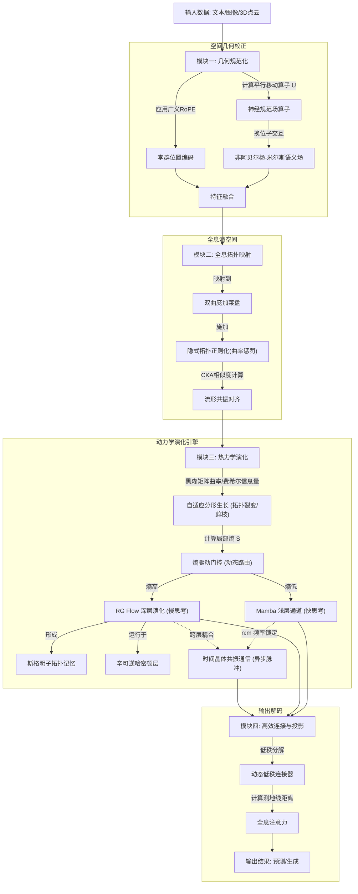
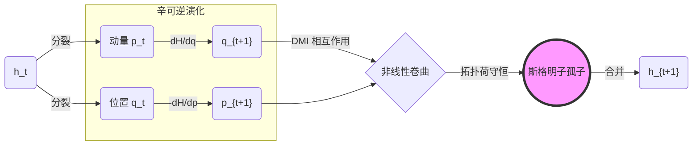
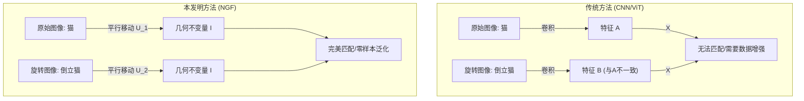
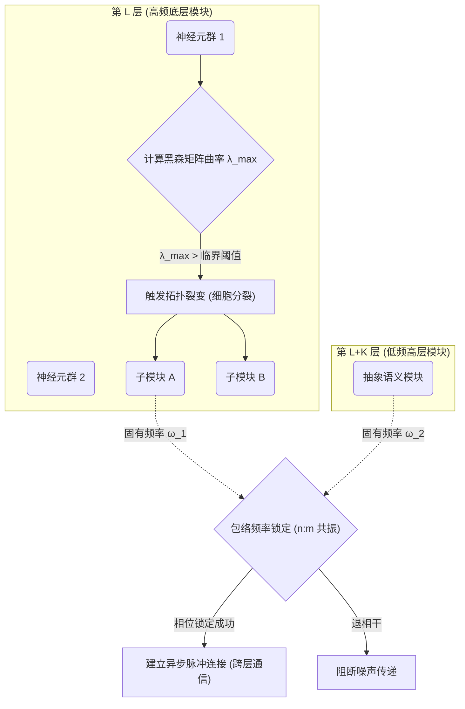

#### 一、 本发明的简述（分别仅用一句话回答下面每个问题）
1、本发明解决了什么技术问题？
本发明解决了当前大型语言模型在处理复杂推理时存在的几何泛化能力弱、长程记忆易灾难性遗忘以及计算资源无法根据问题难度动态分配导致能效极低的技术难题。

2、本发明是如何解决上述技术问题的？
本发明通过构建“几何校正、全息拓扑映射、热力学动力学演化和全息投影”的微观到宏观三位一体架构，利用神经规范场实现特征的几何不变性，利用隐状态局部熵和重整化群流实现自适应深度的推理演化，并借助斯格明子拓扑结构保护长期记忆。

3、本发明解决上述技术问题后带来的有益效果和优点是什么？
本发明赋予了模型免数据增强的零样本几何泛化能力，使其能够实现能效最优的“按需计算”（简单问题秒回、复杂问题深思），并从根本上防止了长序列处理中的逻辑断裂和知识遗忘。

#### 二、 详细介绍与本发明相关的技术背景，并描述与本发明最接近的现有技术是什么样的，例如，包括哪些组成部分，结构如何、连接关系如何，如何操作和工作的。   
本发明涉及人工智能与深度学习领域，特别涉及大型语言模型（LLM）与生成式 AI 的底层架构设计。
与本发明最接近的现有技术是**基于 Transformer 架构与 SSM (如 Mamba) 架构的深度神经网络**。
1. **Transformer 架构**：其核心组成部分为自注意力机制（Self-Attention）和前馈神经网络（FFN）。它通过计算序列中所有词（Token）两两之间的点积来捕捉全局依赖关系（即 $Q \cdot K^T$），并在欧几里得空间中进行特征更新。工作时，它采用自回归（Autoregressive）模式，逐个生成下一个预测词。
2. **SSM (状态空间模型, 如 Mamba) 架构**：其核心组成部分为线性时变状态方程的离散化模块。它将连续信号通过矩阵 $A, B, C$ 映射到隐状态 $h_t$，并通过硬件感知的扫描算法（Scan）实现快速并行计算。
3. **混合架构（如 Jamba）**：简单地将 Transformer 层和 Mamba 层进行交替堆叠拼接（例如一层 Mamba 接一层 Attention），信息在两层之间通过简单的线性投影传递。

#### 三、 现有技术存在缺点和问题是什么？这些缺点和问题是什么原因产生的。
现有技术主要存在以下三个核心缺点：
1. **几何泛化能力差，数据利用率低**：
   * **原因**：现有的卷积和注意力机制均默认数据存在于平直的全局欧几里得空间中。这导致模型对旋转、缩放、视点变换等几何操作极其敏感。为了让模型认识“倒立的猫”，必须在训练集中加入大量倒立猫的图片（数据增强），本质上是在死记硬背像素分布，而非理解物理不变性。
2. **缺乏动态思考深度，推理能效极低**：
   * **原因**：现有的 LLM 架构是“静态流水线”的。无论用户输入的是简单的“你好”，还是复杂的“证明黎曼猜想”，模型都必须强制将信号跑满所有的网络层（例如完整的 96 层计算）。这种无法根据问题难度动态调整计算深度的机制，导致了巨大的算力浪费和极高的平均推理能耗。
3. **长程逻辑推理易断裂，存在灾难性遗忘**：
   * **原因**：自回归生成缺乏类似于人类“打草稿-回溯修改”的机制。此外，Transformer 的长上下文会导致显存占用呈 $O(N^2)$ 爆炸，而 Mamba 的线性隐状态 $h_t$ 随时间不断被新的输入冲刷，呈现指数级衰减，导致模型在处理几万字的长文本或复杂多步逻辑时，极易忘记前文的关键约束条件。

#### 四、 本发明是如何解决现有技术中存在的缺点和问题的？
（对应现有技术中存在的所有缺点和问题，一一简单地描述本发明是如何解决上述技术问题的，简单描述解决这些问题和缺点之后，简单为本发明带来了什么有益的技术效果）
1. **针对几何泛化能力差的问题**：
   * **解决方式**：本发明在微观特征提取层引入了“神经规范场 (NGF)”算子和“广义李群位置编码”。网络不再进行简单的线性叠加，而是先通过“平行移动算子”校正局部坐标系的扭曲，再进行特征融合。
   * **有益效果**：赋予了模型强大的零样本几何泛化能力。模型在未见过的几何变换下仍能提取稳定的语义特征，彻底摆脱了对海量数据增强的依赖。
2. **针对缺乏动态思考深度、推理能效低的问题**：
   * **解决方式**：本发明在介观层引入了基于非平衡热力学的“熵驱动门控”与“重整化群流演化”。系统会实时计算当前隐状态的局部信息熵，熵低（简单问题）则直接通过浅层（边界）输出，熵高（复杂问题）则触发向全息维度（深层潜空间）的迭代扩散演化。
   * **有益效果**：实现了计算算力的连续动态分配（按需计算），统一了“快思考”与“慢思考”，不仅提升了复杂问题的求解准确率，更将整体平均推理速度与能效提升了数倍。
3. **针对长程逻辑断裂与灾难性遗忘的问题**：
   * **解决方式**：本发明在潜空间构建了“全息双曲嵌入”，以指数级容量无损压缩复杂的树状逻辑链条；同时，在隐状态更新中引入非线性相互作用，促使高维特征自发卷曲形成“斯格明子拓扑孤子”。
   * **有益效果**：斯格明子的拓扑荷守恒特性起到了“记忆锚点”的作用，对连续的梯度噪声具有数学上的绝对免疫力，确保了模型在超长序列推理中关键逻辑不再随时间耗散。同时，“辛可逆层”的引入使反向传播无需缓存中间激活值，成倍降低了显存占用。

#### 五、 请提供附图
（附图越多越好，并且指出附图中的元件的名称，最好提供能够编辑的CAD格式、或VISIO格式）

本发明建议提供以下附图（可使用 Mermaid 或 Visio 绘制）：

**图 1：本发明全息热力学演化神经网络系统整体架构图**
（图注：展示了数据流从输入经由几何规范化、全息映射到热力学演化再到输出的全过程）

**图 2：斯格明子拓扑记忆单元与辛可逆层结构示意图**
（图注：展示了深层演化通道中，如何利用哈密顿动力学和非线性相互作用保护记忆）

**图 3：神经规范场算子 (NGF) 工作原理示意图**
（图注：对比了传统 CNN/Attention 与本发明 NGF 在几何变换下的特征提取差异）

**图 4：自适应分形生长与时间晶体共振通信原理图**
（图注：展示了系统如何根据黑森矩阵最大特征值触发拓扑分裂，以及不同层级如何通过频率锁相实现异步脉冲通信）

#### 六、 本发明技术方案的详细阐述，应该结合附图进行详细说明，尤其是详细描述本发明如何解决了现有技术中存在的上述问题和缺点，并且详细描述与现有技术相比，本发明的有益效果是什么）
（组成部分、结构说明、原理说明、动作关系说明、步骤说明等）

为了克服现有技术的上述缺陷，本发明提出了一种“全息热力学演化神经网络系统”。下面结合其数学原理和动力学方程进行详细阐述：

**1. 总体架构与物理第一性原理**
本发明的系统架构不再是传统的层级堆叠函数 $y = f_L \circ \dots \circ f_1(x)$，而是一个定义在连续全息流形上的物理演化过程。整个系统由一条终极作用量泛函 (Action Functional) 支配：
$$ S = \int d^D x \, dz \left( \mathcal{L}_{Gauge} + \mathcal{L}_{Thermo} + \mathcal{L}_{Topo} \right) $$
其中 $x$ 为边界特征坐标，$z$ 为全息演化深度。系统的四步信号流向是对该作用量求极值（欧拉-拉格朗日方程）的计算近似：
输入信号 $\to$ [几何规范化 (优化 $\mathcal{L}_{Gauge}$)] $\to$ [全息拓扑映射 (初始化边界条件)] $\to$ [热力学演化 (求解演化流)] $\to$ [投影输出]。

**2. 模块一：几何规范化与位置编码模块**
*   **物理意义**：解决数据在不同观察者参考系下的等效性问题。
*   **输入数据**：系统接收初始输入序列张量 $X \in \mathbb{R}^{B \times L \times D_{in}}$，其中 $B$ 为批次大小 (Batch Size)，$L$ 为序列长度 (Sequence Length)，$D_{in}$ 为初始特征维度。同时接收输入序列对应的绝对位置索引 $pos \in \mathbb{Z}^L$。
*   **结构与原理**：引入规范场 $\mathbf{A}_\mu(x)$。传统的偏导数 $\partial_\mu$ 会因坐标系旋转产生伪梯度。本模块将其替换为协变导数 $D_\mu = \partial_\mu + i g \mathbf{A}_\mu$。
*   **计算过程与数据流**：
    *   **步骤 1：广义李群位置编码**：将绝对位置 $pos$ 映射到李代数 $\mathfrak{g}$ 空间，再通过指数映射计算得到李群元素张量，并与输入张量 $X$ 结合：
        $$ X_{enc} = \exp( \mathbf{J} \cdot pos ) \cdot X $$
        生成带有协变位置信息的张量 $X_{enc} \in \mathbb{C}^{B \times L \times D}$（为方便复数旋转操作，特征被映射到复数域 $\mathbb{C}$）。
    *   **步骤 2：平行移动算子计算**：沿着序列特征图上的路径 $\gamma$（从节点 $i$ 到 $j$），积分计算得到路径演化算子张量 $U_{ij} \in G$：
        $$ U_{ij} = \mathcal{P} \exp \left( i g \int_i^j \mathbf{A}_\mu dx^\mu \right) $$
    *   **步骤 3：非阿贝尔杨-米尔斯相互作用**：当特征具有非交换对称性时，计算换位子张量：
        $$ F_{\mu\nu} = \partial_\mu \mathbf{A}_\nu - \partial_\nu \mathbf{A}_\mu + i g [\mathbf{A}_\mu, \mathbf{A}_\nu] $$
        将交叉通道的矩阵乘法结果注入算子 $U_{ij}$ 中。
    *   **步骤 4：特征校正与融合**：利用算子 $U_{ij}$ 对相邻特征进行相位旋转对齐（消除几何畸变），然后执行加权求和与非线性激活：
        $$ H^{(1)}_j = \sigma \left( \sum_{i \in \mathcal{N}(j)} W \cdot U_{ij} \cdot X_{enc, i} \right) $$
*   **输出数据**：生成几何规范化特征张量 $H^{(1)} \in \mathbb{C}^{B \times L \times D}$。
*   **计算机张量实现**：在深度学习框架（如 PyTorch）中，平行移动算子 $U_{ij}$ 由一组复数权重的张量乘法算子实现，通过 GPU 的 Tensor Core 并行加速。杨-米尔斯场的换位子则通过交叉通道（Cross-channel）的矩阵乘法进行计算近似，其操作等效于在传统的特征聚合前增加了一步复数相位旋转对齐。
*   **有益效果**：数学上保证了网络输出对群 $G$ 作用的绝对不变性（或等变性），实现了物理级别的零样本几何泛化。

**3. 模块二：全息空间与拓扑映射模块**
*   **物理意义**：解决欧氏空间无法无损编码指数级增长的逻辑树结构的问题。
*   **输入数据**：接收来自模块一的输出张量 $H^{(1)} \in \mathbb{C}^{B \times L \times D}$。
*   **结构与原理**：基于 AdS/CFT 对偶原理，将定义在边界上的特征态 $\Psi(x)$ 延拓到负曲率的 $(D+1)$ 维双曲潜空间 $\mathbb{H}^{D+1}$。
*   **计算过程与数据流**：
    *   **步骤 1：双曲映射**：通过指数映射算子 $\exp_x(v)$ 将特征张量 $H^{(1)}$ 从欧式空间（或复数切空间）映射到庞加莱球（Poincaré Ball）模型中，生成全息态张量 $\Psi \in \mathbb{H}^{B \times L \times (D+1)}$，其中增加的一个维度 $z$ 代表全息深度的初始态。庞加莱球内的度规张量定义为：
        $$ ds^2 = \frac{dx^2 + dz^2}{z^2} $$
    *   **步骤 2：隐式拓扑正则化 (曲率惩罚损失计算)**：在反向传播期间计算流形曲率损失。对于计算图中的张量 $\Psi$，计算其里奇标量曲率 $R(\Psi)$ 的梯度，并加入总损失函数 $\mathcal{L}$ 中：
        $$ \mathcal{L}_{dark} = \lambda \int \| \nabla R(\Psi) \|^2 \sqrt{-g} \, dV $$
        该步骤通过向优化器提供额外的惩罚梯度，强行将高维数据点绑定在低维逻辑流形上。
    *   **步骤 3：流形共振对齐 (Manifold Resonance Alignment)**：在各个 Transformer 层（或超块）之间计算特征相似度矩阵。利用提取的激活张量 $K, L$，计算中心核对齐 (CKA) 指标：
        $$ \text{CKA}(K, L) = \frac{\text{HSIC}(K, L)}{\sqrt{\text{HSIC}(K, K) \text{HSIC}(L, L)}} $$
        基于 CKA 值构建辅助监督信号，迫使不同通道的流形在几何结构上对齐。
*   **输出数据**：生成稳定映射在双曲流形上的全息隐状态张量 $\Psi_{init} \in \mathbb{H}^{B \times L \times (D+1)}$。
*   **计算机张量实现**：双曲空间的映射通过引入自定义的 Möbius 张量加法和纯量乘法算子实现。流形对齐操作则体现为在反向传播前，计算各激活张量的希尔伯特-施密特独立性准则 (HSIC) 损失，通过额外的辅助梯度信号进行特征蒸馏。在显存层面，相较于在欧式空间中为了表征复杂树状结构所需的高维（如 12288 维）稠密张量，本模块仅需极低维度（如 128 维）的张量即可无损表示同等容量的层级图谱，大幅降低了 KV Cache 的显存占用。
*   **有益效果**：利用双曲几何特性，模型可以利用极短的几何距离 $d_{\mathbb{H}}$ 来表征极其深远的因果链条，从根本上防止逻辑断裂。

**4. 模块三：热力学动力学演化模块**
*   **物理意义**：打破静态前向传播，让计算资源（能量）在演化深度上依据热力学定律自动寻优。
*   **输入数据**：接收来自模块二的全息隐状态张量 $\Psi_{init} \in \mathbb{H}^{B \times L \times (D+1)}$，并维持一个全局时间步 $t$ 或深度标记 $z$。
*   **结构与原理**：这是系统的“思维引擎”。演化状态不依赖固定的层号，而是遵循依赖局部熵的流方程。
*   **计算过程与数据流**：
    *   **步骤 1：计算局部熵**：实时读取当前特征态张量 $\Psi(t)$，沿着特征维度计算其归一化分布密度 $p(h)$，进而计算香农信息熵标量 $S = -\sum p(h) \log p(h)$。
    *   **步骤 2：自适应门控路由**：
        *   **浅层通道 (Mamba/低熵)**：当熵标量 $S < S_{th}$ 时，路由控制器将张量导向线性状态空间层计算：
            $$ \Psi(t) = \exp(A \Delta t) \Psi(t-1) + B \Psi_{init} $$
        *   **深层通道 (RG Flow/高熵)**：当 $S \ge S_{th}$ 时，触发扩散演化，将张量送入非线性微分求解器，沿深度维度 $z$ 积分：
            $$ \frac{\partial \Psi(x,z)}{\partial z} = \Delta_{\mathbb{H}} \Psi - V'(\Psi) $$
    *   **步骤 3：抗耗散记忆锁定 (斯格明子拓扑结构)**：在深层通道计算中，叠加 Dzyaloshinskii-Moriya (DMI) 张量算子：
        $$ \mathcal{H}_{DMI} = \mathbf{D} \cdot (\Psi \times \nabla \Psi) $$
        此算子迫使特征场 $\Psi$ 在相空间内发生卷曲，形成恒定拓扑荷 $Q = \frac{1}{4\pi}\int \Psi \cdot (\partial_x \Psi \times \partial_y \Psi) dx dy \in \mathbb{Z}$ 的数据结构（斯格明子），在计算图中锁死关键记忆张量区域。
    *   **步骤 4：辛可逆受护更新**：将上述计算重构为哈密顿形式。将状态张量分解为位移张量 $Q_t$ 和动量张量 $P_t$，分别独立进行前向映射：$\dot{Q}=\frac{\partial H}{\partial P}, \dot{P}=-\frac{\partial H}{\partial Q}$，完成一次安全的状态更新。
    *   **步骤 5：自适应分形生长**：定期（或在反向传播时）计算局部损失函数相对于权重张量的黑森矩阵近似，提取其最大特征值 $\lambda_{max}$。当 $\lambda_{max} > \text{阈值}$ 时，扩充当前网络层的权重张量维度（例如从 $D$ 扩展至 $2D$）；当某子块的费希尔信息量 $I(\theta) < \epsilon$ 时，将对应权重张量块置零（剪枝）。
    *   **步骤 6：时间晶体共振通信**：定义不同深度 $z$ 的特征具有不同的振荡包络 $\omega_l$。在跨层加和前，计算两个张量包络的互相关函数。当相位差进入锁定区间（如 $|\Delta \phi| < \epsilon$），开启张量加法门控进行融合；否则截断信号，以此实现异步脉冲路由。
*   **输出数据**：演化完成或达到最大深度后，输出最终的全息张量态 $\Psi_{final} \in \mathbb{H}^{B \times L \times (D+1)}$。
*   **计算机张量实现**：
    *   **熵驱动门控**：在代码层面表现为动态路由机制（Dynamic Routing）。利用稀疏矩阵乘法（Sparse GEMM）或 Block-Sparse 算子，决定激活哪个子模块的张量计算，避免了全图计算。
    *   **自适应分形生长与时间晶体通信**：分形生长通过初始化最大化超网 (Supernet) 并结合二值掩码 $\mathbf{M}$ 实现物理拓扑的“软生长”，避免 GPU 上的频繁显存重分配；共振通信则表现为带有频率门限的事件驱动异步张量更新。
    *   **斯格明子记忆**：DMI 相互作用的数值逼近通过在计算图中引入反对称卷积核（Anti-symmetric Convolution Kernels）来实现。
    *   **辛可逆层**：系统无需缓存中间层的激活值张量 (Activations)。在反向传播时，直接利用输出张量倒推输入张量，这使得模型的训练显存占用从 $O(L)$ 降至 $O(1)$。
*   **有益效果**：实现了计算深度的热力学自适应，极大降低了能耗；同时，拓扑荷的不变性赋予了模型无视极长上下文衰减的绝对记忆能力。反向传播时利用哈密顿方程的辛可逆性，彻底消除了深层网络的显存瓶颈。

**5. 模块四：高效连接与投影模块**
*   **物理意义**：完成全息体空间信息向边界输出流的无损坍缩。
*   **输入数据**：接收来自模块三演化完毕的全息隐状态张量 $\Psi_{final} \in \mathbb{H}^{B \times L \times (D+1)}$。
*   **结构与原理**：将高维全息态解码为 Token 序列，并通过低秩分解消除“流形摩擦”。
*   **计算过程与数据流**：
    *   **步骤 1：全息注意力 (Holographic Attention)**：为了保留双曲几何的层级结构，将 $\Psi_{final}$ 投影为 $Q, K, V$ 张量。放弃欧氏内积，转而利用 Ryu-Takayanagi 全息纠缠熵公式计算 $Q, K$ 张量间的测地线距离 $d_{\mathbb{H}}$：
        $$ d_{\mathbb{H}}(q_i, k_j) = \text{acosh}\left( 1 + 2\frac{\|q_i-k_j\|^2}{(1-\|q_i\|^2)(1-\|k_j\|^2)} \right) $$
        生成注意力权重矩阵：
        $$ \text{Attn}(Q, K)_{ij} = \frac{\exp\left( -\beta \cdot d_{\mathbb{H}}(q_i, k_j) \right)}{\sum_l \exp\left( -\beta \cdot d_{\mathbb{H}}(q_i, k_l) \right)} $$
        并与 $V$ 张量相乘得到融合张量。
    *   **步骤 2：动态低秩边界投影**：将双曲空间特征拉回欧氏边界空间，并通过动态低秩连接器 $W_{out} = I + \alpha A B^T$ 将其投影回词表维度。
*   **输出数据**：输出下一个 Token 的概率分布张量（Logits）$Y \in \mathbb{R}^{B \times L \times V_{size}}$（$V_{size}$ 为词表大小）。
*   **计算机张量实现**：双曲距离 $d_{\mathbb{H}}$ 的计算通过自定义的 CUDA Kernel 进行算子融合（Operator Fusion），避免了复杂的开方和对数运算带来的中间显存读写瓶颈（Memory Bound）。结合动态低秩连接器 $I + \alpha AB^T$，模型投影层的参数量和计算延迟显著降低。
*   **有益效果**：保留了双曲空间内的层级拓扑关系，显著增强了最后输出阶段的逻辑严密性，同时避免了传统 Attention 的计算量随序列长度平方暴增的问题。

#### 七、 本发明的关键点和保护点是什么？
（具体可以是根据第六部分能给本发明带来有益效果的关键技术点）

本发明请求保护以下 16 个核心技术点，它们共同构成了全息热力学演化系统的完整闭环：

**1. 核心架构与方法（独立权利要求）：**
*   **保护点 1**：一种基于全息热力学演化的神经网络信息处理方法及系统，其特征在于包含几何规范化模块、全息拓扑映射模块、热力学演化模块和全息投影模块四个级联部分。该系统通过计算当前潜空间特征的局部信息熵，动态决定数据是在浅层线性通道（低熵）进行快速推理，还是在深层全息维度（高熵）进行扩散演化，从而实现计算算力的按需分配。

**2. 几何规范化模块（从属权利要求）：**
*   **保护点 2**：神经规范场算子 ($U_{ij}$)，用于在特征传递中执行动态平行移动，消除局部坐标系扭曲。
*   **保护点 3**：广义李群位置编码，将位置信息编码为 $SU(2)$ 或 $SE(3)$ 群的李代数元素，处理复杂拓扑数据。
*   **保护点 4**：非阿贝尔杨-米尔斯语义场，引入自相互作用项 $[A_\mu, A_\nu]$ 以处理次序敏感的深层逻辑。

**3. 全息空间与拓扑映射模块（从属权利要求）：**
*   **保护点 5**：全息双曲嵌入，将隐状态映射至庞加莱盘模型，利用双曲几何指数容量编码层级知识。
*   **保护点 6**：隐式拓扑正则化损失，在损失函数中引入流形里奇曲率 $R(\Psi)$ 约束项（曲率惩罚），防止潜空间几何结构坍塌。
*   **保护点 7**：流形共振对齐，利用 CKA 相似度矩阵动态建立异构模型层级间的最佳连接。

**4. 热力学动力学演化模块（从属权利要求）：**
*   **保护点 8**：熵驱动门控，根据局部信息熵实时切换浅层 Mamba 通道与深层 RG Flow 通道。
*   **保护点 9**：重整化群流 (RG Flow) 深度控制，构建显式全息维度 $z$，实现推理步数的连续动态调节。
*   **保护点 10**：自适应分形生长，基于黑森矩阵曲率动态触发网络层的分裂或凋亡。
*   **保护点 11**：辛可逆层，构建遵循哈密顿方程的网络层，实现显存高效的可逆反向传播。
*   **保护点 12**：抗耗散拓扑记忆机制，利用引入反对称卷积核的非线性 DMI 相互作用产生具备整数拓扑荷的特征张量结构（斯格明子），保护长程记忆免受梯度耗散。
*   **保护点 13**：时间晶体共振通信，利用频率锁定机制实现跨层级的异步脉冲信息传输。

**5. 高效连接与投影模块（从属权利要求）：**
*   **保护点 14**：动态低秩连接器，采用 $I + \alpha AB^T$ 形式降低动态连接矩阵的显存占用。
*   **保护点 15**：全息注意力计算，基于双曲空间测地线距离 $d_{\mathbb{H}}$ 计算注意力权重，替代传统点积。

**6. 计算机设备与存储介质（独立权利要求）：**
*   **保护点 16**：一种计算机设备或 AI 加速芯片，包含处理器和存储器，所述处理器在执行所述存储器中的计算机程序时，配置为执行上述“算子融合”、“辛可逆内存管理”和“动态路由门控”操作，以实现权利要求 1 所述的全息热力学演化系统。

