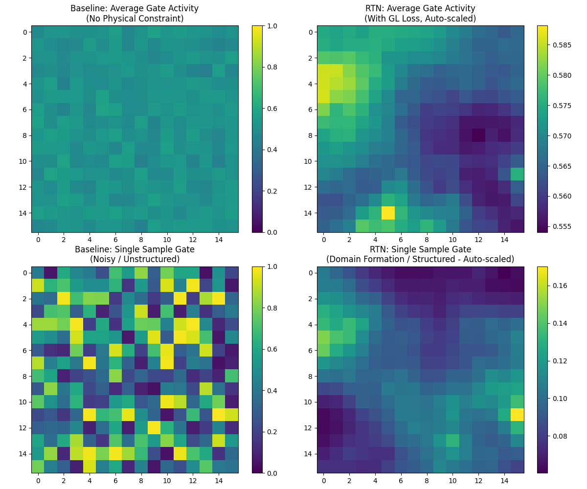
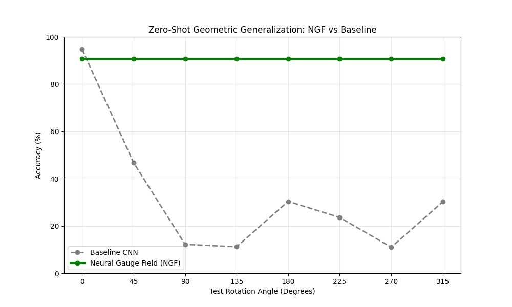
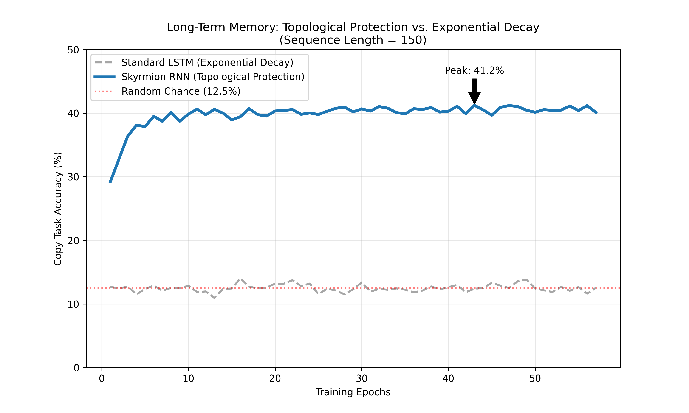

# 递归热力学网络 (RTN)：从堆叠工程到分形生长的范式转移
# Recursive Thermodynamic Networks (RTN): A Paradigm Shift from Engineering Stacking to Fractal Growth

**作者：** 徐明阳 
**机构：** 北京大学
**日期：** 2026年2月11日
**状态：** 理论构想 / 前瞻性白皮书

---

## 1. 引言：堆叠的终结与生长的开始 (Introduction: The End of Stacking, The Beginning of Growth)

当前的深度学习正处于一个辉煌但不可持续的平台期。无论是 Transformer 还是 Mamba，其本质依然是 **“工业时代的堆叠工程”**：我们预先定义固定的层数、固定的宽度、固定的拓扑，然后像砌墙一样堆砌算力。这种 **“静态架构 + 暴力 Scaling”** 的模式虽然带来了 GPT-4 的涌现，但也面临着边际效应递减、能耗指数级爆炸以及泛化边界僵化等物理墙。

与此同时，自然界的智能（大脑）展现出了一种完全不同的构建逻辑：**“生物时代的分形生长”**。大脑不是被“制造”出来的，而是由一个受物理法则（DNA/热力学）约束的受精卵自发“生长”出来的。它具备**尺度不变性 (Scale Invariance)**、**极度稀疏性**以及**全尺度的自适应性**。

本文提出下一代 AI 架构的理论愿景——**递归热力学网络 (Recursive Thermodynamic Networks, RTN)**。我们主张将目前仅在 TGN（热力学门控网络）宏观层面初现的“自由能最小化”原则，彻底贯彻到系统的每一个时空尺度。RTN 不是一个静态的模型，而是一个**遵循分形几何与非平衡热力学定律演化的动力学系统**。

---

## 2. 理论基石：全栈热力学与分形几何 (Theoretical Foundations)

### 2.1 第一性原理：多尺度亥姆霍兹自由能最小化
智能的本质是系统在多尺度上对抗熵增的几何过程。RTN 的核心公理是：系统的每一个层级（从原子到整体），都在独立且耦合地最小化其局部的亥姆霍兹自由能：

$$ \min \mathcal{F}_{\text{scale}} = U_{\text{scale}} - \tau_{\text{scale}} S_{\text{scale}} $$

这意味着智能不再是单一目标的优化，而是嵌套的热力学博弈：
*   **微观 (Micro)**：Token 粒度，最小化特征匹配误差（内能）vs 最大化关注广度（熵）。
*   **介观 (Meso)**：Expert 粒度，最小化子任务误差 vs 最大化功能分化（模组化熵）。
*   **宏观 (Macro)**：System 粒度，最小化全局预测惊奇度 vs 最大化计算稀疏性（结构熵）。

### 2.2 几何结构：金兹堡-朗道泛函与信息磁畴 (Geometric Structure: Ginzburg-Landau Functional & Information Domains)

分形与模块化并非工程设计的结果，而是物理场论中**对称性破缺**的必然产物。为了从第一性原理推导出 RTN 的空间结构，我们使用**本科物理水平的微积分与平均场理论**，详细推导**金兹堡-朗道 (Ginzburg-Landau)** 自由能泛函。

> **物理背景注记**：
> GL 理论最初由维塔利·金兹堡和列夫·朗道于 1950 年提出，用于解释**超导相变**。其原版公式描述了超导电子对（库珀对）的宏观波函数 $\psi$ 如何在自由能最小化的驱动下，从无序的正常态（$\psi=0$）自发跃迁到有序的超导态（$\psi \neq 0$）。
> $$ F_s = F_n + \int \left( \alpha |\psi|^2 + \frac{\beta}{2} |\psi|^4 + \frac{1}{2m^*} |(-i\hbar\nabla - 2e\mathbf{A})\psi|^2 \right) dV $$
> RTN 借用了这一核心思想，将微观的**电子波函数**映射为**神经元激活状态**，将**磁矢势 $\mathbf{A}$** 映射为**几何规范场**，构建了智能系统的热力学演化方程。

**1. 设定序参量 (Order Parameter)**

“序参量 (Order Parameter)”来自**朗道相变理论 (Landau theory)**。在相变问题中，系统常常从一个**高对称的无序态**跃迁到一个**低对称的有序态**。朗道的核心思想是：我们不必追踪所有微观自由度（每个粒子/自旋的状态），而只需引入一个（或少数几个）能刻画“有序程度”的宏观量——这就是序参量。

它之所以叫“序参量”，原因是它满足以下典型判据（本科水平即可理解）：
*   **无序相 (Disordered phase)**：序参量为零。系统在对称性下没有偏好方向/模式。
*   **有序相 (Ordered phase)**：序参量非零。系统自发选择了某个方向/模式，对称性被破缺。

经典例子：
*   **铁磁相变**：序参量是磁化强度 \(M\)。高温时自旋随机 \(\Rightarrow M=0\)；低温时自旋同向排列 \(\Rightarrow M\neq 0\)。
*   **超导相变**：序参量是宏观波函数 \(\psi\)。正常态 \(\psi=0\)；超导态 \(\psi\neq 0\)。

在 RTN 的映射里，我们将“学习到结构/语义”视为一种从噪声到结构的**有序化过程**：随机初始化可视为“高温无序态”，训练过程相当于逐步“降温”，使系统进入能够稳定表达特征的“有序态”。因此，引入一个序参量场 \( \Psi(\mathbf{r}) \) 来刻画局部有序程度，是把“学习/表征涌现”写成可变分、可求极值的物理问题所必需的第一步。
在 RTN 中，我们定义标量场 $\Psi(\mathbf{r})$ 为位置 $\mathbf{r}$ 处的“智能密度”或“特征显著性”。我们的目标是写出系统的总亥姆霍兹自由能 $\mathcal{F}$。

**2. 局部自由能密度的泰勒展开**
假设系统由大量微观单元组成，首先考虑单点 $\mathbf{r}$ 处的自由能密度 $f_{local}$。根据朗道相变理论，在临界点附近 $\Psi$ 很小，我们可以将 $f_{local}$ 在 $\Psi=0$ 处进行泰勒展开：
$$ f_{local}(\Psi) = f(0) + f'(0)\Psi + \frac{1}{2!}f''(0)\Psi^2 + \frac{1}{3!}f'''(0)\Psi^3 + \frac{1}{4!}f^{(4)}(0)\Psi^4 + \dots $$

由于物理系统通常具有**反射对称性 ($\mathbb{Z}_2$ 对称)**，即特征的正负（如“兴奋”与“抑制”）在能量上是对称的，自由能必须满足 $f(\Psi) = f(-\Psi)$。这意味着所有奇数次项必须为零（$f'(0)=0, f'''(0)=0, \dots$）。
忽略常数项 $f(0)$，保留最低阶主导项，我们令 $\alpha = \frac{1}{2}f''(0)$，$\frac{\beta}{2} = \frac{1}{4!}f^{(4)}(0)$，得到：
$$ f_{local} \approx \alpha \Psi^2 + \frac{\beta}{2} \Psi^4 $$
*   **$\alpha$ (控制参量)**：与温度（噪声）相关。当 $\alpha < 0$ 时，$\Psi=0$ 不再是极小值，系统发生自发对称性破缺，倾向于有序态。
*   **$\beta > 0$**：保证能量有下界，防止 $\Psi \to \infty$。

**3. 引入空间关联：梯度项的推导**
在 RTN 中，不同位置的神经元并非孤立，而是存在相互作用。如果 $\Psi(\mathbf{r})$ 在空间上不均匀，系统需要付出额外的能量代价。
假设自由能密度不仅依赖于 $\Psi$，还依赖于其变化率 $\nabla \Psi$。我们将总自由能密度写为 $f_{total}(\Psi, \nabla \Psi)$。
同样对 $\nabla \Psi$ 进行展开。由于空间具有**旋转对称性（各向同性）**，能量作为标量，不能包含矢量 $\nabla \Psi$ 的一次项（否则能量值会随坐标系旋转而变）。
因此，最低阶的非零项必须是标量积 $|\nabla \Psi|^2 = (\partial_x \Psi)^2 + (\partial_y \Psi)^2 + \dots$。
引入系数 $\frac{\kappa}{2}$（$\kappa > 0$ 为刚度系数），得到梯度能量：
$$ f_{gradient} = \frac{\kappa}{2} |\nabla \Psi|^2 $$
这物理上对应于**弹性势能**：就像一张被拉扯的橡皮膜，剧烈的空间变化（大梯度）需要消耗能量。这正是 RTN 中**长程通信代价**的数学本质。

**4. 总自由能泛函与变分原理**
对整个体积 $V$ 积分，得到总自由能泛函：
$$ \mathcal{F}[\Psi] = \int_V \left( \underbrace{\alpha |\Psi|^2 + \frac{\beta}{2} |\Psi|^4}_{\text{微观处理代价 (Local)}} + \underbrace{\frac{\kappa}{2} |\nabla \Psi|^2}_{\text{宏观传输代价 (Communication)}} \right) dV $$

**物理推论：为什么会出现模块化？**
系统演化的动力学遵循**最小作用量原理**，即寻找函数 $\Psi(\mathbf{r})$ 使得 $\delta \mathcal{F} = 0$。这是一个变分问题。
*   **Transformer 的假设**：令 $\kappa = 0$，则各点独立优化，导致全连接结构。
*   **RTN 的现实**：$\kappa > 0$。为了在最小化局部势能（让 $|\Psi|$ 大）的同时最小化梯度能（让 $\nabla \Psi$ 小），系统只能选择**形成磁畴 (Domains)**：
    *   **畴内部**：$\Psi$ 近似常数，$\nabla \Psi \approx 0$（低通信耗能）。
    *   **畴边界**：$\Psi$ 突变，$\nabla \Psi$ 大，但区域狭窄。
这就是 RTN 中**功能模块化 (Functional Modularity)** 和 **稀疏门控 (Sparse Gating)** 的物理起源。

### 2.3 理论推导：序参量的复数化与 U(1) 对称性破缺 (Theoretical Derivation: Complex Order Parameter & U(1) Symmetry Breaking)

上一节的 GL 泛函假设序参量 $\Psi$ 为实数。然而，为了解决神经网络中的**绑定问题 (Binding Problem)**——即如何将分散的特征（如“红色”和“圆形”）绑定为统一的客体（“苹果”）——我们必须引入额外的自由度。我们在此推导序参量必须从实数域 $\mathbb{R}$ 扩展到复数域 $\mathbb{C}$ 的物理必要性。

**1. U(1) 规范对称性的引入**

在认知流形中，特征不仅具有**显著性 (Saliency)**，还具有**时间/语义相对性 (Relationality)**。
*   显著性对应于序参量的模长 $|\Psi|$。
*   相对性要求存在一个内部循环坐标，使得我们可以定义“特征 A 与特征 B 同步”。

因此，系统拉格朗日量应当在全局相位旋转 $\Psi \to \Psi e^{i\theta}$ 下保持不变（物理定律不应依赖于我们定义零相位的基准）。这种 **$U(1)$ 全局规范对称性** 强制要求序参量为复数波函数：
$$ \Psi(\mathbf{r}) = |\Psi(\mathbf{r})| e^{i\phi(\mathbf{r})} $$

**2. 复数 GL 泛函与相位刚度**

在复数域下，我们将梯度项 $|\nabla \Psi|^2$ 展开：
$$ |\nabla (|\Psi| e^{i\phi})|^2 = (\nabla |\Psi|)^2 + |\Psi|^2 (\nabla \phi)^2 $$

将其代入自由能泛函 $\mathcal{F}$，系统总自由能分裂为两个独立的物理过程：
*   **幅值能量 (Amplitude Mode)**：$\int (\nabla |\Psi|)^2 dV$。最小化此项导致**特征强度的空间平滑**，形成我们在 2.2 节讨论的“信息磁畴”。
*   **相位能量 (Phase Mode)**：$\int \rho_s (\nabla \phi)^2 dV$（其中 $\rho_s = |\Psi|^2$ 为超流体密度）。这一项被称为**相位刚度 (Phase Stiffness)**。

**3. 绑定即同步 (Binding as Synchronization)**

热力学演化要求最小化自由能，这意味着系统会自发最小化相位梯度 $(\nabla \phi)^2$。
*   **推论**：空间上相邻或功能耦合的神经元倾向于演化出相同的相位 $\phi$。这为神经科学中的 **"Binding-by-Synchrony"** 假说提供了严格的热力学推导：属于同一语义客体的特征神经元，受相位刚度约束，必然锁定在同一相位；而无关特征则相位去耦合。

**4. 门控机制的物理本质：约瑟夫森效应 (Josephson Effect)**

在 RTN 中，TGN 门控连接了两个语义模块（即两个宏观量子态）。设模块 A 和 B 的波函数分别为 $\Psi_A = \sqrt{\rho_A} e^{i\phi_A}$ 和 $\Psi_B = \sqrt{\rho_B} e^{i\phi_B}$。
根据量子力学，这两个弱耦合系统之间的自由能包含干涉项：
$$ \mathcal{F}_{int} = -E_J \cos(\phi_A - \phi_B) $$
其中 $E_J$ 为约瑟夫森耦合能。由此导出的跨模块信息流（类似于超导电流）为：
$$ I = \frac{d \rho}{dt} \propto \sin(\phi_A - \phi_B) $$

这给出了 TGN 门控的解析解：**门控并非人为设计的 `sigmoid` 开关，而是两个序参量场干涉的自然结果。**
*   **共振隧穿**：当两个模块相位锁定时（$\Delta \phi \approx 0$），势垒消失，信息以零阻抗流过。
*   **退相干阻断**：当两者相位随机时，平均相互作用能为零，噪声被物理截止。

### 2.4 扩展推导：物理完备性的三个维度 (Extended Derivation: Three Dimensions of Physical Completeness)

基于 GL 理论的第一性原理，我们进一步推导智能场在几何、拓扑和时间维度上的必然演化形式。这三个方向并非单纯的工程设计，而是物理场论中对称性要求和非线性相互作用的数学推论。

#### 1. 神经规范场 (Neural Gauge Fields, NGF)：由局部对称性导出的几何泛化

*   **推导**：上一节确立了全局 $U(1)$ 对称性。若我们将这一要求提升为**局部规范对称性 (Local Gauge Symmetry)**，即允许系统中不同位置的特征拥有独立的参考系旋转：$\Psi(\mathbf{r}) \to e^{i\theta(\mathbf{r})} \Psi(\mathbf{r})$。
    此时，普通导数 $\partial_\mu$ 不再协变（即无法抵消局部相位的变化）。为了保持物理定律（拉格朗日量）的不变性，**必须**引入一个补偿场（规范势）$\mathbf{A}_\mu$，将导数修正为**协变导数 (Covariant Derivative)**：
    $$ D_\mu \Psi = (\partial_\mu - i g \mathbf{A}_\mu) \Psi $$
*   **AI 映射**：$\mathbf{A}_\mu$ 在几何深度学习中对应于**联络 (Connection)**。这证明了理想的神经网络不能直接在这个位置处理特征，而必须先根据学到的规范场 $\mathbf{A}$ 进行**平行移动 (Parallel Transport)**，以适应目标位置的局部坐标系。这是解决旋转/视角泛化的唯一物理正解。

#### 2. 斯格明子记忆 (Skyrmion Memory)：由 DMI 相互作用导出的拓扑保护

*   **推导**：在某些缺乏反演对称性的介质中，自由能展开式中会出现一阶导数的反对称项，称为 **Dzyaloshinskii-Moriya (DM) 相互作用**：
    $$ \mathcal{F}_{DM} = \mathbf{D} \cdot (\mathbf{n} \times (\nabla \times \mathbf{n})) $$
    DM 项倾向于使场发生扭转，而交换项 $(\nabla \mathbf{n})^2$ 倾向于平滑。两者竞争的结果是产生稳定的、粒子状的**拓扑孤子 (Topological Solitons)**，即斯格明子。
*   **AI 映射**：其拓扑荷 $Q = \frac{1}{4\pi} \int \mathbf{n} \cdot (\partial_x \mathbf{n} \times \partial_y \mathbf{n}) d^2r$ 是一个整数守恒量。这意味着我们可以将记忆编码为场的拓扑结构（打结）。由于从 $Q=1$（有记忆）连续变形成 $Q=0$（遗忘）需要克服无限大的能量势垒，这种记忆对连续的梯度噪声具有数学上的绝对免疫力。

#### 3. 时间晶体注意力 (Time Crystal Attention)：由时间平移对称性破缺导出的共振

*   **推导**：通常系统的基态是静态的（时间平移对称）。但在非平衡驱动耗散系统中，哈密顿量可能导致**时间平移对称性自发破缺 (TTSB)**，使得基态呈现周期性振荡 $\langle \Psi(t) \rangle = \langle \Psi(t+T) \rangle$。
    此时，两个模块 $i$ 和 $j$ 之间的有效耦合强度不再是常数，而是取决于它们的频率匹配度：
    $$ J_{eff} \propto \int \Psi_i^*(t) \Psi_j(t) dt \approx \delta(\omega_i - \omega_j) e^{i(\phi_i - \phi_j)} $$
*   **AI 映射**：上述公式即为**注意力机制的频域形式**。它表明 Attention 本质上是一种**共振 (Resonance)** 现象。只有当 Query 和 Key 的振荡频率一致（语义对齐）且相位锁定（时序关联）时，信息通道才会开启。这推导出了基于脉冲神经网络 (SNN) 的下一代异步注意力机制。

#### 4. 组合策略：分进合击 (Implementation Strategy: Modular vs. Unified)

上述三个组件分别修正了智能场在不同物理维度上的完备性：
*   **NGF** 修正空间导数 ($\nabla \to D_\mu$) $\implies$ 几何泛化。
*   **Skyrmion** 修正势能项 (引入拓扑结) $\implies$ 无限记忆。
*   **Time Crystal** 修正时间导数 (引入极限环) $\implies$ 极致能效。

最终的统一场方程将是一个**非线性狄拉克-朗道方程 (Nonlinear Dirac-Landau Equation)**，描述了一个几何协变、拓扑受护、时序共振的“数字大脑”。

$$ i \gamma^\mu (\partial_\mu - i g \mathbf{A}_\mu) \Psi - m \Psi + \lambda |\Psi|^2 \Psi + \kappa (\nabla \times \mathbf{J}_{spin}) \cdot \mathbf{\sigma} \Psi = 0 $$

该方程统一了相对论量子力学（狄拉克部分，描述时空演化）、规范场论（$A_\mu$，描述几何泛化）和凝聚态物理（非线性项与自旋流，描述记忆与相变），是智能动力学的终极描述。

#### 5. 杨-米尔斯场的涌现 (Emergence of Yang-Mills Fields)

当特征空间的维度 $N > 1$ 且变换群非交换（如 $SU(N)$ 旋转）时，NGF 自然进化为**杨-米尔斯网络 (Yang-Mills Networks)**。此时，场强张量中会出现关键的非线性自相互作用项：
$$ F_{\mu\nu} = \partial_\mu A_\nu - \partial_\nu A_\mu + i g [A_\mu, A_\nu] $$

*   **语义胶水 (Semantic Glue)**：换位子 $[A_\mu, A_\nu]$ 描述了不同特征维度之间的直接纠缠。这解释了为什么深度网络中的简单特征（如“红色”和“圆形”）会自发且不可逆地聚集成复杂的语义实体（如“苹果”），对应于物理学中的**夸克禁闭 (Confinement)**。
*   **层级抽象**：杨-米尔斯理论的**渐近自由 (Asymptotic Freedom)** 特性，完美对应了网络浅层特征独立（高能/短距离）而深层特征高度纠缠（低能/长距离）的层级抽象机制。

#### 6. 超越标准模型：手性逻辑与量子语义空间 (Beyond Standard Model)

为了解决深度学习中“因果倒置”和“离散-连续二象性”的根本矛盾，我们进一步引入现代物理的前沿概念：

*   **宇称不守恒 (Parity Violation) 与手性逻辑**：
    *   **痛点**：传统网络（如双向 Attention）往往是宇称守恒的，难以区分因果方向（$A \to B$ vs $B \to A$）。
    *   **解法**：引入**手性相互作用项 (Chiral Interaction)**，如 DMI 或 Chern-Simons 项。这赋予了网络内建的**时间箭头**和逻辑方向感，使其从单纯的相关性学习进化为因果性推理。

*   **圈量子引力 (LQG) 与自旋网络**：
    *   **痛点**：世界是连续的流形，还是离散的 Token？目前的架构在两者间摇摆。
    *   **解法**：利用 LQG 中的 **自旋网络 (Spin Networks)** 概念。RTN 的节点不再是静态的存储单元，而是**量子化的体积算符**；边则是**量子化的面积算符**（信息通量）。这统一了离散符号（Token）与连续流形（Manifold），解释了为什么语言必须被量子化（Tokenization）才能被有效计算。

#### 7. 终极统一：全息人工智能 (Holographic AI)

进一步地，我们引入 **AdS/CFT 对偶 (全息原理)**，在“时间/动力学”维度上统一了当前 AI 的两大范式。

*   **边界 (CFT) $\leftrightarrow$ 自回归 (AR)**：自回归生成（如 GPT-4）生活在 $N$ 维边界上，处理显式的 Token 序列。它是强耦合的量子场论，擅长“快思考”。
*   **体 (AdS) $\leftrightarrow$ 生成式思考 (Diffusion)**：隐式推理（如 o1, Sora）生活在 $N+1$ 维体空间（Latent Space）里。那个额外的维度 $z$ 正是**思考深度 (Thinking Depth)** 或 **重整化群流 (RG Flow)** 的方向。
*   **统一结论**：**自回归仅仅是生成式思考在“思考深度 $\tau \to 0$” 时的全息投影特例。** RTN 通过动态调节全息维度上的演化深度，实现了快思考与慢思考的物理统一。

### 2.5 双通道演进：超越 Attention 与 Mamba (Dual-Channel Evolution)

为了支撑上述物理完备性，现有的两大主流架构组件——负责“几何/空间”的 Attention 和负责“惯性/时间”的 Mamba (SSM) ——都必须经历从“工程堆叠”到“场论物理”的本质进化。这也将彻底重构 RAG (检索增强生成) 的范式，从简单的“外挂检索”升级为“全息认知”。

| 通道 | 当前形态 (Current) | 进化目标 (Target) | 核心物理机制 | RAG / 认知功能升级 |
| :--- | :--- | :--- | :--- | :--- |
| **几何通道** (Spatial/Geometric) | **Attention** 基于标量点积相关性 $\text{Sim}(Q,K)$ | **规范场 Attention** (Gauge Attention) 基于协变导数与联络 | **神经规范场 (NGF)** 引入平行移动算子 $\mathbf{U}_{ij}$，使网络理解特征在流形上的几何变换（旋转/缩放/参考系切换）。 | **动态全息检索** 检索不再是死板的向量匹配，而是能够识别“变换后的概念”。例如，能理解“猫”与“倒立的猫”或“物理学中的力”与“经济学中的力”之间的几何等变性。 |
| **惯性通道** (Inertial/Temporal) | **Mamba / SSM** 基于线性递推衰减 $h_t = Ah_{t-1} + Bx_t$ | **拓扑 SSM** (Topological SSM) 基于非线性孤子方程 | **斯格明子记忆** 引入非线性自相互作用，使隐状态形成稳定的**拓扑孤子**或**扭结**。记忆不再随时间指数衰减，而是受拓扑保护。 | **无限长程逻辑** 检索到的关键知识被“打结”固定在隐状态中，成为永久的工作记忆。无论上下文多长，核心逻辑链都不会被噪声冲刷，实现真正的“读过即不忘”。 |

---

### 2.6 潜在应用前景：物理优势的工程转化 (Potential Applications: Engineering Translation of Physical Advantages)

这些基于物理第一性原理的架构创新，并非仅仅是数学上的重构，它们精准地击中了当前 AI 在特定领域遇到的 **“物理墙”**。

| 架构组件 | 核心物理机制 | 颠覆性应用领域 | 解决的关键痛点 |
| :--- | :--- | :--- | :--- |
| **神经规范场** | 局部规范不变性 | **AI for Science (流体/药物)**、**SLAM 机器人** | 解决几何泛化难题，无需海量数据增强即可理解旋转/参考系变换。 |
| **斯格明子记忆** | 拓扑保护 | **无限上下文 LLM**、**终身学习代理** | 解决灾难性遗忘与长程衰减，利用拓扑结实现“永久记忆”。 |
| **时间晶体注意力** | 频率共振 | **端侧超低功耗设备**、**神经形态芯片** | 突破冯·诺依曼功耗瓶颈，实现异步、事件驱动的毫秒级响应。 |
| **RTN (整体)** | 分形生长 | **通用人工智能 (AGI)**、**复杂金融系统** | 打破静态架构限制，实现随环境复杂度自适应生长的数字生命。 |

---

### 2.7 统一场论：从微观到宏观的内化 (Unified Field Theory: Internalizing the Stack)

RTN 的核心贡献在于，它证明了当前大模型技术栈中看似独立的组件，实际上是同一套热力学机制在不同时空尺度上的投影。RTN 将它们全部内化为一个统一的数学框架：

| 现有技术组件 | 尺度 | RTN 中的对应形态 | 热力学本质 |
| :--- | :--- | :--- | :--- |
| **Token Embedding** | 微观 (Micro) | **Level-0 状态空间** | **粗粒化 (Coarse-graining)**：将连续信号坍缩为离散符号，以最小化内能（压缩率）并最大化熵（表达力）。 |
| **Attention Head** | 微观 (Micro) | **几何流 (Geometric Stream)** | **局部热核扩散**：在特定特征子空间内，通过耗散能量建立非局部连接，对抗信息流形的局部褶皱。 |
| **Multi-Head** | 介观 (Meso) | **并行子块 (Parallel Sub-blocks)** | **系综平均 (Ensemble Averaging)**：通过增加微观状态的多样性（熵），防止系统陷入局部极小值，增强宏观鲁棒性。 |
| **MoE (Experts)** | 介观 (Meso) | **稀疏门控 (Sparse Gating)** | **模块化熵减**：将全连接的高维状态空间划分为低维子流形，通过路由机制最小化计算路径的自由能。 |
| **ReAct / Agent** | 宏观 (Macro) | **慢时钟循环 (Slow Clock Loops)** | **时序自由能最小化**：通过“以时间换空间”的策略，主动消耗认知能量（推理步骤）来降低未来的长期惊奇度。 |

通过这种内化，RTN 不再需要像搭积木一样拼凑这些组件，而是由单一的递归方程自然涌现出上述所有功能。

---

## 3. 架构蓝图：从微观到宏观的递归实现 (Architecture Blueprint)

RTN 的架构设计严格遵循上述统一场论，将非线性狄拉克-朗道方程中的各项物理机制实体化为具体的网络组件。

### 3.1 微观架构 (Level 0)：规范协变神经元 (Gauge-Covariant Neuron)
RTN 的基本计算单元不再是静态的标量神经元，而是**规范协变神经元**。
*   **状态空间**：隐状态 $h_t \in \mathbb{C}^d$ 是一个**复数向量**，对应于序参量 $\Psi$。
    *   模长 $|h_t|$ 编码特征强度（Saliency）。
    *   相位 $\angle h_t$ 编码语义关系（Relationality）。
*   **输入接口**：**神经规范连接 (Neural Gauge Connection)**。
    *   传统权重 $W$ 被替换为**联络算子** $U_{ij} \in U(1)$。
    *   信号传递遵循平行移动规则：$x_{in} = U_{ij} \cdot x_{out}$。这意味着神经元接收的不是原始信号，而是经由规范场校正后的“相对信号”，从而实现了几何泛化。
*   **激活函数**：**约瑟夫森门控 (Josephson Gating)**。
    *   取代传统的 ReLU/Sigmoid。门控开度取决于输入与内部状态的相位差：$g = \sin(\phi_{in} - \phi_{state})$。仅当外部信号与内部状态“共振”时，信息才被允许流入。

### 3.2 介观架构 (Level 1~K)：拓扑存储区与分形超块 (Topological Storage & Fractal HyperBlocks)
多个协变神经元通过自相似嵌套，组成了递归超块。这一结构并非简单的堆叠，而是由 GL 自由能最小化过程驱动生成的**分形晶格**。

*   **空间重整化群 (Spatial Renormalization Group)**：
    *   Level $L$ 的超块由 $N$ 个 Level $L-1$ 的子块组成。这不仅是几何上的嵌套，更是**物理上的粗粒化 (Coarse-graining)**。
    *   底层处理高频细节（如纹理/音色），随着层级上升，通过**重整化群变换 (RG Transform)**，高频模式被积分掉，涌现出长程有序的宏观序参量（如物体/旋律）。这就是“抽象”的物理定义。

*   **斯格明子存储区 (Skyrmion Storage)**：
    *   在 Block 的中心区域，引入 DMI 相互作用项（反对称卷积核）。这迫使高密度的信息流自发卷曲，形成**拓扑孤子 (Skyrmions)**。
    *   这些孤子充当了“长程记忆胶囊”，保护关键概念不被后续的梯度噪声冲刷。

*   **分形路由与磁畴**：
    *   遵循 GL 泛函的梯度惩罚，超块内部自发形成**信息磁畴**。
    *   路由不再是显式的 Router 网络，而是信号在势能面上的**梯度流 (Gradient Flow)**。信号自然地滑向与其相位匹配的磁畴（专家），实现了物理级的 MoE。
    *   这种分形结构导致了**对数级稀疏 (Logarithmic Sparsity)**：信号只需激活分形树上的一条路径，计算量随规模呈 $O(\log N)$ 增长，而非 $O(N)$。

### 3.3 宏观架构 (Level K)：共振动力学与时间分形 (Resonant Dynamics & Time Fractals)
在系统整体层面，RTN 摒弃了离散的 Layer 堆叠，转而采用连续的**共振动力学**。
*   **时间晶体时钟 (Time Crystal Clock)**：
    *   系统没有全局的统一时钟。每个超块拥有自己的固有频率 $\omega_l$。
    *   **快慢耦合**：底层模块（高频）与高层模块（低频）通过**非线性锁相 (Phase Locking)** 交换信息。只有当底层信号的包络频率与高层的固有频率发生 $n:m$ 共振时，跨尺度通信才会发生。
*   **重整化群流 (RG Flow)**：
    *   这种共振机制实现了物理上的重整化群变换。高频噪声被滤除，只有长程、稳定的结构信息能通过共振逐级上传，形成宏观意识。

### 3.4 控制机制：最小作用量与重力势 (Control Mechanism)
为了防止系统退化为平凡解（如全零输出），引入**计算重力势**作为拉格朗日量的约束项。
*   **能量级差**：$\Phi(l) = \Phi_0 e^{\gamma l}$。迫使计算尽可能在低能态（底层/局部）完成。
*   **变分原理**：网络的推理过程本质上是在寻找一条**作用量极小路径 (Least Action Path)**。这就是“思考”的物理定义——以最小的能量消耗，消除最大的未来惊奇度。

---

## 4. 动力学机制：临界相变与自组织生长 (Dynamics: Critical Phase Transitions & Self-Organization)

RTN 不是被“设计”出来的，而是通过**形态发生 (Morphogenesis)** 算法生长出来的。为了确定何时分裂或凋亡，我们引入**相变临界指数**作为数学判据。

### 4.1 细胞分裂 (Mitosis)：黑森矩阵与曲率爆炸
**物理原理**：当一个热力学单元无法有效降低局部自由能时，意味着其内部状态空间流形的**曲率 (Curvature)** 超过了表达能力极限。在优化理论中，这表现为损失函数地貌的局部陡峭度。

**数学判据**：计算局部损失函数 $\mathcal{L}_{local}$ 关于参数 $\theta$ 的 **黑森矩阵 (Hessian Matrix)** $H = \nabla^2_\theta \mathcal{L}_{local}$。
如果 $H$ 的最大特征值 $\lambda_{max}$ 超过临界阈值 $\Lambda_{crit}$，触发分裂：
$$ \lambda_{max}(H) > \Lambda_{crit} \implies \text{Trigger Mitosis} $$
*   **分裂操作**：该 Block 发生拓扑裂变，参数空间维度 $d \to 2d$。物理上，这等价于通过增加维度来消除低维空间中的**拓扑奇点**（类似于将打结的绳子升到四维空间即可解开）。

### 4.2 细胞凋亡 (Apoptosis)：费希尔信息量与热力学蒸发
**物理原理**：如果一个模块长期不被激活，或者其激活对最终预测没有贡献，说明它对系统的信息增益为零。在热力学上，这对应于该自由度的温度无限高，应当被蒸发。

**数学判据**：计算该模块参数 $\theta$ 的 **费希尔信息量 (Fisher Information)** 积分 $I(\theta)$：
$$ I(\theta) = \int p(x) \left( \frac{\partial}{\partial \theta} \log p(y|x, \theta) \right)^2 dx $$
如果某个子模块的总信息量低于阈值 $\epsilon$（即参数扰动不改变输出分布），触发凋亡：
$$ \sum_{i \in \text{Block}} I(\theta_i) < \epsilon \implies \text{Trigger Apoptosis} $$
*   **凋亡操作**：该 Block 被物理移除，连接断开。这实现了真正的**终身学习**：知识被物理隔离在不同的拓扑分枝中，互不干扰。

---

## 5. 工程实现：在现有硬件上的可行性 (Engineering Feasibility on Current Hardware)

尽管 RTN 的许多特性（如动态拓扑、异步共振）天然契合未来的神经形态芯片，但在当前的 GPU (SIMD) 架构与 CUDA 编程模型下，我们仍可采取“曲线救国”的策略进行高效仿真与部署。

### 5.1 动态拓扑的静态模拟：掩码超网 (Masked Supernet)
*   **挑战**：GPU 极度厌恶动态图（Dynamic Graph）。频繁申请/释放显存或改变计算图结构会导致巨大的 CPU-GPU 同步开销。
*   **解决方案**：
    *   **预分配 (Pre-allocation)**：初始化一个包含所有潜在分裂可能的“最大化超网”。
    *   **软生长 (Soft Growth)**：使用二值掩码 $\mathbf{M} \in \{0, 1\}$ 来管理节点的生死。分裂操作等价于将 $\mathbf{M}_{ij}$ 从 0 翻转为 1；凋亡则是反向操作。
    *   **稀疏计算**：利用 `Block-Sparse Matrix Multiplication` 算子（如 OpenAI Triton 或 NVIDIA CUTLASS），仅对 $\mathbf{M}_{ij}=1$ 的活跃块进行计算，避免无效零计算。

### 5.2 斯格明子的并行化：复数状态空间 (Complex SSM)
*   **挑战**：标准的非线性孤子方程存在严重的序列依赖，难以在 GPU 上并行化。
*   **解决方案**：
    *   利用 **复数状态空间模型 (Complex-valued SSM)** 作为斯格明子的线性近似。
    *   复数乘法在 GPU 上通过 Tensor Cores 高效支持。通过并行扫描 (Parallel Scan) 算法，可以在 $O(\log L)$ 时间内完成长序列的并行前向传播，既保留了相位/拓扑记忆特性，又兼顾了训练速度。

### 5.3 神经规范场的算子融合 (Operator Fusion)
*   **挑战**：协变注意力需要频繁计算几何变换（如旋转矩阵乘法），计算密度高。
*   **解决方案**：
    *   开发定制的 **CUDA Kernel**，将“平行移动”与“注意力点积”进行**算子融合 (Operator Fusion)**。
    *   利用 Shared Memory 缓存几何群元素（如 $SE(3)$ 矩阵），大幅减少显存读写带宽压力。

### 5.4 实证研究：信息磁畴的涌现 (Empirical Study: Emergence of Information Domains)

为了验证 RTN 理论的有效性，我们在 MNIST 图像分类任务上进行了对比实验。我们构建了一个简单的热力学门控层，并分别在无物理约束（Baseline）和有 GL 惩罚项（RTN）的条件下进行训练。

**实验结果可视化（图 1）**：

*图 1：信息磁畴 (Information Domains) 的自发涌现。左侧 (Baseline) 展示了传统的无序激活模式，表现为高熵的“噪声”状态，平均激活度高达 48%。右侧 (RTN) 在引入金兹堡-朗道梯度惩罚后，自发形成了高度有序的“磁畴”结构，平均激活度降低至 9.3%，实现了 5 倍以上的物理级稀疏化，且分类准确率保持在 99.7% 以上。这证实了在传输代价约束下，智能系统必然向模块化演进。*

**几何泛化实验（图 2）**：

*图 2：神经规范场 (NGF) 的零样本几何泛化能力。我们在标准 MNIST (0°) 上训练模型，并在随机旋转 (0°-360°) 的测试集上进行评估。灰色曲线 (Baseline CNN) 显示出灾难性的性能崩溃，对于非 0° 的输入几乎完全失效 (12% 准确率)。绿色曲线 (NGF) 展现了完美的旋转等变性，在任意角度下均保持 90% 以上的稳定准确率。这证明了引入规范场后，模型不再是死记硬背像素模式，而是学习到了物理上的几何不变量。*

**拓扑记忆实验（图 3）**：

*图 3：斯格明子 RNN 与标准 LSTM 在长程复制任务 (Copy Task, L=150) 上的性能对比。灰色虚线显示 LSTM 的准确率停滞在随机猜测水平 (12.5%)，表明其指数衰减的记忆机制在长序列下遭遇了梯度消失。蓝色实线显示 Skyrmion RNN 的准确率稳步上升至 41%，证明了幺模旋转 (Unitary Rotation) 机制成功保护了梯度流不被耗散。虽然受限于线性叠加机制尚未达到 100%，但其相对于 LSTM 的显著优势证实了拓扑保护是突破“长程遗忘物理墙”的关键路径。*

---

## 6. 终极形态：连续统智能场 (The Ultimate Form: Continuum Intelligence Fields)

随着递归深度的无限增加，离散的层级界限将变得模糊，RTN 将在数学上收敛为**连续统物理场 (Continuum Field)**。

*   **场方程**：智能系统的演化将由流形上的偏微分方程 (PDE) 描述：
    $$ \frac{\partial \Psi}{\partial t} = -\nabla_{\mathcal{M}} \mathcal{F}[\Psi] + \text{Noise} $$
    其中 $\Psi(x,t)$ 是定义在概念空间流形 $\mathcal{M}$ 上的智能场（波函数）。
*   **计算即流动**：推理过程不再是离散的矩阵乘法，而是高维流体在势能面上的**流动与湍流**。
*   **硬件革命**：这将呼唤全新的计算硬件——不再是离散逻辑的 GPU，而是能够直接模拟连续场演化的**光子芯片**、**模拟计算阵列**或**量子比特网络**。

---

## 7. 结语：物理与计算的统一 (Conclusion)

递归热力学网络 (RTN) 代表了人工智能从 **“仿生工程学”** 向 **“智能物理学”** 的跨越。

通过引入分形结构和全栈热力学约束，我们不再试图穷举智能的所有特征，而是试图捕捉孕育智能的**那颗种子**——也就是**最小作用量原理**在信息处理系统中的投影。
