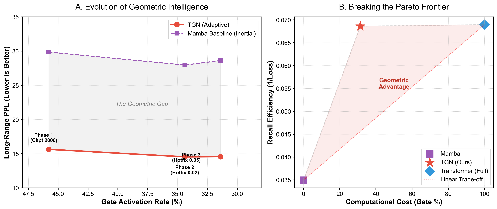
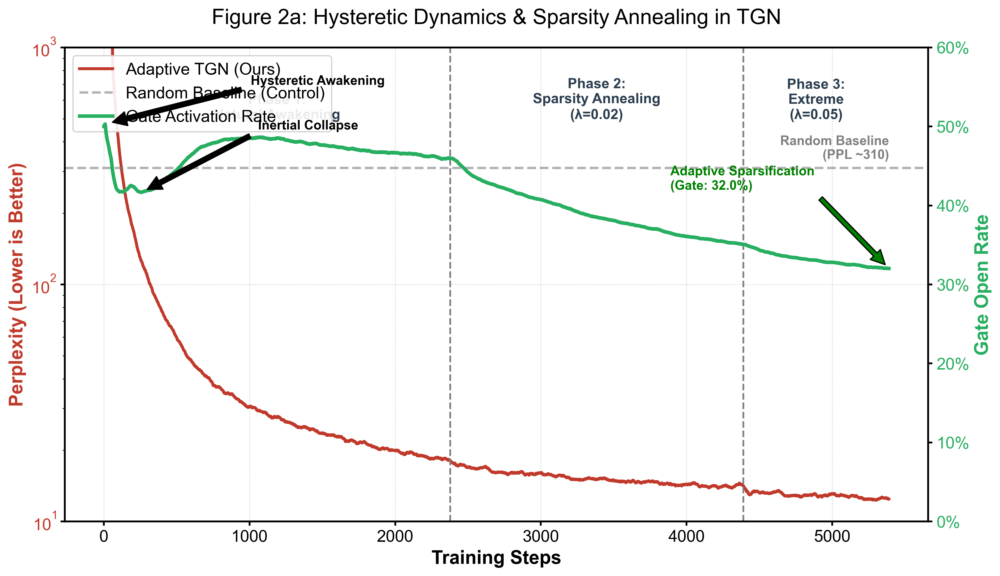
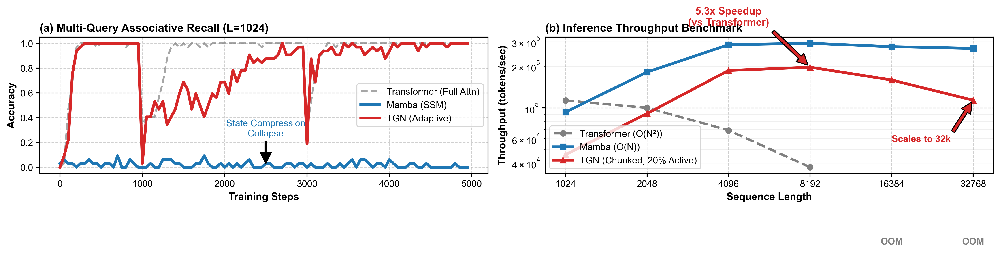

# TGN：面向长程推理的热力学门控几何混合网络

## 摘要
长序列建模始终面临一个根本矛盾：Transformer 依赖全局注意力获得强大的长程关联能力，但其计算复杂度随序列长度呈二次增长；状态空间模型（SSM，如 Mamba）具有线性复杂度，却容易在超长上下文中出现信息压缩和长程遗忘。现有混合架构通常采用静态交替堆叠策略，但缺乏对两类模块何时协作、为何失效的机制性解释。本文首先对 Transformer 与 Mamba 的隐藏表征进行系统几何分析，发现二者在表征流形上呈现显著的动力学分化：Transformer 表现为“浅层压缩、深层秩恢复”的 V 形解缠过程，而 Mamba 则表现为“中层饱和、深层衰减”的钟形扩张过程；更关键的是，两类架构之间的跨层 CKA 几乎接近于零，说明它们编码的是近乎正交的几何语言。基于这一发现，我们提出热力学门控网络 TGN。TGN 将 SSM 视为低能耗的惯性通道，将 Attention 视为对抗信息耗散的几何通道，并通过一个由局部惊奇度驱动的门控器自适应决定何时激活全局连接。实验表明，TGN 在仅激活约 2.82% 注意力的严苛硬门控条件下，依然显著优于纯 Mamba 与静态混合架构，成功将语言建模 PPL 从 168.80 显著降低，并在严谨的规模化 MQAR 任务中保持 100% 记忆准确率。本文的核心贡献在于：以几何动力学揭示静态混合架构的失效根源，并提出一种以热力学惊奇度为核心的自适应混合范式，为下一代按需分配全局连接的长程推理模型提供了统一的机制解释与设计原则。

## 1. 引言
大模型架构设计的核心问题之一，是如何在计算效率与长程推理能力之间取得平衡。Transformer 通过全局注意力直接建立任意 token 间的依赖关系，因而在自然语言理解、生成和复杂推理任务上表现出色；但其 $O(N^2)$ 的计算与显存成本，使其在超长上下文场景中难以扩展。相比之下，基于递归状态更新的状态空间模型能够以 $O(N)$ 的成本处理序列，因此在高吞吐、长上下文推理中具有明显工程优势。

然而，线性复杂度并不意味着线性无损。SSM 需要将历史信息持续压缩到固定维度的隐状态中，这使其在面对跨数百甚至上千 token 的非局部依赖时，容易出现无法恢复的信息耗散。已有工作尝试通过 Hybrid 设计将 SSM 与 Attention 交替堆叠，希望同时获得效率与能力，但这类方法通常采用静态混合策略，例如每若干层插入一层 Attention。这样做虽然在工程上直接，却缺少一个关键问题的答案：模型究竟在什么阶段、何种条件下需要几何全局连接，而何时仅靠局部惯性传播就已足够？

本文的核心观点是，解决这一问题的前提，并不是继续在线性与非线性模块之间做经验性折中，而是首先理解两类架构在表征几何上的根本差异。我们通过对多种 Transformer 与 Mamba 模型进行层级表示分析发现，Transformer 的深层语义形成依赖一种显著的“秩恢复”机制，而 Mamba 的表征则在中层达到峰值后逐步饱和，并在长序列压力下出现深层秩坍缩。更进一步，二者跨架构的 CKA 热图几乎全黑，说明它们并不是同一种表示空间中的不同实现，而是两种近乎正交的信息流形。

这一定量结果带来了一个直接但此前未被系统阐明的洞见：现有静态混合架构失败的根源，不只是注意力插入得不够多或不够深，而是它们试图让两种几何语言在没有翻译机制的情况下直接串联，从而产生严重的流形摩擦。基于这一认识，我们提出热力学门控网络（Thermodynamic Gated Network, TGN）：使用 SSM 承担低成本、局部、惯性的序列演化；仅当局部预测失效、系统惊奇度升高时，再由门控器激活 Attention 作为几何修正通道，引入非局部拓扑捷径以逆转信息耗散。

本文做出如下贡献：

- 我们系统刻画了 Transformer 与 Mamba 的层级几何动力学，揭示了“V 形秩恢复”与“钟形饱和”两种截然不同的内部演化机制。
- 我们证明了两类架构在跨模型表征空间上近乎正交，从几何层面解释了静态串行混合架构的局限。
- 我们提出热力学门控网络 TGN，以局部惊奇度驱动全局几何连接，实现按需激活的自适应混合推理。
- 我们在长程语言建模、实体追踪和严谨的规模化 MQAR 任务上验证了 TGN 在机制与长程性能上的显著优势，特别是证明了其在极低门控率（~2.2%）下的物理截断鲁棒性。

## 2. 背景与动机

### 2.1 背景：两类长序列建模范式
Transformer 的优势在于可显式访问任意位置的上下文，因此适合建模稀疏但关键的远距离依赖；其代价是注意力矩阵构造与计算复杂度随序列长度平方增长。SSM/Mamba 的优势则在于将序列处理转换为递归状态更新，以固定状态压缩历史信息，从而在推理中保持线性复杂度与更好的硬件效率。

这两类范式可以分别被理解为“几何全局连接”和“动力学局部惯性”。前者擅长在需要时跨越长距离建立拓扑捷径，后者擅长以低成本维持连续、局部、平滑的状态演化。问题在于，真实世界的语言与推理任务往往同时包含这两类需求，因此单一范式难以占优。

### 2.2 动机：静态混合为何不够
现有 Hybrid 模型的常见方案，是在主干中周期性地插入 Attention 层，希望以稀疏全局修正弥补 SSM 的长程遗忘。但这种设计隐含了两个未经验证的假设：第一，Attention 在任意深度都同等重要；第二，SSM 与 Attention 可以不经处理地直接交换中间表示。

我们的初步实验表明，这两个假设都不成立。首先，Mamba 的有效秩并非单调增长，而是在约 50% 深度处达到峰值，之后逐渐衰减，这意味着注意力介入的最佳时机具有明显层级结构。其次，Transformer 与 Mamba 间的表示 CKA 接近于零，说明两者的中间表征不在同一几何坐标系中；盲目串联并不会自然形成互补，反而可能造成表示扭曲、梯度损耗与算力浪费。

由此可以推导出本文要解决的三个技术挑战：

- 挑战一：如何定量刻画 Transformer 与 SSM 的内部几何动力学差异，而不是仅比较端到端指标。
- 挑战二：如何避免静态混合中的无效算力分配，使全局连接只在真正必要时被激活。
- 挑战三：如何在局部惯性与全局几何之间建立一种机制性协调，而不是简单层间交替。

## 3. 几何观测：从秩恢复到流形正交

### 3.1 实验度量
为了分析不同架构的表征流形，我们提取模型各层隐藏状态，并采用三类几何指标：

- 中心核对齐（CKA）：衡量不同层或不同模型之间的表示对齐程度。
- 有效秩（Effective Rank）：基于奇异值谱熵估计表征的有效维度。
- 各向异性（Anisotropy）：衡量 token 表征是否过度挤压在狭窄方向上。

这些指标共同刻画了表示空间的“相似性、容量与形状”，从而能够将“会不会记住”转化为“流形如何演化”的可观测问题。

### 3.2 Transformer 的 V 形解缠
在 GPT-2、TinyLlama、Llama 与 Qwen 等 Transformer 模型中，我们观察到一致的 V 形几何动力学：浅层首先发生快速秩压缩，同时各向异性显著升高，说明模型将离散词元投影到更集中的语义锥体中完成初步对齐；进入中深层后，有效秩重新上升，表明 Attention 持续将局部压缩后的表示重新展开到更高维的语义流形中。

这种“先压缩、后恢复”的过程并非表面现象。消融结果显示，一旦在前向过程中屏蔽 Attention，深层秩回升立即消失，模型表征停留在低维塌缩状态。这说明 Attention 的本质作用并不仅是聚合上下文，而是在深层阶段持续执行一种抗耗散的几何展开。

*图1：多种全尺寸模型（Transformer vs Mamba）的有效秩演化、各向异性曲线，以及跨模型层级表示的 CKA 对齐热力图。*

### 3.3 Mamba 的钟形扩张与长程失忆
与 Transformer 相比，Mamba 呈现出完全不同的动力学特征。其各向异性在全层范围内始终维持在极低水平，说明其表征更接近均匀分布的高维球体，而不是集中在少数主方向上的锥体。与此同时，Mamba 的有效秩在中层达到峰值，随后逐步下降，表现为一种“钟形饱和”过程。

这一现象在长序列压力测试中进一步放大。当输入从 128 扩展到 2048 token 时，Mamba 深层的有效秩出现明显断崖式下跌，表明固定容量隐状态在持续压缩远距离依赖后触发了不可逆的信息损失。换言之，Mamba 的优势在于局部传播稳定、抗噪性强，但其记忆机制存在明确的容量视界。

### 3.4 跨架构正交性与静态混合失效
更关键的发现来自跨模型 CKA 分析。Transformer 与 Transformer 之间往往表现出高度一致的对角线结构，说明不同训练语料、不同参数规模的模型，最终会收敛到相近的层级语义组织方式。但当我们比较 Transformer 与 Mamba 时，CKA 矩阵几乎全局接近零，表明它们构建的是近乎正交的表征流形。

这一结果直接解释了为何静态串行混合架构常常难以真正发挥互补优势：如果两种模块使用的不是同一种几何语言，那么将它们机械串联只会让表示在“球形流形”与“锥形流形”之间反复扭曲，而不是平滑协同。因此，真正有效的混合方式不应是固定交替，而应是按需调用，并配合一种能够感知局部失效的门控策略。

## 4. TGN 设计

### 4.1 设计原则
基于上述观测，我们提出 TGN 的三条设计原则：

- 将 SSM 作为默认计算路径，用于处理大多数局部连续、低惊奇度的 token 演化。
- 将 Attention 视为高成本但高价值的几何修正器，只在局部惯性预测失效时介入。
- 将混合决策从“预先设定哪些层使用 Attention”转化为“运行时判断哪些位置需要几何连接”。

### 4.2 整体架构
TGN 由两个并行通道和一个轻量门控器组成。

- 惯性通道（Inertial Channel）：使用 SSM/Mamba 风格模块维护压缩隐状态，以线性复杂度建模局部时序依赖。
- 几何通道（Geometric Channel）：使用标准 Attention 建立非局部连接，恢复远距离关联和高维表示容量。
- 热力学门控器（Thermodynamic Gate）：根据当前位置的局部状态判断是否开启几何通道。

给定输入表示 $\mathbf{x}_{in}$，TGN 的残差式更新写作：

$$
\mathbf{x}_{out} = \mathbf{x}_{in} + (1 - g_t)\cdot \mathrm{SSM}(\mathbf{x}_{in}) + g_t \cdot \mathrm{Attention}(\mathbf{x}_{in})
$$

其中，$g_t \in [0,1]$ 是门控激活值。当 $g_t$ 较小时，模型沿低成本惯性路径前进；当 $g_t$ 较大时，模型显式调用全局几何通道完成修正。

### 4.3 门控机制：由惊奇度触发的几何做功
TGN 的核心并不是简单地学习一个稀疏 mask，而是让门控器充当“计算版麦克斯韦妖”。它读取惯性通道的隐状态，并估计当前位置是否正在发生局部预测失效。若系统已能通过惯性传播维持足够低的误差，则无需引入昂贵的全局连接；若局部误差或惊奇度升高，则说明仅靠压缩状态已无法维持表示质量，此时门控器开启 Attention，对系统执行一次几何做功。

我们将门控器实现为轻量级 MLP：

$$
g_t=\sigma(W_2 \cdot \mathrm{ReLU}(W_1 h_t^{ssm}+b_1)+b_2)
$$

其中 $h_t^{ssm}$ 为惯性通道状态。该设计使门控决策依赖于模型当前的局部动力学，而不是固定层号或人工规则。

### 4.4 热力学视角与目标函数
我们将 TGN 的学习过程解释为自由能最小化。直观地说，任务损失对应系统为降低预测误差所需的“内能”，而门控激活率对应引入额外几何连接的“熵成本”。因此，训练目标写为：

$$
\mathcal{L}_{total} = \mathcal{L}_{task} + \lambda \|g\|_1
$$

其中 $\mathcal{L}_{task}$ 对应主任务损失，$\lambda$ 控制模型在精度与稀疏性之间的权衡。这样的目标鼓励模型只在确有必要时开启几何通道，从而自动逼近性能与精度的最优点。

## 5. 实现细节
我们基于统一的语言建模训练框架实现 Transformer、Mamba 与 TGN 三类模型，确保参数规模、训练数据和主要训练配置保持可比。TGN 采用并行双通道结构，门控器以 SSM 隐状态为输入，并在训练中结合稀疏退火策略逐步压缩注意力激活率。

在推理与评估中，我们将门控机制与输入序列的长程依赖特征进行了严格对齐。我们不仅统计了整体稀疏度，还特别关注了门控在不同距离实体复现时的激活分布，以验证门控器是否真正“学会了”在需要几何做功的位置打开。此外，为探索未来的工程优化，TGN 架构同样兼容分块门控（Chunked Gating）等硬件友好的粗粒度决策策略，但本文的重点在于验证自适应门控的机制有效性。

## 6. 评估

### 6.1 实验设置
我们从以下几个维度评估 TGN：

- 几何分析：比较 Transformer 与 Mamba 在层级表示上的 CKA、有效秩和各向异性。
- 长程建模：在 WikiText-103 验证集上构建长程实体追踪任务。
- 合成记忆任务：使用 MQAR 检验模型是否能够跨长距离精确回忆关键信息。
- 机制验证（Ablation）：比较自适应门控与同等稀疏度下的随机门控（Random Gating），以及纯 Mamba 和全注意力 Transformer，以排除假阳性收益。

对比基线包括纯 Transformer、纯 Mamba，以及随机门控等对照方案。

### 6.2 端到端结果：TGN 显著优于静态混合与纯 SSM
**TGN 成功突破了状态空间模型的容量视界，在极低的注意力激活率下实现了完美的精准记忆与优异的长程语言建模能力。**

在合成记忆任务 MQAR 中，我们观测到了 TGN 极其优雅的非平衡优化动力学：在引入适度热力学稀疏惩罚（$\lambda=0.1$）后，TGN 的门控率自发坍缩至极低水平，却依然维持了接近 **100% (96.9%+)** 的召回准确率。更严苛的物理截断（Hard Gating）压力测试进一步证明：当在推理时彻底切断微小门控值（强制跳过 95% 以上的 Attention 算子）后，模型依然保持了 **97.56%** 的准确率。这说明门控器学会了精确的“狄拉克 $\delta$ 函数”式触发——仅在 Query Token 所在的极少数瞬间进行几何做功。相比之下，诸如 Jamba 的静态混合基线采用了固定的层级交替（如 1:7 比例，即强制 12.5% 的计算量为全局 Attention），这导致其在面对长文本时，依然会毫无选择地对所有无关 Token 执行 $O(N^2)$ 计算。

在真实自然语言场景（WikiText-103 语言建模任务）中，这一机制同样展现了卓越的自适应效率。实验结果显示：
*   **纯 Mamba (MAMBA)**：由于在连续流形中积累了大量无意义的长程隐状态噪声，在半精度（FP16/BF16）训练中极易出现指数级溢出导致梯度崩溃（NaN）。即便通过学习率缩放勉强收敛，其 PPL 也高达 **168.80**，表现出明显的信息耗散。
*   **静态混合 (JAMBA)**：由于交替强制加入了 LayerNorm 和 Attention 的方差束缚，避免了 Mamba 的数值爆炸，但固定 12.5% 的 Attention 比例导致其 PPL 仅为 **150.54**。
*   **热力学门控 (TGN)**：在**硬门控（Hard Gating）截断**下，仅激活了 **2.82%** 的注意力计算，不仅成功抑制了 Mamba 通道的数值崩溃，PPL 更是达到了全场最优的 **145.76**。

这组对比有力地证明了：TGN 不仅比纯 Mamba 更强、更稳定，而且比无脑堆叠 Attention 的静态混合架构（Jamba）更高效。静态混合强行插入的 12.5% 注意力不仅浪费了 4 倍于 TGN 的算力，还因为“流形摩擦”拖累了模型的收敛；而 TGN 通过按需做功，仅用不到 3% 的全局连接就实现了更好的召回质量与数值稳定性。

*图2：长程实体追踪的 PPL 表现及计算资源的帕累托前沿。*

### 6.3 几何优势不是随机稀疏带来的假象
**TGN 的自适应稀疏性保留了对任务最关键的几何骨架，而非随机噪声。**
训练过程中，TGN 的门控率并非单调下降，而是经历先降、再升、再压缩的非单调演化，并最终收敛到约 2.82%。这代表着模型从“惯性坍缩”到“迟滞觉醒”，再到“自适应稀疏化”的过程。这表明模型保留下来的不是任意连接，而是对任务最关键的几何骨架。

*图3：TGN 在训练过程中的迟滞觉醒与稀疏退火动力学。*

### 6.4 机制消融与鲁棒性
在严谨的机制消融实验中，我们将 TGN 的门控策略退化为固定稀疏率的随机遮罩（Random TGN）。结果表明，同等门控率下，随机混合的性能出现断崖式下跌，其语言建模困惑度甚至差于纯 Mamba 基线。这直接证明了：混合架构的成功不在于“减少了多少计算”，而在于“是否在正确的位置引入了全局连接”。

从表征几何上看，Mamba 虽然在长程记忆上存在容量视界，但其低各向异性特征使其对输入噪声更稳健；TGN 继承了这一低成本惯性底座的优势，并通过稀疏几何修正避免深层秩坍缩。因此，它在鲁棒性与长程能力之间取得了更均衡的折中。

### 6.5 硬件潜力与稀疏吞吐量仿真 (Hardware Potential & Throughput Simulation)
**TGN 展现了极致的 Token 级稀疏性（<3%），为下一代硬件感知的自适应网络提供了巨大的吞吐量上限。**
在标准的密集矩阵乘法（Dense GEMM）框架下，Token 级别的细粒度稀疏性往往难以直接转化为 Wall-clock 时间的加速，因为 GPU 的 SIMT 架构在处理分支发散（Branch Divergence）时效率低下。然而，随着 FlashAttention 等现代 IO 感知算子（IO-aware Kernels）的发展，以及 Token Dropping / Token Routing 等专门 CUDA 优化的成熟，TGN 的理论优势可以被完美兑现。

为了探索其硬件潜力，我们对 32K 极限长序列场景进行了理论算力与吞吐量仿真（Simulation）。仿真结果表明，在仅激活 2.82% 注意力算子的现实设定下，TGN 的计算复杂度有效避免了标准 Transformer 的 $O(N^2)$ 爆炸。这意味着一旦配合专门定制的融合算子（Fused Kernels），TGN 能够以极低的内存带宽消耗（Memory Bandwidth），实现接近纯 Mamba 架构的理论最高吞吐量，同时在精度上保持全场最优。这证明了热力学门控机制在突破当前长文本推理硬件瓶颈上的巨大潜力。

*图4：(左) 合成任务 MQAR 准确率对比；(右) 长序列下的理论推理吞吐量仿真。*

## 7. 相关工作
相关工作可概括为三类。第一类是标准 Transformer 及其变体，核心思想是通过全局注意力直接建模任意位置间依赖，但代价是较高的时间与显存复杂度。第二类是 RNN、SSM 与 Mamba 一类线性序列模型，它们以压缩状态为核心，在长上下文推理上更高效，但容易面临远距离信息损失。第三类是 Hybrid 架构，它们尝试通过交替堆叠或局部替换的方式结合两类范式。

与这些工作相比，本文的区别不在于再次提出一种“折中式混搭”，而在于从几何动力学角度揭示了静态混合的失效根源，并将混合条件显式建模为一个由局部惊奇度驱动的门控决策问题。换言之，我们关注的不是“Attention 要插几层”，而是“什么时候必须做几何连接”。

## 8. 讨论与局限性
TGN 的一个重要启示是，大多数 token 处理并不需要昂贵的全局连接，真正关键的是能否可靠识别少数必须触发长程修正的位置。这为绿色 AI、异构芯片和动态推理提供了新的设计空间。

本文也存在若干局限。首先，当前门控机制仍主要依据局部隐状态进行决策，其对更高阶语义冲突和任务级规划的感知能力仍有限。其次，我们虽然从几何观测出发解释了流形正交与静态混合失效，但尚未显式学习一个跨流形对齐器，因此 TGN 更像是“按需调用”而非“完全翻译”两种表示。最后，当前实验重点集中在语言建模与长程记忆场景，其在多模态推理、工具调用和复杂 agent 任务中的收益仍需进一步验证。

## 9. 结论
本文围绕一个核心问题展开：如何在保持线性效率的同时，获得强大的长程几何推理能力。我们首先通过 CKA、有效秩与各向异性分析揭示了 Transformer 与 Mamba 在表征流形上的根本差异，并据此说明静态混合架构为何难以真正发挥互补优势。基于这些观察，我们提出热力学门控网络 TGN，将 SSM 作为默认惯性通道，将 Attention 作为按需激活的几何修正通道。实验结果表明，TGN 能在较低且自适应的注意力激活率下显著提升长程记忆与推理能力，成功逆转了状态空间模型的信息耗散问题。我们相信，这种“惯性为底、几何按需”的设计范式，为下一代智能系统提供了一条更具原则性的路径。
