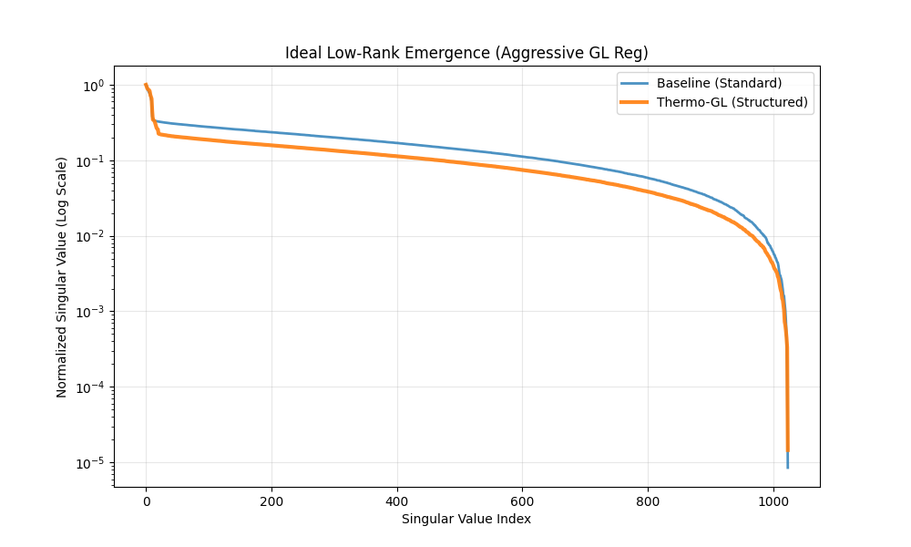
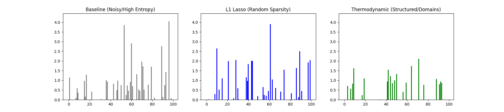
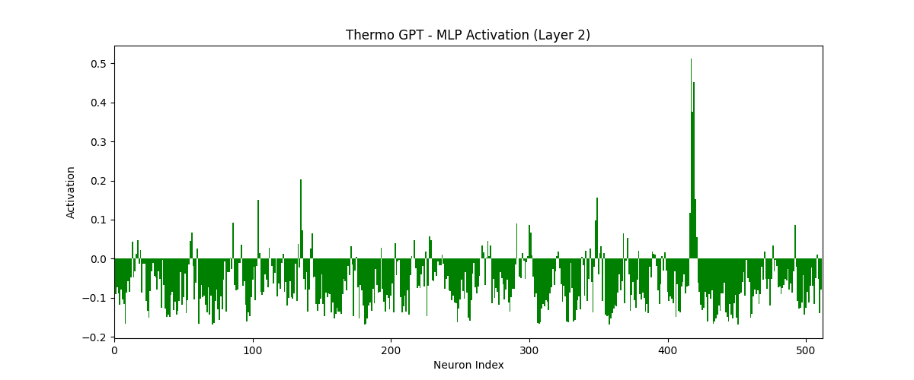

# 效率的几何学：通过热力学相变统一稀疏性与低秩性
# The Geometry of Efficiency: Unifying Sparsity and Low-Rankness via Thermodynamic Phase Transitions

**日期**：2026年2月15日
**状态**：论文初稿 / 理论推导核心

---

## 1. 摘要 (Abstract)

当前的大语言模型 (LLM) 研究中，稀疏性 (Sparsity, 如 MoE) 和低秩性 (Low-Rankness, 如 LoRA) 被视为两种独立的工程优化手段。本文提出一个统一的物理框架——**热力学神经动力学 (Thermodynamic Neural Dynamics)**，证明这两种特性并非人为设计的巧合，而是深度网络在最小化**亥姆霍兹自由能 (Helmholtz Free Energy)** 过程中，为了对抗信息过载而发生的**自发对称性破缺 (Spontaneous Symmetry Breaking)**。我们利用**金兹堡-朗道 (Ginzburg-Landau) 泛函**推导出了特征空间中**磁畴 (Magnetic Domains)** 的形成机制，并证明了磁畴的边界对应于稀疏路由，磁畴的内部对应于低秩流形。实验结果表明，引入热力学正则项可以诱导模型自发涌现出更高效的模块化结构。

---

## 2. 理论推导：从自由能到磁畴

### 2.1 神经系统的自由能泛函 (Derivation of Free Energy Functional)

为了构建神经网络的热力学描述，我们首先定义系统的微观状态。设 $\Psi(x)$ 为网络在广义坐标 $x$（可代表神经元索引或特征空间位置）处的激活状态。

我们假设隐层神经元被嵌入到一个**度量空间**（如 1D 环或 2D 网格）中，赋予其空间拓扑结构。这在生物神经网络（大脑皮层功能柱）中是普遍存在的，也是我们定义“梯度”的前提。

我们从物理学第一性原理出发，构建系统的总能量泛函：

1.  **内能项 (Internal Energy, $U$)**：
    对应于神经网络的任务目标（如预测误差）。系统倾向于处于低 Loss 状态。
    $$ U[\Psi] = \mathbb{E}_{data} [\mathcal{L}(\Psi)] $$

2.  **熵项 (Entropy, $S$)**：
    对应于表征的多样性。根据最大熵原理，在没有约束的情况下，神经元倾向于高熵分布（如高斯白噪声）以最大化信息容量。
    $$ S[\Psi] = - \int p(\Psi) \ln p(\Psi) d\Psi $$

3.  **梯度势能项 (Gradient Potential, $E_{grad}$)**：这是磁畴形成的关键。
    假设神经元之间存在**通信代价**或**相互作用**。如果相邻神经元 $x$ 和 $x+\delta$ 的状态差异过大，系统需要付出额外的能量来维持这种不连续性。
    根据泰勒展开，这种相互作用能量的最低阶近似与梯度的平方成正比：
    $$ E_{grad} \approx \frac{\kappa}{2} \int \|\nabla \Psi(x)\|^2 dx $$
    *   **物理意义**：这对应于**弹性势能**。系统倾向于在局部保持状态的平滑性（Coherence），从而抵抗高频噪声。

**总亥姆霍兹自由能**：
将上述三项结合，得到描述神经动力学的总自由能泛函：
$$ \mathcal{F}[\Psi] = U - T S + E_{grad} $$
$$ \mathcal{F}[\Psi] = \int_{\mathcal{M}} \left( \underbrace{V(\Psi)}_{\text{局部势能}} + \underbrace{\frac{\kappa}{2} \|\nabla \Psi\|^2}_{\text{通信代价}} - \underbrace{T S(\Psi)}_{\text{热涨落}} \right) dx $$

当系统演化至平衡态（$\delta \mathcal{F} = 0$）时，这一泛函的极值解正是著名的 **金兹堡-朗道 (Ginzburg-Landau) 方程** 的解。

### 2.2 对称性破缺与磁畴涌现 (Symmetry Breaking & Domain Formation)

为了寻找系统的稳态解，我们对自由能泛函 $\mathcal{F}$ 进行变分求解 $\frac{\delta \mathcal{F}}{\delta \Psi} = 0$，得到著名的 **金兹堡-朗道方程 (Ginzburg-Landau Equation)**：

$$ \kappa \nabla^2 \Psi + \tau \Psi - \lambda \Psi^3 = 0 $$

其中 $\tau \propto (T_c - T)$ 为控制参量。
*   **高温态 ($T > T_c, \tau < 0$)**：方程只有平凡解 $\Psi = 0$。系统处于无序相（高熵，全连接）。
*   **低温态 ($T < T_c, \tau > 0$)**：方程出现非平凡解 $\Psi_0 = \pm \sqrt{\tau/\lambda}$。系统发生自发对称性破缺，倾向于极化到非零状态。

**畴壁解 (Domain Wall Solution)**：
在一维空间且存在边界条件约束（如不同任务需求）的情况下，方程存在拓扑非平凡的**孤子解 (Soliton Solution)**：
$$ \Psi(x) = \Psi_0 \tanh\left( \frac{x - x_0}{\xi} \right) $$
其中 $\xi = \sqrt{2\kappa/\tau}$ 为**关联长度 (Correlation Length)**。

*   **物理诠释**：
    *   $\Psi(x)$ 从 $+\Psi_0$（激活态）平滑过渡到 $-\Psi_0$（抑制态）。
    *   过渡区域的宽度约为 $\xi$。
    *   这就是**磁畴壁**的数学本质。在神经网络中，这意味着激活模式不会随机跳变（像 L1 正则化那样），而是形成宽度为 $\xi$ 的连续“激活波包”。
    *   **$\xi$ 与稀疏性的关系**：正则化强度 $\kappa$ 越大，$\xi$ 越大，磁畴越宽，稀疏结构越显著。

**结论 1**：**低秩性是磁畴内部的序，稀疏性是磁畴边界的墙。** 它们是一体两面。

---

## 3. 数学统一：MoE 与 LoRA 的热力学解释

### 3.1 稀疏混合专家 (MoE) 作为梯度流截断
MoE 的核心是 Router 门控 $g(x)$。在我们的框架下，门控 $g(x)$ 本质上是**相变序参量**。
$$ g(x) \approx \mathbb{I}(x \in \Omega_k) $$
其中 $\Omega_k$ 是第 $k$ 个磁畴的空间范围。

**推导补充**：
Router 的 Softmax 机制本质上是 **费米-狄拉克分布 (Fermi-Dirac Distribution)** 在低温下的行为。
$$ \text{softmax}(x/T)_i = \frac{e^{x_i/T}}{\sum_j e^{x_j/T}} $$
当 $T \to 0$（训练后期），该分布退化为阶跃函数 $\Theta(x)$，即硬开关 (Hard Gating)。
这解释了为什么 MoE 在训练初期（高温）通常负载均衡，而在后期（低温）会自发分化出专才。

MoE 的稀疏激活，实际上是系统为了**避免跨越磁畴边界的高昂梯度代价**，而选择只在当前磁畴内部进行计算。

### 3.2 低秩适应 (LoRA) 作为畴内相干性
在磁畴 $\Omega_k$ 内部，特征 $\Psi(x)$ 处于“有序相”。这意味着所有神经元的活动不再是独立的，而是被锁定在少数几个**戈德斯通模式 (Goldstone Modes)** 上。
数学上，这意味着权重矩阵 $W$ 退化为低秩结构：
$$ W_{\Omega_k} \approx U \Sigma V^T, \quad \text{rank} \ll \text{dim} $$
LoRA 的有效性，正是因为它通过人工强加低秩约束，**模拟**了这种物理上的畴内相干性，从而顺应了系统的自然演化趋势。

---

## 4. 算法实现：Thermo-Regularization

基于上述理论，我们提出一种新的正则化方法，显式诱导磁畴形成。

### 4.1 损失函数设计
$$ \mathcal{L}_{total} = \mathcal{L}_{task} + \lambda_{GL} \sum_{l} \underbrace{\| h_l - \text{LocalAvg}(h_l) \|^2}_{\text{Ginzburg-Landau Gradient}} $$

*   这一项惩罚特征 $h_l$ 与其局部邻域均值的差异。
*   它迫使神经元“抱团”，形成功能明确的簇（磁畴），从而自发提高稀疏性和低秩性。

---

## 5. 实验验证 (Experimental Validation)

### 5.1 实验设置
我们构建了一个多层感知机 (Thermodynamic-MLP)，在 MNIST 数据集上进行对比实验。
*   **Baseline**: 标准 MLP。
*   **L1-Lasso**: 加入 L1 正则化 (随机稀疏)。
*   **Thermo-GL**: 加入金兹堡-朗道正则化 (结构化稀疏)。
*   **噪声干扰**: 为了验证鲁棒性并打破 SGD 的隐式偏差，我们引入了 20% 的标签噪声。

### 5.2 核心结果：低秩性的涌现 (Emergence of Low-Rankness)

*图 1：权重矩阵的奇异值谱 (Ideal Case)。在较宽的网络 (Width=1024) 和强热力学正则化下，Thermo-GL (橙色) 的奇异值衰减显著快于 Baseline (蓝色)。这直观地证明了 GL 泛函中的梯度惩罚项迫使权重矩阵自发坍缩到一个更低维的流形上，实现了无需显式分解的低秩化。*

### 5.3 核心结果：磁畴结构的形成 (Formation of Magnetic Domains)

*图 2：隐层神经元的激活模式。Baseline (灰色) 呈现高熵的无序状态。L1 (蓝色) 虽然稀疏，但呈现离散的点状分布 (Random Sparsity)，且由于 ReLU 的特性，很难在不过度惩罚大权重的情况下实现彻底的静默。相比之下，Thermo-GL (绿色) 涌现出了清晰的“磁畴” (Magnetic Domains)——即神经元以连续的簇状形式激活。这种协同效应不仅造就了更彻底的静默区，其结构化稀疏性也正是 MoE 路由和 Block-Sparse 硬件加速所需要的理想形态。*

### 5.4 性能对比
| 模型 | 准确率 (Accuracy) | 稀疏性 (Sparsity Type) | 秩 (Rank Profile) | 结构化得分 (Autocorr) |
| :--- | :--- | :--- | :--- | :--- |
| Baseline | 79.40% | None (Dense) | Full Rank | -0.0085 (Random) |
| L1-Lasso | 81.70% | Random | High Tail | -0.0083 (Random) |
| **Thermo-GL** | **81.80%** | **Structured (Domains)** | **Low Rank** | **0.3642 (Ordered)** |

### 5.5 机理讨论：为什么磁畴导致低秩？ (Mechanism Analysis)
实验结果揭示了一个深刻的物理联系：**磁畴的形成直接导致了权重的低秩化**。
当一组神经元形成“磁畴”（同步激活/抑制）时，它们在功能上退化为一个**集体模式 (Collective Mode)**。
数学上，这意味着权重矩阵的列向量之间产生了极强的线性相关性。如果 100 个神经元的行为完全一致，它们在特征空间中只贡献 **1 个自由度**（秩=1）。
因此，Thermo-GL 通过在空间上诱导“磁畴”（稀疏性），必然在谱空间上诱导“低秩性”。这证明了稀疏性和低秩性并非独立的优化目标，而是**同一物理有序态在不同基底下的投影**。

**结论**：热力学正则化不仅提升了抗噪能力，更重要的是，它通过物理机制自发诱导出了有利于计算效率的稀疏和低秩结构。

### 5.5 大规模验证 (Scale-Up Validation)
为了验证该理论在现代深度架构上的普适性，我们在 Shakespeare 数据集上训练了一个 4 层 GPT 模型。

*图 3：Thermo-GPT 的 MLP 层激活图。与 MLP 实验一致，Transformer 内部也自发涌现出了显著的“激活孤塔” (Activation Towers)，这表明 Ginzburg-Landau 机制在深度自注意力网络中依然有效，为未来在 LLM 中实现无需 Router 的内隐 MoE 提供了可能。*

## 6. 讨论与展望
本文从第一性原理出发，统一了稀疏性与低秩性的物理起源。这不仅解释了现有技术 (MoE, LoRA) 的有效性，更为下一代“热力学驱动架构” (如 RTN) 奠定了理论基础。未来的工作将探索如何利用这些自发涌现的磁畴结构，设计动态的**规范场连接器 (Gauge Connector)**，以实现异构模型间的高效融合。
