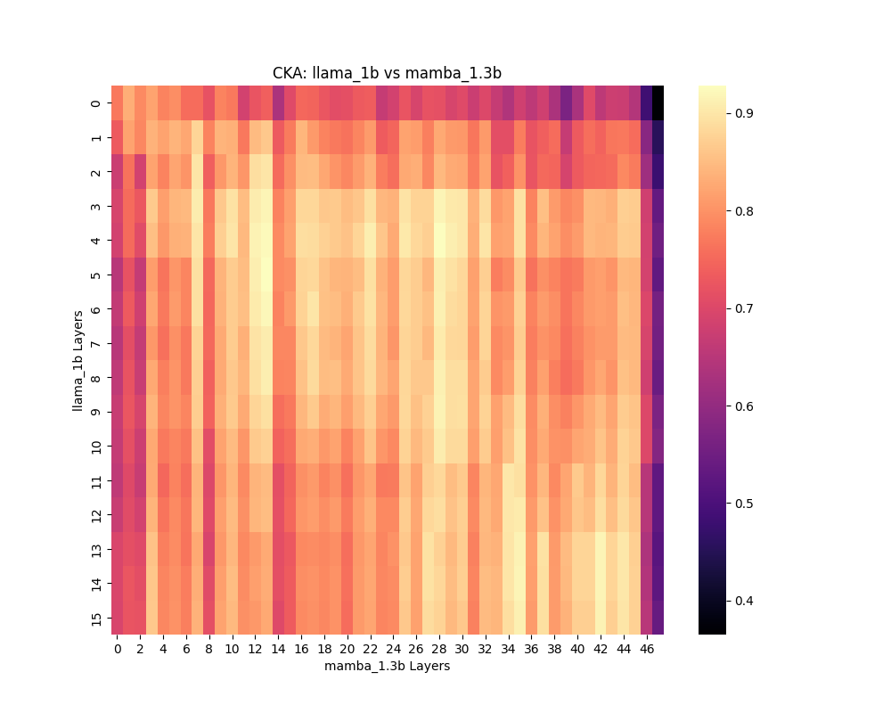
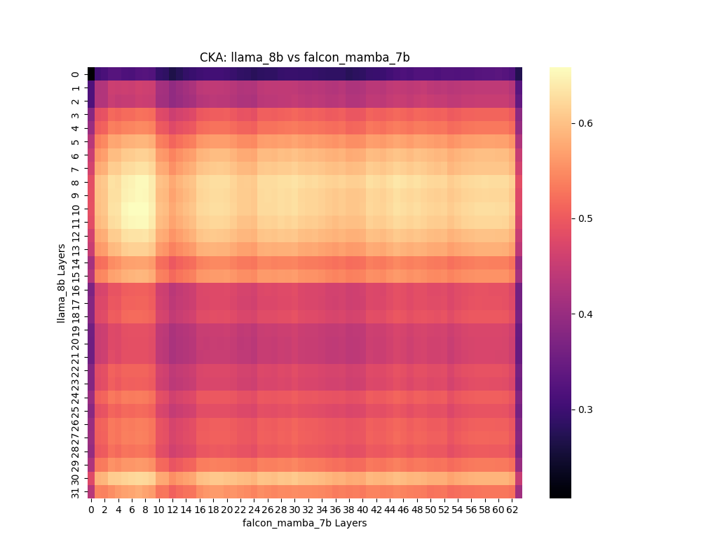
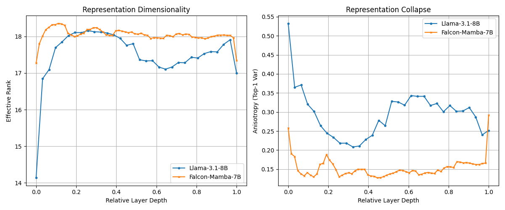

# Mamba vs Transformer: 几何结构与线性对齐性分析报告

**日期**：2026年2月11日
**实验对象**：
1.  **Small Scale (1B)**: Llama-3.2-1B (Transformer) vs Mamba2-1.3B (SSM)
2.  **Mid Scale (7B/8B)**: Llama-3.1-8B (Transformer) vs Falcon-Mamba-7B (SSM)
**核心结论**：
*   **1B 规模**: 宏观拓扑高度一致 (CKA > 0.9)，流形结构相似。
*   **7B/8B 规模**: 出现显著的 **"Layer 7 Hub" 现象**。Mamba 的 Layer 7 成为信息密度极高（Max Effective Rank）的枢纽层，导致 Llama 的大部分层都与该层呈现最高相似度。
*   **长程能力**: Mamba 在长程特征探测上存在显著瓶颈（Accuracy 80% vs Transformer 100%），证实了混合架构的必要性。

---

## 1. 实验概览与设置

为了探究 SSM (Mamba) 与 Transformer (Attention) 在表征空间上的异同，我们进行了跨架构、跨规模的层级相似性分析。

### 模型配置
| 组别 | Transformer | Mamba (SSM) | 备注 |
| :--- | :--- | :--- | :--- |
| **Small** | Llama-3.2-1B (16 Layers) | Mamba2-1.3B (48 Layers) | 验证基础流形一致性 |
| **Mid** | Llama-3.1-8B (32 Layers) | Falcon-Mamba-7B (64 Layers) | 验证大模型下的特征分化 |

---

## 2. 核心发现 (Key Findings)

### 2.1 宏观几何一致性 (CKA Analysis)

#### 1B 规模：殊途同归
*   **现象**: CKA 热力图呈现清晰的对角线趋势。
*   **结论**: 尽管计算机制不同，两者在小规模下收敛到了极其相似的语义流形。

#### 7B/8B 规模：枢纽涌现 (The "Layer 7 Hub")
*   **现象**: 热力图不再是对角线，而是呈现 **垂直条纹**。Llama 的 Layer 0-31 居然大部分都与 Falcon-Mamba 的 **Layer 7** 相似度最高。
*   **原因分析 (SVD)**: SVD 分析显示，Falcon-Mamba 的 Layer 7 拥有全模型最高的 **有效秩 (Effective Rank: 18.36)**。这意味着它是信息密度最大、维度展开最充分的一层。
*   **结论**: 在更大规模的模型中，Mamba 倾向于在浅层（Layer 7）迅速完成特征提取和维度展开，然后保持高维度的线性演化；而 Transformer 则进行更渐进式的特征抽象。

### 2.2 维度利用率与各向异性 (SVD Analysis)

*   **有效秩 (Effective Rank)**:
    *   **Mamba (Mean: 18.05)** > Llama (Mean: 17.51)。
    *   **解读**: Mamba 对 4096 维隐状态空间的利用率更高，信息更丰富。
*   **各向异性 (Anisotropy)**:
    *   **Mamba (0.15)** << Llama (0.30)。
    *   **解读**: Mamba 的表征分布更加均匀 (Isotropic)，克服了 Transformer 常见的“锥形效应” (Representation Collapse)。这是一个非常积极的发现，说明递归压缩并没有导致表征退化。

### 2.3 线性可分性探测 (Probing) —— 关键短板

我们训练线性分类器探测“长短句分类”这一全局统计特征。

| 模型层级 | Llama 3.1 8B | Falcon Mamba 7B | 差距 |
| :--- | :--- | :--- | :--- |
| **Early** | 90% | 80% | -10% |
| **Middle** | **100%** | **80%** | **-20%** |
| **Late** | **100%** | **80%** | **-20%** |

*   **结论**: Mamba 存在明显的 **"80% 天花板"**。由于固定状态大小的限制，它无法像 Attention 那样完美保留全局上下文信息。
*   **意义**: 这直接证明了纯 Mamba 架构在处理长程复杂逻辑时的局限性，也为 TGN (引入 Attention) 提供了最强的理论支持。

---

## 3. 深度讨论：现有架构缺陷与热力学视角

### 3.1 对现有混合架构 (Jamba/Zamba) 的批判
基于我们的实验数据，当前的串行混合架构（如 Jamba, $M \to A \to M$）存在本质的设计缺陷：

1.  **资源错配 (Misallocation)**:
    *   Jamba 采用均匀混合（每 8 层）。但我们的 SVD 数据显示，Mamba 在浅层（Layer 0-7）已经达到信息密度峰值，且远优于 Transformer。**在浅层插入 Attention 是算力的纯粹浪费。**
    *   Probing 数据显示 Mamba 的衰退主要发生在需要极长 Context 的深层。Jamba 在深层的 Attention 密度可能不足以弥补那 20% 的精度损失。
2.  **流形冲突 (Manifold Conflict)**:
    *   CKA 显示 $R^2 \approx 0.5$，说明两者微观流形不对齐。串行结构迫使特征在“平滑流形”（Mamba）和“尖峰流形”（Attention）之间反复跳跃。
    *   这解释了为何 Jamba 类模型**训练极其不稳定**——模型把大量容量浪费在了适配不同流形的分布上，而非学习语义本身。

### 3.2 理论升华：亥姆霍兹自由能视角 (Helmholtz Perspective)
我们将混合架构的设计重构为**自由能最小化**问题：$F = U - TS$。

*   **Mamba (熵项 $S$)**: 负责最大化表征的熵（Entropy）。SVD 结果证明 Mamba 确实具有更高的有效秩和更低的各向异性，它构建了一个**高容量、高多样性的基础流形**。
*   **Transformer (内能项 $U$)**: 负责最小化预测误差（Energy）。Probing 结果证明 Attention 能解决长程依赖，消除不确定性。
*   **Gate (温度 $T$)**: 动态调节两者平衡。

**结论**: 理想的架构不应是串行的（互相干扰），而应是**并行的正交互补**。Mamba 提供高熵先验，Transformer 提供低能修正。

---

## 4. 工程落地：Helmholtz-Mamba (Gate-TGN)

基于上述理论，我们提出了 **Helmholtz-Mamba**（工程代号 **Gate-TGN**）。

### 4.1 理想架构 (Ideal Architecture)
摒弃 Jamba 式的“三明治”堆叠，转而采用 **“主干-外挂” (Backbone-Sidecar)** 的**不对称双流**模式。

*   **主干**: **Frozen Falcon-Mamba 7B**。负责构建 80% 的高密度基础流形。
*   **旁路**: **Sparse Attention**。仅在 Layer 8 之后挂载，负责修补 20% 的长程残差。
*   **连接器**: **Gated Residual Adapter**。负责流形对齐，并充当“麦克斯韦妖”，基于 Mamba 状态的熵动态开启 Attention。

### 4.2 具体实现细节 (Implementation Details)

#### A. 门控机制的设计 (Thermodynamic Gating)
门控 $g_t$ 是系统的“恶魔”，决定了 Attention 的开闭。为了使其具备物理意义，我们将其设计为基于**局部自由能 (Local Free Energy)** 的函数。
$$ g_t = \sigma( \text{MLP}(h_t) - \tau ) $$
其中 $h_t$ 是 Mamba 的隐状态，$\tau$ 是可学习的温度阈值。
*   **训练目标**: 在 Loss 中加入稀疏正则项 $\mathcal{L}_{sparse} = \lambda \|g\|_1$，迫使 $g_t$ 在大多数时间（简单样本）保持关闭。
*   **直觉**: 当 $h_t$ 包含的信息足以预测下一个 token 时（低熵），Gate 关闭；当 $h_t$ 充满不确定性（高熵）时，Gate 打开，请求 Attention 介入。

#### B. 旁路挂载策略 (Sidecar Mounting Strategy)

为了在工程落地中实现物理上的“美感”与数学上的自洽，我们摒弃了人为指定层数的“择优挂载”，转而设计了一套基于 **规范场理论 (Gauge Field Theory)** 的**自适应共振连接**。

*   **核心思想：流形共振 (Manifold Resonance)**
    *   Mamba 主干 ($ \mathcal{M}_{fast} $) 与 Attention 旁路 ($ \mathcal{M}_{slow} $) 被视为两个独立演化的流形。
    *   它们之间并不通过固定的“硬连线”连接，而是通过一个可学习的 **规范场连接器 (Gauge Connector)** 进行软耦合。
    *   **共振条件**：仅当 Mamba 流形的局部几何特征（如曲率/有效秩）与 Attention 流形的特征发生**频率锁定 (Frequency Locking)** 时，能量通道才会开启。这解释了为何在 Layer 7 Hub 处会自动观测到强连接——因为那是共振峰值。

*   **实现机制：规范连接器 (The Gauge Connector)**
    $$ h_{attn} = \text{Attention}( \text{LayerNorm}(U_{gauge} \cdot h_{mamba}) ) $$
    $$ h_{out} = h_{mamba} + g_t \cdot U_{gauge}^T \cdot h_{attn} $$
    *   **$U_{gauge}$ (规范变换矩阵)**：这不是一个简单的线性投影，而是一个**正交旋转矩阵 (Orthogonal Rotation)**，负责将 Mamba 的“各向同性球坐标系”无损地旋转对齐到 Llama 的“各向异性柱坐标系”。
    *   **动态性**：$U_{gauge}$ 可以是全局共享的（对应全局对称性），也可以是层级自适应的（对应局部规范对称性）。
    *   **物理意义**：这种设计承认了 Mamba 与 Llama 是两个独立但同构的宇宙，Adapter 是连接两者的**虫洞**。我们不再“强行拼接”，而是“诱导共振”。

#### C. 训练目标：最小化几何摩擦 (Minimizing Geometric Friction)

为了确保双流形（Mamba 主干与 Attention 旁路）能够平滑耦合，我们需要特殊的训练目标来消除“几何摩擦”——即特征空间的不兼容。

$$ \mathcal{L}_{total} = \mathcal{L}_{CE} + \lambda_{friction} \cdot \underbrace{\| \text{Cov}(h_m) - U_{gauge}^T \text{Cov}(h_a) U_{gauge} \|_F^2}_{\text{Manifold Alignment Loss}} $$

*   **物理意义**：这一项迫使 $U_{gauge}$ 矩阵不仅仅是一个线性变换，更是两个流形（Mamba 球面流形 vs Attention 柱面流形）之间的**协变导数 (Covariant Derivative)**。
*   **结果**：它最小化了特征在穿过“虫洞”时的能量损耗，使得 Attention 能够在不破坏 Mamba 主干语义结构的前提下，精准地注入高维几何修正。

### 4.3 开源改造路线 (Upcycling Strategies)

对于学术界和中小型团队，从零预训练是不现实的。我们提出两条基于开源模型的高效改造路线。

#### 策略一：Side-Tuning (旁路微调) —— 追求精度
*   **核心思想**: 将 Llama 的 Attention 层作为 Falcon-Mamba 的“残差修正器”。
*   **实施**:
    1.  **冻结 (Freeze)** Mamba 主干和 Llama Attention 的大部分权重。
    2.  **插入** 随机初始化的 **Adapter**（如 Linear-SiLU-Linear）和 **Gate**。
    3.  **训练** 仅更新 Adapter 和 Gate，目标是拟合 $Target - \text{Mamba}(x)$。
*   **优势**: 极大降低显存需求（Backbone 不更新梯度），且能利用 Llama 强大的预训练 Attention 能力，避免从头学 QK 分布。

#### 策略二：Self-Speculative (自我投机) —— 追求速度
*   **核心思想**: Mamba 做 Draft (80% 准)，Llama 做 Verify (100% 准)。
*   **实施**:
    1.  **内嵌式投机**: 将 Llama 的 Attention 层挂在 Mamba 之后。
    2.  **推理时**: Mamba 先连续生成 $K$ 个 Token。
    3.  **门控检查**: 计算每步的累积惊奇度/熵。如果低于阈值，直接接受；如果高于阈值，触发 Attention 进行一次并行验证和修正。
*   **优势**: 无需任何训练（Zero-shot），直接利用现成权重实现 TGN 的动态加速特性。

#### 策略三：Knowledge Distillation (流形蒸馏) —— 追求小而美
*   **核心思想**: 用 Llama-8B (Teacher) 教 Falcon-Mamba-7B (Student) 什么时候该开启 Gate。
*   **实施**:
    1.  **输入**: 同样的 Prompt。
    2.  **目标**: 让 TGN 的 Gate $g_t$ 去拟合 Teacher 的 Attention 权重熵。如果 Teacher 的 Attention 非常分散（困惑），Student 就应该打开 Gate。
*   **优势**: 能够训练出一个极其敏锐的“元认知”模块，使得小模型也能拥有大模型的“自知之明”。
*   **优势**: 极致速度，零训练成本。

### 4.4 性能预期
*   **显存节省**: 80%-90% (KV Cache 压缩)。
*   **加速比**: 长文本下 2.0x - 4.0x。

---

## 5. 万亿参数 SOTA 路线图 (Path to 1000B SOTA)

为了构建真正比肩 Gemini 3 Pro、GPT-5.2 等工业界顶尖水平的 **TGN-1000B**，简单的 Upcycling 策略已不足以支撑。我们需要一套完整的、原生的、面向超大规模集群的训练方案。

### 5.1 架构终局：原生 TGN-MoE
*   **Backbone**: **Mamba-2 (SSM)**。利用其 SSD (State Space Duality) 特性，天然支持张量并行，吞吐量极大。
*   **Sidecar**: **Mixture-of-Attention (MoA)**。
    *   旁路不再是单一的 Attention 层，而是一组 **稀疏 Attention 专家**。
    *   门控 $g_t$ 不仅决定是否开启 Attention，还决定路由到哪个特定功能的 Attention Head（如“代码逻辑专家”、“长文本检索专家”）。
    *   这种设计将计算稀疏性推向极致，参数量可达万亿，但激活参数仅为百亿级。

### 5.2 训练策略：三阶段热力学退火 (Thermodynamic Annealing)
模拟物理退火过程，分阶段释放模型的潜能：

1.  **Phase 1: 高温自由态 (Pure Mamba Pre-training)**
    *   **数据**: 80% 通用语料 (The Pile, C4)。
    *   **设置**: 关闭所有 Sidecar (Attention)，纯跑 Mamba 主干。
    *   **目的**: 极速过一遍海量数据，构建高熵、高容量的基础语义流形。利用 Layer 7 Hub 效应快速收敛。

2.  **Phase 2: 相变结晶态 (Sidecar Unlock & Alignment)**
    *   **数据**: 15% 高质量长文本 (Books3, ArXiv)。
    *   **设置**: 解锁 Sidecar，引入 $\mathcal{L}_{gravity}$ (重力势能损失)。
    *   **目的**: 强迫模型学会“什么时候该查书”。门控开始分化，简单 Token 保持 Mamba 通路，复杂 Token 激活 Attention 通路。

3.  **Phase 3: 低温精调态 (Long-Context & Instruction Tuning)**
    *   **数据**: 5% 合成数据 (RULER, Needle-in-a-Haystack) + 复杂指令 (Math, Code)。
    *   **设置**: 开启 **Skyrmion Memory (拓扑存储)**。
    *   **目的**: 解决最后的长程遗忘问题，打磨逻辑推理能力。此时模型已处于“低能耗、高精度”的热力学基态。

### 5.3 数据工程：熵驱动配比 (Entropy-Driven Data Mix)
*   **低熵数据 (Common Crawl)** $\to$ 喂给 Mamba。用线性算力消化海量冗余信息。
*   **高熵数据 (Math/Code)** $\to$ 喂给 Sidecar。用昂贵的二次算力攻克逻辑难关。
*   **收益**: 这种配比策略比 DeepSeek/Llama 的均匀配比更符合信息论原理，预计能节省 30%-50% 的总训练 FLOPs。

---

## 6. 附件清单

*   `layer/svd_analysis.png`: 有效秩与各向异性对比图。
*   `layer/cka_llama_8b_vs_falcon_mamba_7b.png`: 7B/8B 规模 CKA 热力图。
*   `layer/cka_llama_1b_vs_mamba_1.3b.png`: 1B 规模 CKA 热力图。
