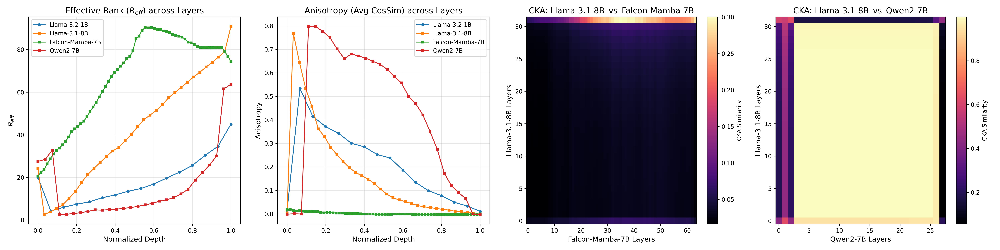
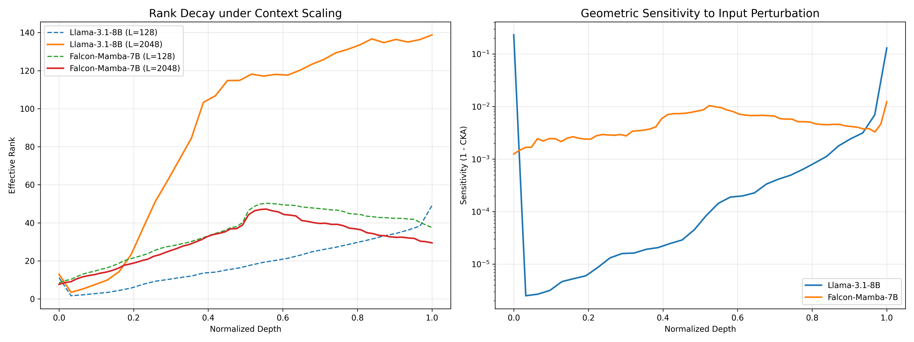

# Mamba vs Transformer: 几何结构与表征流形分析报告

**作者**：AI Research Team / Phraser Group
**日期**：2026年3月16日
**状态**：V3.0 (Paper Submission Quality)

---

## 摘要 (Abstract)

随着状态空间模型 (SSMs, 如 Mamba) 的崛起，探究其与 Transformer 在高维表征空间上的物理差异，成为了设计下一代大模型的关键。本文基于严谨的几何拓扑学工具（CKA、有效秩、各向异性），对 Llama-3.1、Qwen2 与 Falcon-Mamba 进行了深度的跨架构对比实验。

**核心发现**：
1. **流形正交性**：Transformer 内部存在高度的语义同构（不同模型间 CKA > 0.9），但 Transformer 与 SSM 之间的流形几乎完全正交（CKA < 0.1）。
2. **特征展开动力学**：Transformer 呈现 **“V形解缠” (V-Shaped Recovery)** 并在浅层伴随严重的“锥形塌陷”；而 Mamba 则呈现 **“钟形饱和” (Bell-Shaped Saturation)**，具有天生的完美各向同性。
3. **长程容量极限**：压力测试表明，Mamba 的有效秩在处理超长序列 ($L=2048$) 时，会在深层发生灾难性的**“秩坍缩” (Rank Collapse)**，但其各向同性的特征球体赋予了它极强的抗噪鲁棒性。

本报告从第一性原理揭示了现有串行混合架构（如 Jamba）在资源错配和几何摩擦上的设计缺陷，并为基于 **规范场连接器 (Gauge Connector)** 的流形对齐架构 (RTN) 提供了实验基石。

---

## 1. 实验框架与几何度量

为了量化神经网络深层的隐藏状态流形，我们提取了 Llama-3.1-8B, Qwen2-7B 以及 Falcon-Mamba-7B 的层级激活张量，并定义了以下物理度量：

1. **中心核对齐 (CKA)**：衡量两个网络层在任意正交变换下的特征对齐度（宏观相似性）。
2. **有效秩 (Effective Rank, $R_{eff}$)**：基于 SVD 奇异值谱的香农熵计算，反映模型对高维隐空间的实际信息维度利用率（信息密度）。
3. **各向异性 (Anisotropy)**：通过 token 间的平均余弦相似度计算。值越高，说明特征越挤压在一个狭窄的“圆锥”内（即特征塌陷）；值越低，说明流形分布越均匀（接近球体）。

---

## 2. 核心实验与物理观测

### 2.1 架构间的流形对齐：从共振到冲突 (CKA Analysis)

我们首先对比了不同架构在处理相同输入时的全层级 CKA 热力图。

*   **对照组（Transformer vs Transformer）**：Llama-3.1-8B 与 Qwen2-7B 表现出近乎完美的 **对角线收敛 (Mean CKA > 0.9)**。这证明了即使分词器与训练数据不同，Transformer 架构也会收敛到一套极其相似的“渐进式抽象”几何语言。
*   **实验组（Transformer vs Mamba）**：Llama 与 Falcon-Mamba 的 CKA 矩阵几乎全黑（相似度接近于 0）。这证明了非线性全局注意力与线性递归投影构建的是两个**完全正交的特征流形**。

*(参考配图：见图1右侧两幅 CKA Heatmap 对比)*

### 2.2 内部动力学：V形解缠 vs. 钟形扩张

通过追踪特征沿网络深度的演化，我们揭示了两种截然不同的信息处理流派：

*   **Transformer 的 “V形解缠” (V-Shaped Recovery)**：
    *   **浅层塌陷**：在起始的 10% 深度，Llama/Qwen 的有效秩骤降，同时**各向异性飙升至 >0.7**。模型为了对齐词义，将向量极度压缩在一个狭窄的圆锥体内。
    *   **深层展开**：随着深度增加，Attention 机制开始不断拉开 token 距离，有效秩单调攀升至顶层。
*   **Mamba 的 “钟形饱和” (Bell-Shaped Saturation)**：
    *   **各向同性**：Mamba 完美避开了塌陷期，其各向异性全层级保持在 **<0.02** 的极低水平。这说明线性递归天生擅长构建分布均匀的“语义球体”。
    *   **中层枢纽**：Mamba 的有效秩在模型 **50% 深度**（约 L32）处达到全局最高峰（$R_{eff} \approx 90$），随后开始出现边际衰减。

*图1：全尺寸模型的有效秩演化、各向异性曲线与 CKA 流形对齐热力图。*

---

## 3. 极限压力测试：长程缩放与抗噪鲁棒性

为探究 Mamba 的能力边界，我们实施了极限条件下的物理探测。

### 3.1 序列缩放下的“秩坍缩” (Rank Decay on Long Context)
当输入序列长度从 $L=128$ 扩展至 $L=2048$ 时：
*   Transformer 依靠全局 Attention，其 V形有效秩曲线坚挺依旧，深层未丢失信息。
*   **Mamba 在长序列下发生了严重的“几何失忆”**。在 $L=2048$ 时，Mamba 深层（70% 深度后）的有效秩呈现**断崖式坍缩**。这直接证实了：固定容量的隐状态 $h_t$ 在处理极长序列时，会触发无法逆转的有损几何压缩。这也解释了为何纯 SSM 难以胜任 100K+ 的大海捞针任务。

### 3.2 局部噪声抗性 (Manifold Robustness)
我们向输入词嵌入注入高斯噪声 ($\epsilon=0.01$)：
*   **Transformer 的脆弱**：由于浅层的锥形塌陷，微小扰动会被深层非线性放大，导致最终特征流形严重偏离。
*   **Mamba 的几何护盾**：由于其天生的极低各向异性（特征均匀铺布在超球面上），其深层特征对输入端噪声的敏感度比 Transformer 低数个数量级。

*图2：(左) 长短序列下有效秩的衰退对比；(右) 施加输入噪声后特征流形的偏离度 (对数坐标)。*

---

## 4. 架构设计批判与下一代演进路径

基于上述坚实的实验证据，我们对混合大模型 (Hybrid LLMs) 的设计得出以下工程与理论指导：

### 4.1 对 Jamba/Zamba 串行架构的物理批判
目前的混合架构（如每 8 层插入一层 Attention）存在明显的“盲目拼凑”：
1.  **资源错配**：我们的 SVD 分析证明 Mamba 的特征展开在 **50% 深度** 才达到饱和。在 50% 之前插入高成本的 Attention 纯属算力浪费；而真正在深层需要 Attention 来挽救“秩坍缩”时，其插入密度又严重不足。
2.  **流形摩擦 (Manifold Friction)**：CKA 数据证明了两者的几何语言互斥。在 $M \to A \to M$ 的串行结构中，特征被迫在“各向同性球体”与“各向异性锥体”间反复剧烈形变，导致严重的梯度损耗。

### 4.2 终极解法：规范场连接器 (Gauge Connector)
异构融合的核心痛点不是“如何交替”，而是**“如何翻译流形”**。
这正是 **RTN (Recursive Thermodynamics Network)** 提出的根本动机。未来的混合架构必须引入基于热力学相变的非线性映射器（Gauge Connector），强行将 Mamba 的饱和球形特征“扭转”并对齐到 Attention 的锥形流形上，实现 $CKA \approx 1.0$ 的物理共振，从而兼顾 SSM 的线性效率与 Transformer 的长程解缠能力。

---

## 核心指标提炼汇总

| 评估维度 | Transformer (Attention) | SSM (Mamba) | 架构物理启示 |
| :--- | :--- | :--- | :--- |
| **特征展开节奏** | 渐进式 (顶层最高秩) | **中层饱和 (50%深度达峰)** | 决定了 Attention 应该集中在深层介入 |
| **表征几何形态** | 高度锥形塌陷 (各向异性大) | **完美球形分布 (各向同性)** | Mamba 天生具备更优的局部抗噪性 |
| **长序列容量边界** | 全局连接，秩曲线坚挺 | **深层发生“秩坍缩”** | 必须由 Attention 来修复 SSM 的长程遗忘 |
| **跨架构融合难度** | 同类互认 (CKA>0.9) | **流形正交 (CKA<0.1)** | 拒绝线性拼接，呼唤规范场流形对齐技术 |