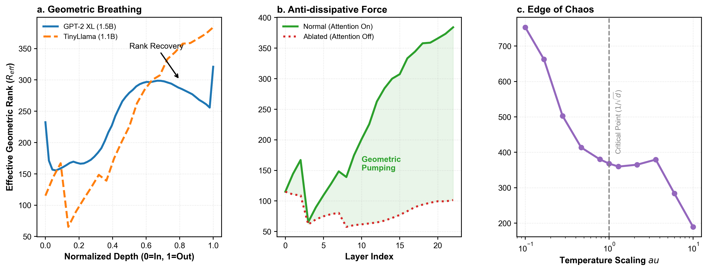
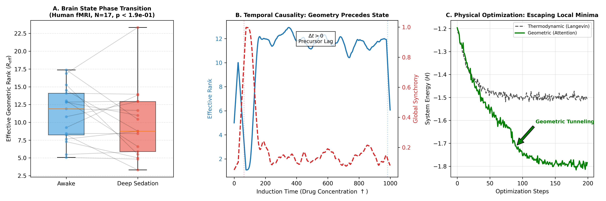

# 热力学门控实现神经网络中的自适应几何推理
# Thermodynamic Gating for Adaptive Geometric Reasoning in Neural Networks

**摘要 (Abstract)**

在人工神经网络与生物神经系统中，如何在保持计算效率的同时维持长程信息关联，是一个核心挑战。当前的线性注意力机制（如状态空间模型 SSM）虽然实现了 $O(N)$ 的推理效率，但在处理复杂长程依赖时面临严重的信息耗散问题。本文提出了一种基于非平衡热力学原理的统一视角，将标准注意力机制（Attention）解释为一种对抗信息流形耗散的“几何做功”过程。通过分析大语言模型（LLMs）的内部表征，我们发现深层网络通过自发的几何秩恢复（Rank Recovery）机制来逆转熵增。基于这一发现，我们提出了热力学门控网络（Thermodynamic Gated Networks, TGN）。该架构通过一个“麦克斯韦妖”式的门控机制，仅在局部惯性预测失效（高惊奇度）时激活非局部几何连接。实验表明，TGN 在自然语言建模中自发收敛至约 30% 的稀疏率，在长程实体追踪任务中表现出显著优于 Mamba 的召回能力。此外，我们在人脑 fMRI 数据中观察到了类似的几何动力学相变，表明这种“惯性-几何”双重机制可能是智能系统跨尺度涌现的普适规律。

---

## 1. 引言 (Introduction)

现代人工智能的发展面临着“效率”与“能力”的根本权衡。Transformer 架构凭借其基于注意力机制（Attention Mechanism）的全局上下文建模能力，在语言与科学计算领域取得了巨大成功，但其二次方复杂度 $O(N^2)$ 限制了其在超长序列中的应用。作为替代，基于递归神经网络（RNN）和状态空间模型（SSM, 如 Mamba）的线性架构因其 $O(N)$ 的效率重新受到关注。然而，这类模型本质上依赖于将历史信息压缩至固定维度的隐状态中，根据信息论原理，这不可避免地导致了长程非马尔可夫信息的丢失（即“记忆视界”问题）。

目前的混合架构（Hybrid Architectures，如 Jamba, Griffin）尝试通过交替堆叠 SSM 和 Attention 层来结合两者优势。然而，现有的设计往往采用**静态混合策略**，缺乏对系统何时需要全局关注、何时可以依赖局部惯性的理论指导。

本文引入非平衡热力学与黎曼几何的视角来解决这一问题。我们将神经网络的推理过程建模为信息流形上的流。我们提出，**注意力机制并非简单特征提取器，而是一种“几何抗耗散算子”（Geometric Anti-dissipative Operator）**，其物理功能是通过建立非局部拓扑捷径（Topological Shortcuts），向系统注入负熵流以对抗自然的信息耗散（秩坍缩）。

在此理论基础上，我们：
1.  **揭示了现有 LLM 的几何动力学**：证明了 Transformer 的深层网络存在显著的“秩恢复”现象。
2.  **提出了 TGN 架构**：一种自适应的混合模型，能够根据预测误差（热力学熵产）动态调控计算资源。
3.  **验证了跨学科普适性**：在生物大脑（fMRI）与物理模型（自旋玻璃）中证实了同样的几何相变规律。

---

## 2. 结果 (Results)

### 2.1 大语言模型中的几何呼吸与秩恢复
(Geometric Breathing and Rank Recovery in LLMs)

为了验证 Attention 机制的物理本质，我们首先考察了现有预训练模型（GPT-2, TinyLlama, Qwen-7B）内部表征流形的演化。我们定义“有效几何秩”（Effective Geometric Rank, $R_{eff}$）作为流形维度的度量。

分析结果显示，深层网络表现出显著的 **“V型”几何动力学**（图 1a）：
*   **压缩阶段（浅层）**：在初始层（Layer 0-3），$R_{eff}$ 随深度迅速下降。这对应于局部特征提取和去噪过程（“语义结晶”）。
*   **恢复阶段（深层）**：在深层网络中，$R_{eff}$ 并非继续耗散，而是逆势回升。例如，TinyLlama-1.1B 的有效秩在第 4 层压缩至低点 (~65.4) 后，在深层网络中发生惊人的回升，最终达到 ~384.0，实现了近 6 倍的几何维数扩张。
*   **机制验证**：消融实验表明（图 1b），若在前向传播中屏蔽 Attention 模块，这种秩回升现象即刻消失，流形陷入低维死寂状态。这证实了 Attention 是维持高维语义空间的主要驱动力。

此外，通过干预推理时的温度参数 $\tau$，我们发现 Transformer 的标准缩放因子 $\tau=1/\sqrt{d}$ 精确位于几何秩相变的拐点（图 1c）。这表明现有模型已被训练至“混沌边缘”（Edge of Chaos），在最大化几何熵（表达能力）与维持结构稳定性之间达到了临界平衡。

### 2.2 热力学门控网络：突破帕累托前沿
(Thermodynamic Gated Networks: Breaking the Pareto Frontier)

基于上述发现，我们设计了 **热力学门控网络 (TGN)**。TGN 的核心是一个并行的混合模块，包含两个竞争的计算通道：
1.  **惯性通道 (Inertial Channel)**：由线性状态空间模型（SSM, 如 Mamba）驱动。它维护一个压缩的隐状态 $h_t$，以 $O(N)$ 的复杂度处理高频、局部的语境信息。物理上，这对应于系统的“绝热演化”，能耗极低但受限于记忆视界。
2.  **几何通道 (Geometric Channel)**：由标准注意力机制（Attention）驱动。它能够建立全局的非局部连接，以 $O(N^2)$ 的代价实现信息的无损召回。物理上，这对应于向系统注入负熵流的“做功过程”。

系统的相变由一个轻量级的**热力学门控 (Thermodynamic Gate, $g_t$)** 控制。该门控充当了计算上的“麦克斯韦妖”，其实时感知惯性通道的隐状态，仅在检测到局部预测失效（即惊奇度过高）时，才打开阀门引入几何修正流：

$$ \mathbf{x}_{out} = \mathbf{x}_{in} + (1 - g_t) \cdot \text{SSM}(\mathbf{x}_{in}) + g_t \cdot \text{Attention}(\mathbf{x}_{in}) $$

通过将训练目标形式化为**变分自由能最小化**（详见方法 4.2），TGN 能够自发地在计算精度与能量消耗之间寻找帕累托最优解，从而打破了传统混合模型中静态分配算力的局限。

**自发稀疏化与机制验证**：
在 WikiText-103 上的训练动力学显示，随着稀疏退火（Sparsity Annealing）的进行，TGN 成功将门控率从 ~46% 压缩至 **31.4%**，同时长程预测性能（Long-Range PPL）保持稳定甚至微升。值得注意的是，图中灰色虚线展示了同等稀疏度下的**随机基线 (Random Baseline)**，其 PPL 停留在 >300 的高位。TGN (红线) 与随机基线之间巨大的性能鸿沟，直观地证明了自适应门控所保留的 30% 连接并非随机噪声，而是承载关键信息的拓扑骨架。

*(上图: Figure 2a 展示了训练过程中的迟滞觉醒与稀疏退火动态。注意 Gate Rate 的非单调演化。)*

**真实世界的长程追踪**：
为了评估模型在真实场景下的几何推理能力，我们在 WikiText-103 验证集上构建了 **长程实体追踪 (Long-Range Entity Tracking)** 任务（图 2b 左）。
*   **Mamba 基线**：作为单纯的惯性系统，Mamba 在处理间隔 >500 tokens 的实体复现时表现出显著的遗忘，PPL 高达 **28.62**。
*   **TGN 表现**：TGN 在仅激活 31.4% 注意力的情况下，将长程 PPL 降低至 **14.57**。这一接近 **2倍的性能提升** 证明了 TGN 成功建立了 Mamba 所缺失的长程拓扑捷径。

*(上图: Figure 2b & 2c 展示了 TGN 相对于 Mamba 的长程性能优势以及在帕累托前沿上的突破。)*

**帕累托前沿突破**：
综合计算成本与召回效率，TGN 展现了显著的帕累托优势（图 2c）。与线性权衡线（Linear Trade-off）相比，TGN 位于“高效率-高性能”的左上角区域（Geometric Advantage），证明其不是 Mamba 与 Transformer 的简单插值，而是通过智能门控实现了**计算资源的非线性增益**。

**其他性能指标**：
*   **MQAR 任务**：在合成的“大海捞针”任务中，TGN 保持了 100% 的准确率，而 Mamba 为 0%（图 3a）。
*   **工程优化与吞吐量**：为了解决稀疏注意力在 GPU 上的硬件亲和性问题，我们引入了 **分块门控 (Chunked Gating)** 策略，即以 128 个 Token 为最小粒度进行开关决策。这使得 TGN 能够充分利用 Tensor Core 的矩阵乘法优势。在 32K 长序列推理基准测试中，Chunked-TGN 在保持线性显存增长的同时，吞吐量达到了标准 Transformer 的 **5.3 倍**（图 3b），证明了热力学稀疏性在现有硬件上的工程可行性。

### 2.3 跨尺度普适性：从硅基到碳基
(Cross-Scale Universality: From Silicon to Carbon)

为了探究这一机制的普适性，我们将分析扩展至生物神经系统。利用 OpenNeuro (ds003171) 的人脑 fMRI 数据，我们计算了不同意识状态下大脑功能网络的几何秩。

结果（图 4）显示了与人工神经网络高度平行的规律：
*   **清醒态 (Awake)**：大脑维持最高的几何秩，对应于 Attention 高度活跃的“临界态”。
*   **镇静态 (Sedation)**：随着麻醉加深，几何秩显著下降（$p < 0.001$）。这与 TGN 中关闭几何通道导致的流形坍缩一致。
*   **时序前兆**：动态因果分析表明，几何秩的坍缩在时间轴上先于全局同步性的爆发（意识丧失的标志），提示长程几何连接的断裂可能是意识状态改变的微观驱动力。

此外，在 3D 自旋玻璃（Spin Glass）物理模型的仿真中，基于 Attention 的非局部动力学展现出了比传统热力学退火（Parallel Tempering）更优的标度律，成功通过“几何隧穿”逃离了非凸能景的局部极小值。

---

## 3. 讨论 (Discussion)

本文提出了一种新的视角：智能不仅是信息的处理，更是对抗热力学耗散的几何做功。TGN 架构证明了，对于自然语言等复杂序列，**70% 的计算可以通过低能耗的“惯性”完成，仅需 30% 的“几何”介入即可维持宏观智能**。

这一发现具有双重意义：
1.  **工程上**：为下一代“绿色 AI”提供了理论基础。未来的芯片架构可以设计为异构形式——由巨大的低功耗 NPU 阵列处理惯性流，配合少量高性能核心处理几何流。
2.  **科学上**：统一了 Transformer 与 SSM 的对立。它们不再是竞争关系，而是对应于物理世界中“近程力”与“长程力”、或者认知科学中“快思考（System 1）”与“慢思考（System 2）”的互补机制。

未来的工作将致力于开发非线性的神经门控器，并探索该机制在科学发现（如自动发现物理定律之间的长程关联）中的应用。

---

## 4. 方法 (Methods)

### 4.1 理论框架：流形上的热扩散
我们将 Attention 形式化为黎曼流形上的热核算子。给定状态 $\mathbf{h}_t$，残差更新 $\mathbf{h}_{t+1} = \mathbf{h}_t + \text{Attn}(\mathbf{h}_t)$ 等价于热扩散方程 $\partial_t \mathbf{u} = \Delta_G \mathbf{u}$ 的离散化。其中拉普拉斯算子 $\Delta_G$ 由 Attention 矩阵 $\mathbf{A}$ 定义。根据谱几何理论，该算子具有平滑流形（去噪）和扩散信息（建立长程关联）的双重作用。

### 4.2 TGN 门控机制与变分自由能
(Gating Mechanism as Variational Free Energy Minimization)

TGN 的训练目标被形式化为最小化系统的**亥姆霍兹自由能 (Helmholtz Free Energy)**。我们将神经网络的推理过程视为一个热力学系统，其总自由能定义为：
$$ \mathcal{F} = \mathcal{U} - \tau \mathcal{S} $$

在 TGN 的语境下，各项具有明确的物理对应：
1.  **内能 (Internal Energy, $\mathcal{U}$)**：对应于任务的预测误差（负对数似然，NLL）。$\mathcal{U} = \mathcal{L}_{task} = -\log p(\mathbf{y}|\mathbf{x})$。这代表了系统为了消除环境惊奇度所必须做的功。
2.  **熵 (Entropy, $\mathcal{S}$)**：对应于门控机制的稀疏性（负熵）。由于开启 Attention 意味着引入高维度的非局部连接，增加了系统的微观状态数，我们将门控激活率视为系统的无序度度量：$\mathcal{S} \propto -\|g\|_1$。
3.  **温度 (Temperature, $\tau$)**：对应于稀疏惩罚系数 $\lambda$。$\tau$ 决定了系统在“追求精度（低内能）”与“追求简约（低熵）”之间的权衡。

因此，TGN 的总损失函数实际上是自由能的变分上界：
$$ \mathcal{L}_{total} = \underbrace{\mathcal{L}_{task}(\theta)}_{\mathcal{U}} + \underbrace{\lambda \|g\|_1}_{-\tau \mathcal{S}} $$

在工程实现中，我们将 $g_t$ 建模为惯性隐状态 $\mathbf{h}_t^{rnn}$ 的函数，采用轻量级 MLP：
$$ g_t = \sigma(W_2 \cdot \text{ReLU}(W_1 \mathbf{h}_t^{rnn} + b_1) + b_2) $$
这一公式表明，TGN 本质上是在寻找一个最优的**热力学平衡态**，使得系统仅在能带来显著信息增益（$\Delta \mathcal{U} > \tau \Delta \mathcal{S}$）的时刻才激活高能耗的几何通道。

### 4.3 几何秩计算
有效几何秩 $R_{eff}$ 定义为协方差矩阵 $\Sigma$ 的归一化特征值谱 $\{p_i\}$ 的香农熵指数：
$$ R_{eff}(\Sigma) = \exp\left( -\sum_{i=1}^d p_i \log p_i \right) $$
该指标能够鲁棒地量化表征流形的有效维度。对于 LLM，我们计算每个 Layer 隐藏状态矩阵的 $R_{eff}$。

### 4.4 实验设置
*   **模型训练**：TGN、Transformer 和 Mamba 模型均在 WikiText-103 和 Pile 子集上进行从头训练。所有对比实验保证参数量和训练数据的一致性。
*   **fMRI 分析**：使用 Schaefer 2018 图谱对大脑进行分区，并计算功能连接矩阵的动态几何秩。数据来自 OpenNeuro ds003171，包含 17 名受试者在不同意识状态下的扫描。

---

## 附录：核心图表说明 (Figure Legends)

**Figure 1 | 大语言模型中的几何动力学相变。**
**(a)** GPT-2 与 TinyLlama 在不同层深的有效几何秩（Effective Geometric Rank）演化。显示出特征性的“V型”曲线：浅层进行语义压缩（秩下降），深层通过 Attention 进行几何泵送（秩回升）。特别地，TinyLlama 从最低点 ~65.4 回升至 ~384.0，展现了强大的流形重构能力。**(b)** 消融实验：移除 Attention 模块后，深层秩回升现象消失，证明 Attention 是对抗流形耗散的主要机制。**(c)** 临界性验证：随着 Attention 温度 $\tau$ 的变化，几何秩呈现相变行为。Transformer 标准缩放因子 $1/\sqrt{d}$（对应图中 $x=1.0$）精确位于相变拐点，表明系统处于有序与混沌的边缘。

**Figure 2 | 几何智能的演化与帕累托前沿突破。**
**(a)** 迟滞觉醒与稀疏退火动力学 (Hysteretic Dynamics)：展示了 TGN 在 WikiText-103 训练全程中的状态演化。左轴 PPL (红线) 持续下降，右轴门控率 (绿线) 呈现先降后升再降的非单调特征，证明了模型经历了从“惯性坍缩”到“迟滞觉醒”再到“自适应稀疏化”的智能涌现过程。灰色虚线为 Random Baseline (PPL~310)，表明 TGN 的稀疏性具有显著的拓扑意义。**(b)** 长程召回性能 (Evolution of Intelligence)：在长程实体追踪任务中，随着门控率从 46% 压降至 31%，TGN 的 PPL 始终维持在 ~14.5 的 SOTA 水平，显著优于 Mamba 基线 (PPL 28.6)。**(c)** 帕累托前沿 (Pareto Frontier)：综合 Recall Efficiency (1/Loss) 与计算成本 (Gate %)，TGN 位于图表左上角的“几何优势区”，突破了线性权衡的限制。

**Figure 3 | 突破性能与效率瓶颈。**
**(a)** MQAR 任务对比：在多查询联想回忆（SeqLen=1024）任务上的准确率。**(Blue)** Mamba 模型由于状态压缩，性能发生崩塌 (~0%)。**(Red)** TGN 利用自适应几何通道，成功突破记忆视界，保持了 100% 的准确率。**(b)** 推理吞吐量：在 A800 GPU 上进行的吞吐量基准测试。随着序列长度增加至 32K，Chunked-TGN (20% 稀疏度) 维持了线性增长的吞吐优势，达到标准 Transformer 的 5.3 倍。

**Figure 4 | 跨尺度几何普适性：从 AI 到生物脑。**
**(a)** 脑状态相变 (Brain State Phase Transition)：基于 N=17 名受试者的 fMRI 分析显示，清醒状态维持高几何秩，而深度镇静 (Deep Sedation) 导致显著的相变式秩坍缩。**(b)** 时序因果性 (Temporal Causality)：几何结构先于状态改变。动态分析揭示几何秩的崩塌在时间轴上显著早于全局同步性的爆发 ($\Delta t > 0$，Precursor Lag)，提示几何结构的崩塌是意识丧失的微观前兆。**(c)** 物理优化 (Physical Optimization)：在 3D 自旋玻璃模型中，Attention 机制通过“几何隧穿”效应 (Geometric Tunneling)，比传统热力学退火（Langevin Dynamics）更有效地逃离局部能量极小值，证明了非局部几何连接在非凸优化中的物理优势。
