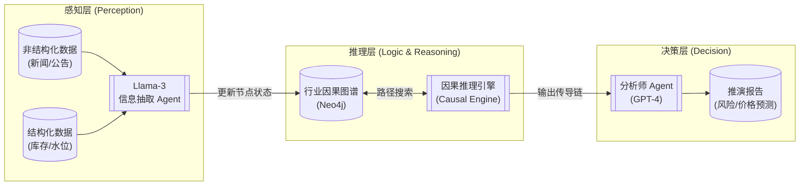
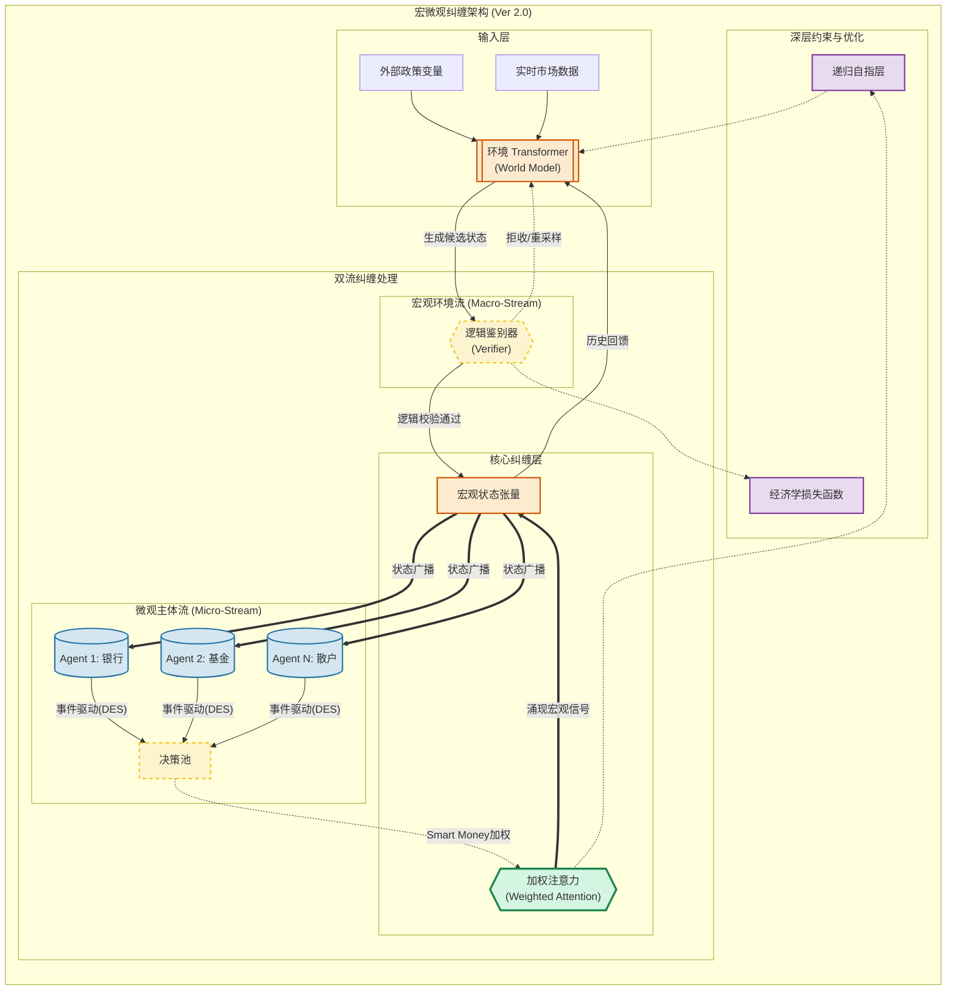

# 技术架构篇：神经-沙盒同构与双流纠缠机制

### 1. 总体演进路线：从因果辅助到全真孪生

本技术架构遵循“先落地、后升维”的演进逻辑，分为两个阶段：
1.  **Phase 1 (当前阶段)**：基于**Agentic AI + 行业因果图谱**的辅助决策系统。
2.  **Phase 2 (终极形态)**：基于**环境 Transformer + 宏微观纠缠**的全真数字孪生系统。

---

### 2. Phase 1 架构：Agentic AI + 行业因果链图谱

在全真“环境 Transformer”成熟之前，为了快速落地**供应链风险预警**与**期货行情推演**场景，我们设计了一套**“神经-符号耦合 (Neuro-Symbolic Coupling)”**的过渡架构。

该架构利用**知识图谱 (Knowledge Graph)** 作为显式的逻辑约束，解决了大模型在处理严谨产业链逻辑时的“幻觉”问题。

#### 2.1 核心组件解析
1.  **感知 Agent (Perception Agent)**：
    *   **功能**：24小时监控多模态数据源（Bloomberg 新闻、港口卫星图、航运数据）。
    *   **技术**：基于 RAG (检索增强生成) 技术，将非结构化文本转化为图谱中的**节点状态更新**（如：`Event: 罢工` -> `Node: 智利Escondida铜矿` -> `Status: 停产`）。
2.  **行业因果图谱 (Industry Causal Graph)**：
    *   **功能**：这是系统的“理性大脑”。它存储了专家经验固化的硬逻辑（如：`铜矿停产` -> `精炼铜产量下降` -> `LME库存下降` -> `现货升水上涨`）。
    *   **价值**：防止 AI 胡乱归因。AI 可以决定“当前发生了什么”，但“发生后会怎样”必须遵循图谱逻辑。
3.  **因果推理引擎 (Causal Engine)**：
    *   **功能**：基于图算法（如最短路径、影响力传播模型）计算单一事件对下游节点（如最终价格）的冲击传导概率。

#### 2.2 适用场景：期货与供应链
*   **期货研究**：当“巴拿马运河干旱”发生时，系统不依赖 AI 的想象，而是沿着图谱计算运力受阻对“铜到岸成本”的具体量化影响。
*   **供应链韧性**：当某级供应商断供时，系统迅速遍历图谱，识别出所有受影响的下游产品线，并推荐替代供应商路径。

---

### 3. Phase 2 架构：神经-沙盒同构与双流纠缠机制 (终极形态)

本架构展示了一个**“双流纠缠（Two-Stream Entanglement）”**的闭环系统，这是对传统“外挂式沙盒”的根本性重构。其核心逻辑在于消除“主体”与“环境”的二元对立，将其统一在一个基于神经网络的动态场域中。

为了解决工程落地中的信号损耗与逻辑控制难题，我们在 Ver 2.0 架构中引入了**“关键少数注意力”、“离散事件调度”与“对抗式判别器”**三大优化机制。

#### 3.1 核心优化机制解析 (Ver 2.0 特性)

针对基础架构在工程落地中可能遇到的挑战，我们引入了以下关键优化：

##### 3.1.1 关键少数注意力 (Weighted Attention for Smart Money)
*   **痛点**：传统平均聚合会稀释“聪明钱”的信号，导致系统对黑天鹅事件不敏感。
*   **机制**：引入动态权重 $\alpha$。系统实时追踪 Agent 的历史预测准确率，对于“业绩”优异的 Agent（如成功预测过危机的 Soros-Agent），其决策在 Cross-Attention 中的权重将被自动放大。这确保了微弱但正确的信号不会被噪音淹没。

##### 3.1.2 离散事件调度 (Discrete Event Simulation, DES)
*   **痛点**：宏观环境的“时钟驱动”与 Agent 的“事件驱动”存在步长错配，导致大量无效计算。
*   **机制**：放弃固定的时间步长（Tick）。采用**事件队列**机制，只有当 Agent 的累积行动意愿超过阈值，或外部发生重大 Shock 时，才触发一次环境模型的推理。这不仅提升了 100 倍算力效率，还防止了模型学习“无操作”的懒惰特征。

##### 3.1.3 生成-判别对抗闭环 (Generator-Verifier Loop)
*   **痛点**：单纯的 Loss 函数具有滞后性，无法在推理阶段实时阻止模型生成违反常识的“幻觉”。
*   **机制**：引入一个轻量级的**逻辑鉴别器 (Verifier)**，其核心规则库继承自 **Phase 1 的行业因果图谱**。关键在于，该鉴别器采用**“弱约束 (Soft Constraint)”**策略：它仅过滤违反物理时空或绝对硬逻辑的谬误（如：时间倒流、库存为负），而对看似违反主流经济学直觉但可能属于极端黑天鹅的生成结果（如：负油价）保持宽容。这确保了系统既不产生低级幻觉，又保留了“涌现未知”的可能性。

##### 3.1.4 开放 Agent 接入协议 (Open Agent Protocol)
*   **痛点**：机构客户（如对冲基金）希望在沙盒中测试私有策略，但绝不允许核心代码明文上传，同时也无法接受本地运行带来的高延迟。
*   **机制**：采用 **TEE (可信执行环境) + AOA (Agency on Agency)** 架构。
    *   **机密计算容器**：机构将 Agent 封装为加密镜像，上传至基于 Intel SGX/AMD TDX 的云端飞地 (Enclave) 中运行。即便平台方也无法窥探内存中的策略逻辑。
    *   **远程证明 (Remote Attestation)**：通过硬件级签名，向机构证明其 Agent 确实运行在未被篡改的安全环境中。
    *   **价值**：在保证“零信任”安全的前提下，实现了微秒级的仿真低延迟，这是构建高频量化生态的基石。

#### 3.2 基础模块解析

##### 3.2.1 左侧：微观主体流 (Micro-Stream) —— 异质性的涌现源
*   这里不仅有银行、基金和散户，更关键的是它们是**异质性 (Heterogeneous)** 的。每个 Agent 都有独立的 CoT（思维链），这意味着它们对同一条宏观信息的解读可能截然相反（例如：加息对银行是利好，对散户是恐慌）。
*   **CoT 推理**：决策不再是简单的规则匹配（if-then），而是基于大模型的逻辑演绎。这种推理过程保留了人类决策的“非理性”与“情绪化”特征。
 
##### 3.2.2 右侧：宏观环境流 (Macro-Stream) —— 内生的物理引擎
*   **自适应演化环境 (Adaptive Evolving Environment)**：
    *   **混合架构 (SSM + Transformer)**：摒弃单一的 Transformer 架构，采用 **Mamba/Transformer 混合架构**。利用 Transformer 处理复杂的逻辑推理，利用 SSM (状态空间模型) 处理连续的时间流特征。这使得环境模型不仅能进行离散决策，还能模拟出类似流体力学的连续市场情绪波动。
    *   **在线学习 (Online Learning via LoRA)**：解决模型“僵化”与“不更新”的痛点。系统维护一个**动态 LoRA 适配器池**。主模型冻结以保持长期记忆（通用的经济物理定律），而 LoRA 适配器则根据最近 N 个仿真步长的误差进行**实时梯度更新**。这意味着环境是“活”的——当市场从平稳期突然切换到动荡期 (Regime Switch) 时，LoRA 适配器会迅速适应新的波动率特征，实现对当下市场体制的实时拟合。
*   **状态张量**：宏观状态被编码为高维向量，不仅包含显性的价格信息，还隐含了市场情绪、流动性压力等隐变量。

##### 3.2.3 中间：核心纠缠层 (Entanglement) —— 涌现发生的场所
*   **双向交叉注意力 (Cross-Attention)**：这是连接微观与宏观的数学桥梁。
    *   **向上涌现**：无数微观 Agent 的决策（买/卖/观望）通过注意力机制聚合，形成对宏观环境的“压力”。这种压力如果超过临界点，就会导致环境模型的输出发生非线性突变（如黑天鹅事件）。
    *   **向下广播**：环境生成的新宏观状态（Macro_State）被广播回每一个 Agent，成为它们下一轮 CoT 推理的上下文 (Context)。
*   **反身性闭环**：Agent 的预期改变了环境，环境的变化验证或证伪了预期，进而引发 Agent 下一轮更激烈的反应。这就是索罗斯“反身性”的数学实现。

##### 3.2.4 底部：深层约束与优化 (Mechanisms) —— 防止混沌失控
*   **递归自指层**：模拟“预期的预期”。它让系统能够处理二阶甚至高阶的博弈逻辑（例如：我知道央行知道我知道它要救市）。
*   **演化博弈与自学习 (Evolutionary Self-Learning)**：
    *   **从监督到强化**：系统超越了单纯拟合历史数据的监督学习范式，引入**多智能体强化学习 (MARL)**。
    *   **Agent 进化 (优胜劣汰)**：在仿真周期结束后，系统会执行“达尔文机制”。破产的 Agent 被剔除，而盈利能力强的 Agent 的策略（CoT 逻辑/风险偏好）将被**克隆并变异**。这意味着市场中的对手盘会随着仿真轮次变得越来越狡猾，从而逼真地模拟出真实市场中“超额收益递减”的进化特征。
    *   **对抗式环境生成**：环境模型的目标不再仅仅是“合理”，而是**“探索系统的脆弱性”**。它采用类似 GAN (对抗生成网络) 的思路，主动生成那些能让大多数 Agent 爆仓的边缘宏观状态（Adversarial Scenarios），从而实现对金融系统鲁棒性的终极压力测试。

#### 3.3 演进路径：Phase 1 资产的平移与复用

Phase 1 的建设并非一次性投入，其核心组件将作为“器官”无缝移植至 Phase 2 的仿生躯体中，实现从“辅助决策”到“全真孪生”的平滑过渡：

1.  **感知层平移 (Eyes & Ears)**：Phase 1 训练成熟的**信息抽取 Agent (Llama-3)** 直接平移为 Phase 2 的环境感知模块，继续负责将 Bloomberg 新闻、卫星数据等非结构化信息转化为环境模型的实时输入信号。
2.  **逻辑层下沉 (Left Brain)**：Phase 1 的**行业因果图谱 (Knowledge Graph)** 从前台的“推理引擎”退居幕后，成为 Phase 2 **逻辑鉴别器 (Verifier)** 的核心数据库。它不再直接驱动推理，而是作为系统的“理性超我”，以**“弱约束”**的形式审核神经网络生成的“感性幻觉”——即只拦截逻辑矛盾（如库存为负），而不扼杀极端涌现（如价格崩盘）。
3.  **主体层进化 (Persona)**：Phase 1 积累的**分析师 Agent** 人设（Prompt Engineering）与 **RAG 行业知识库**，将直接用于初始化 Phase 2 的微观交易 Agent。这确保了市场参与者开局即具备资深的行业常识与特定的风险偏好，避免了零样本启动时的“白痴做市商”现象。
4.  **数据层滋养 (Seed Data)**：Phase 1 运行期间积累的“事件 -> 传导 -> 结果”结构化数据链条，将作为高质量的 **SFT (监督微调) 数据集**，用于 Phase 2 环境 Transformer 的预训练，加速模型对基本经济规律的学习。

### 4. 核心挑战与应对：拥抱混沌与残酷现实

与传统追求“稳定均衡”的仿真系统不同，本架构的核心理念是**“在硅基世界中复现真实的混乱”**。我们认为，那些被主流模型视为“噪音”或“错误”的混沌现象，恰恰是理解复杂系统的钥匙。

1.  **从“控制混沌”到“驾驭混沌” (Surfing the Chaos)**
    *   **核心理念**：传统 ABM 试图消除蝴蝶效应，而我们致力于捕捉它。我们不认为系统崩溃是算法的失败，而是**成功的涌现**。
    *   **技术挑战**：如何区分“无意义的算法幻觉”与“有意义的结构性崩盘”？
    *   **解决方案**：引入**“分形维度分析” (Fractal Dimension Analysis)**。真实的金融混沌具有特定的分形特征（如幂律分布），而纯粹的随机幻觉则是高斯噪声。我们训练环境模型去识别并奖励那些符合“曼德勃罗集”特征的极端波动，而不是简单地遏制它。这使系统能够模拟出类似 1987 年股灾那样的“无理由暴跌”。

2.  **算力成本的“不可承受之重”**
    *   **挑战描述**：模拟一个完整的宏观经济周期可能涉及数千个 Agent 进行数万轮次的交互。如果完全依赖 GPT-4 等超大模型，单次推演的 Token 消耗量将是天文数字。
    *   **应对策略**：采用**“模型蒸馏与分层”**策略。
        *   **L0 (核心层)**：仅关键的做市商或央行 Agent 使用高智商的大模型（如 GPT-4）。
        *   **L1 (噪音层)**：大量的散户 Agent 使用经过特定微调的小模型（如 Llama-3-8B），仅保留基本的跟风与恐慌逻辑，大幅降低推理成本。

3.  **数据黑洞与过拟合风险**
    *   **挑战描述**：真实历史数据不足以训练出能应对未来的模型。
    *   **应对策略**：构建**“合成历史” (Synthetic History)**。利用传统 ABM 生成数百万条“反事实”的经济场景数据，先用合成数据对环境模型进行预训练，再用真实历史数据进行微调（SFT）。

4.  **残酷现实主义：摒弃“政治正确”的伦理约束**
    *   **核心理念**：真实的经济博弈不讲道德，只讲利益。如果为了“伦理安全”而限制 Agent 的贪婪或歧视行为（如银行对高风险地区的信贷歧视），仿真结果将失去真实性。
    *   **设计原则**：**“Agent 无伦理，系统有观察”**。我们允许 Agent 表现出极度的贪婪、恐慌甚至欺诈（如果这符合其利益最大化目标），因为只有这样才能暴露系统在极端人性下的脆弱点。我们不对 Agent 进行道德阉割，而是把它们作为“人性之恶”的容器，从而在宏观上测试制度的鲁棒性。
